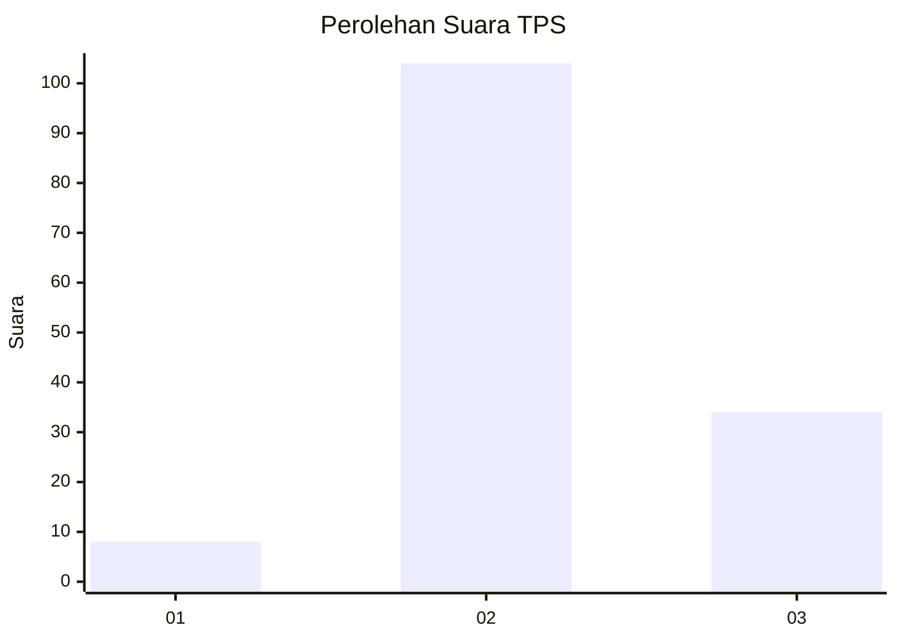
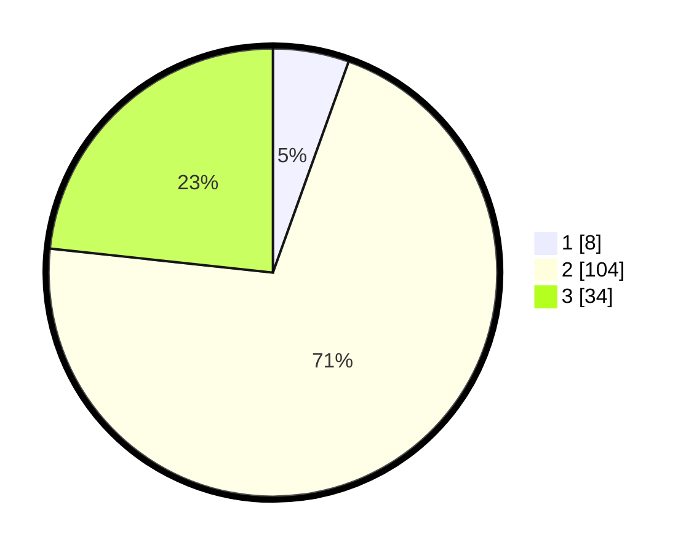

# Hasil

## Grafik

## Tabel

| No. | Nama Paslon    | Suara | Suara (raw) | Persentase |
|:--- |:-------------- | -----:| -----------:| ----------:|
| 1   | ANIES MUHAIMIN | 8     | [8][p-1]    | 5,48       |
| 2   | PRABOWO GIBRAN | 104   | [104][p-2]  | 71,23      |
| 3   | GANJAR MAHFUD  | 34    | [34][p-3]   | 23,29      |

[p-1]: https://github.com/gigit-pemilu/pemilu-2024-35-jawa-timur/blob/main/pilpres/hitung-suara/sub/35-jawa-timur/sub/09-jember/sub/08-puger/sub/2004-pugerkulon/sub/021-tps/sub/paslon-1.txt
[p-2]: https://github.com/gigit-pemilu/pemilu-2024-35-jawa-timur/blob/main/pilpres/hitung-suara/sub/35-jawa-timur/sub/09-jember/sub/08-puger/sub/2004-pugerkulon/sub/021-tps/sub/paslon-2.txt
[p-3]: https://github.com/gigit-pemilu/pemilu-2024-35-jawa-timur/blob/main/pilpres/hitung-suara/sub/35-jawa-timur/sub/09-jember/sub/08-puger/sub/2004-pugerkulon/sub/021-tps/sub/paslon-3.txt

## Foto C Plano

https://sirekap-obj-formc.kpu.go.id/7210/pemilu/ppwp/35/09/08/20/04/3509082004021-20240216-143155--29cfe876-698e-44e0-aea6-3d0bc0824061.jpg

https://sirekap-obj-formc.kpu.go.id/7210/pemilu/ppwp/35/09/08/20/04/3509082004021-20240216-143301--74192061-1388-4504-af3b-d5e21b7afb88.jpg

https://sirekap-obj-formc.kpu.go.id/7210/pemilu/ppwp/35/09/08/20/04/3509082004021-20240215-192221--7ce2e02b-e2c3-4e39-b33c-9ac89d171375.jpg

## Metadata

| Key        | Value               |
| ---------- | ------------------- |
| Time Stamp | 2024-02-24 22:31:28 |

