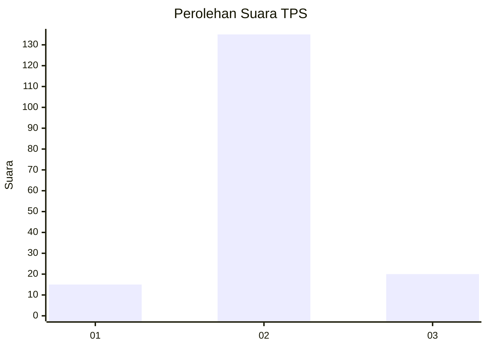
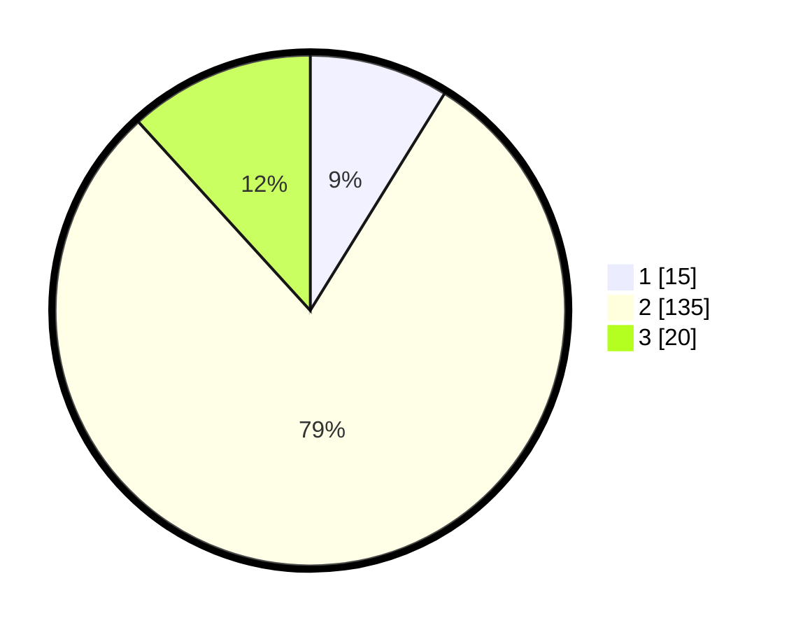

# Hasil

## Grafik

## Tabel

| No. | Nama Paslon    | Suara | Suara (raw) | Persentase |
|:--- |:-------------- | -----:| -----------:| ----------:|
| 1   | ANIES MUHAIMIN | 15    | [15][p-1]   | 8,82       |
| 2   | PRABOWO GIBRAN | 135   | [135][p-2]  | 79,41      |
| 3   | GANJAR MAHFUD  | 20    | [20][p-3]   | 11,76      |

[p-1]: https://github.com/gigit-pemilu/pemilu-2024/blob/main/pilpres/hitung-suara/sub/35-jawa-timur/sub/09-jember/sub/08-puger/sub/2004-pugerkulon/sub/026-tps/sub/paslon-1.txt
[p-2]: https://github.com/gigit-pemilu/pemilu-2024/blob/main/pilpres/hitung-suara/sub/35-jawa-timur/sub/09-jember/sub/08-puger/sub/2004-pugerkulon/sub/026-tps/sub/paslon-2.txt
[p-3]: https://github.com/gigit-pemilu/pemilu-2024/blob/main/pilpres/hitung-suara/sub/35-jawa-timur/sub/09-jember/sub/08-puger/sub/2004-pugerkulon/sub/026-tps/sub/paslon-3.txt

## Foto C Plano

https://sirekap-obj-formc.kpu.go.id/6d91/pemilu/ppwp/35/09/08/20/04/3509082004026-20240215-005528--6e68d7d7-e5e8-4ccd-80fe-ee38f47cf364.jpg

https://sirekap-obj-formc.kpu.go.id/6d91/pemilu/ppwp/35/09/08/20/04/3509082004026-20240215-002900--ff160ccc-44c1-4d44-90ca-4f24822fca06.jpg

https://sirekap-obj-formc.kpu.go.id/6d91/pemilu/ppwp/35/09/08/20/04/3509082004026-20240214-225920--272fdb9a-6dcf-4b37-9ce4-1f37a17aeb23.jpg

## Metadata

| Key        | Value               |
| ---------- | ------------------- |
| Time Stamp | 2024-02-24 22:31:28 |

