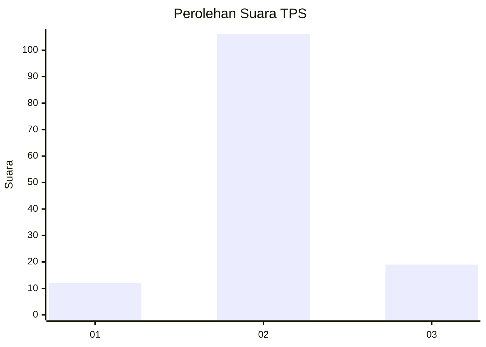
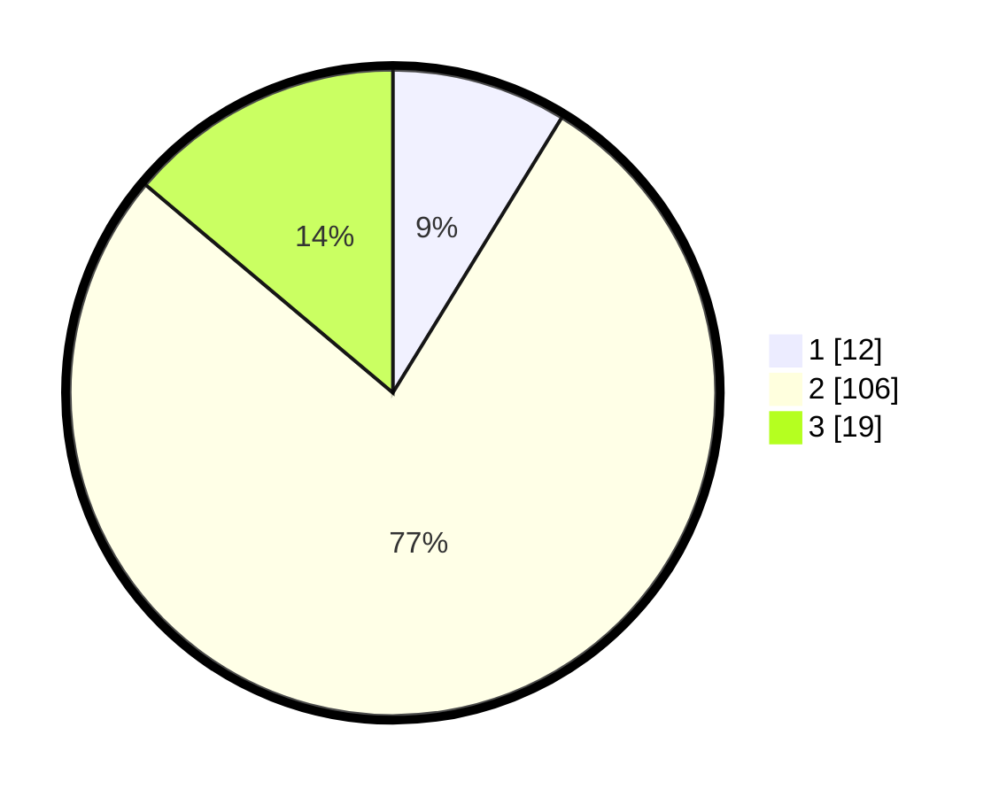

# Hasil

## Grafik

## Tabel

| No. | Nama Paslon    | Suara | Suara (raw) | Persentase |
|:--- |:-------------- | -----:| -----------:| ----------:|
| 1   | ANIES MUHAIMIN | 12    | [12][p-1]   | 8,76       |
| 2   | PRABOWO GIBRAN | 106   | [106][p-2]  | 77,37      |
| 3   | GANJAR MAHFUD  | 19    | [19][p-3]   | 13,87      |

[p-1]: https://github.com/gigit-pemilu/pemilu-2024/blob/main/pilpres/hitung-suara/sub/35-jawa-timur/sub/09-jember/sub/08-puger/sub/2004-pugerkulon/sub/027-tps/sub/paslon-1.txt
[p-2]: https://github.com/gigit-pemilu/pemilu-2024/blob/main/pilpres/hitung-suara/sub/35-jawa-timur/sub/09-jember/sub/08-puger/sub/2004-pugerkulon/sub/027-tps/sub/paslon-2.txt
[p-3]: https://github.com/gigit-pemilu/pemilu-2024/blob/main/pilpres/hitung-suara/sub/35-jawa-timur/sub/09-jember/sub/08-puger/sub/2004-pugerkulon/sub/027-tps/sub/paslon-3.txt

## Foto C Plano

https://sirekap-obj-formc.kpu.go.id/9e48/pemilu/ppwp/35/09/08/20/04/3509082004027-20240214-192423--2cf0f9a3-d428-4b70-b166-11241790da4f.jpg

https://sirekap-obj-formc.kpu.go.id/9e48/pemilu/ppwp/35/09/08/20/04/3509082004027-20240219-231329--0ce959f5-7475-4178-960d-c4d8f9e959ef.jpg

https://sirekap-obj-formc.kpu.go.id/9e48/pemilu/ppwp/35/09/08/20/04/3509082004027-20240219-231549--ed41cc9b-5037-44ba-9bf5-4dd7de552d70.jpg

## Metadata

| Key        | Value               |
| ---------- | ------------------- |
| Time Stamp | 2024-02-20 00:00:00 |

