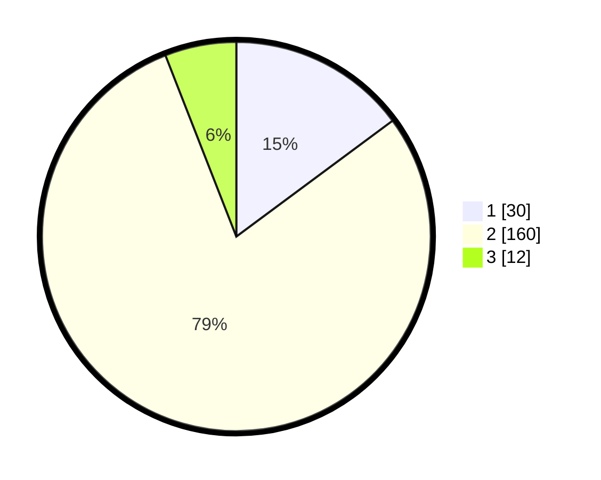

# Hasil

## Grafik

## Tabel

| No. | Nama Paslon    | Suara | Suara (raw) | Persentase |
|:--- |:-------------- | -----:| -----------:| ----------:|
| 1   | ANIES MUHAIMIN | 30    | [30][p-1]   | 14,85      |
| 2   | PRABOWO GIBRAN | 160   | [160][p-2]  | 79,21      |
| 3   | GANJAR MAHFUD  | 12    | [12][p-3]   | 5,94       |

[p-1]: https://github.com/gigit-pemilu/pemilu-2024-35-jawa-timur/blob/main/pilpres/hitung-suara/sub/35-jawa-timur/sub/09-jember/sub/08-puger/sub/2004-pugerkulon/sub/030-tps/sub/paslon-1.txt
[p-2]: https://github.com/gigit-pemilu/pemilu-2024-35-jawa-timur/blob/main/pilpres/hitung-suara/sub/35-jawa-timur/sub/09-jember/sub/08-puger/sub/2004-pugerkulon/sub/030-tps/sub/paslon-2.txt
[p-3]: https://github.com/gigit-pemilu/pemilu-2024-35-jawa-timur/blob/main/pilpres/hitung-suara/sub/35-jawa-timur/sub/09-jember/sub/08-puger/sub/2004-pugerkulon/sub/030-tps/sub/paslon-3.txt

## Foto C Plano

https://sirekap-obj-formc.kpu.go.id/d7c6/pemilu/ppwp/35/09/08/20/04/3509082004030-20240215-015038--b297b506-2ffa-47cf-8b98-968cd4ac2ae8.jpg

https://sirekap-obj-formc.kpu.go.id/d7c6/pemilu/ppwp/35/09/08/20/04/3509082004030-20240215-015317--9a6e3ee0-15ba-48f9-856f-980e8cd69517.jpg

https://sirekap-obj-formc.kpu.go.id/d7c6/pemilu/ppwp/35/09/08/20/04/3509082004030-20240215-015413--41fc7bef-0e89-4ca5-a189-acd3a9511282.jpg

## Metadata

| Key        | Value               |
| ---------- | ------------------- |
| Time Stamp | 2024-02-15 16:00:26 |

