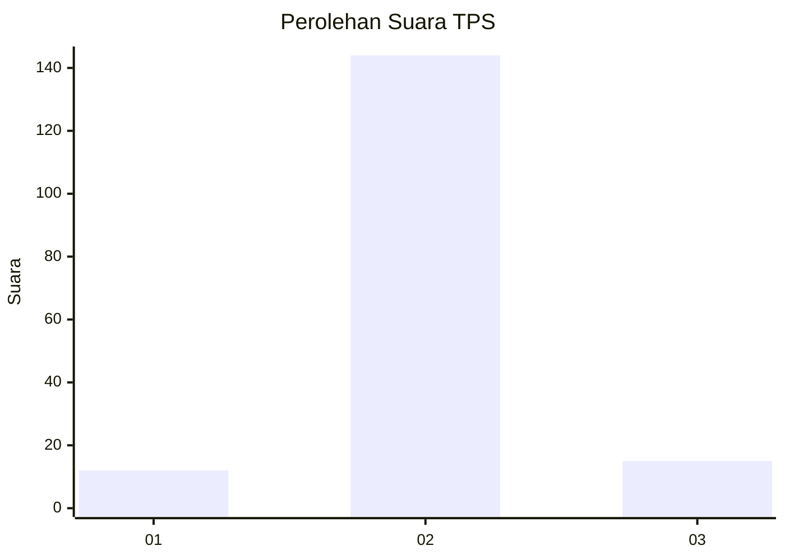
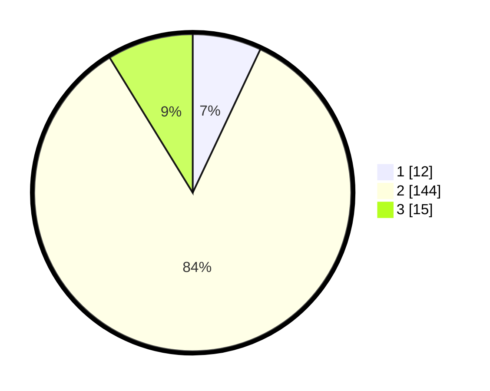

# Hasil

## Grafik

## Tabel

| No. | Nama Paslon    | Suara | Suara (raw) | Persentase |
|:--- |:-------------- | -----:| -----------:| ----------:|
| 1   | ANIES MUHAIMIN | 12    | [12][p-1]   | 7,02       |
| 2   | PRABOWO GIBRAN | 144   | [144][p-2]  | 84,21      |
| 3   | GANJAR MAHFUD  | 15    | [15][p-3]   | 8,77       |

[p-1]: https://github.com/gigit-pemilu/pemilu-2024-35-jawa-timur/blob/main/pilpres/hitung-suara/sub/35-jawa-timur/sub/09-jember/sub/08-puger/sub/2004-pugerkulon/sub/033-tps/sub/paslon-1.txt
[p-2]: https://github.com/gigit-pemilu/pemilu-2024-35-jawa-timur/blob/main/pilpres/hitung-suara/sub/35-jawa-timur/sub/09-jember/sub/08-puger/sub/2004-pugerkulon/sub/033-tps/sub/paslon-2.txt
[p-3]: https://github.com/gigit-pemilu/pemilu-2024-35-jawa-timur/blob/main/pilpres/hitung-suara/sub/35-jawa-timur/sub/09-jember/sub/08-puger/sub/2004-pugerkulon/sub/033-tps/sub/paslon-3.txt

## Foto C Plano

https://sirekap-obj-formc.kpu.go.id/624b/pemilu/ppwp/35/09/08/20/04/3509082004033-20240214-230202--8e172503-d2dd-467f-afd8-fdb017d6dc3a.jpg

https://sirekap-obj-formc.kpu.go.id/624b/pemilu/ppwp/35/09/08/20/04/3509082004033-20240214-230405--1970de40-7d3e-48e0-ae8b-f7557b82f3f7.jpg

https://sirekap-obj-formc.kpu.go.id/624b/pemilu/ppwp/35/09/08/20/04/3509082004033-20240214-231631--e2850de9-929d-49ba-8942-fdfcf235a9c1.jpg

## Metadata

| Key        | Value               |
| ---------- | ------------------- |
| Time Stamp | 2024-02-15 16:00:26 |

