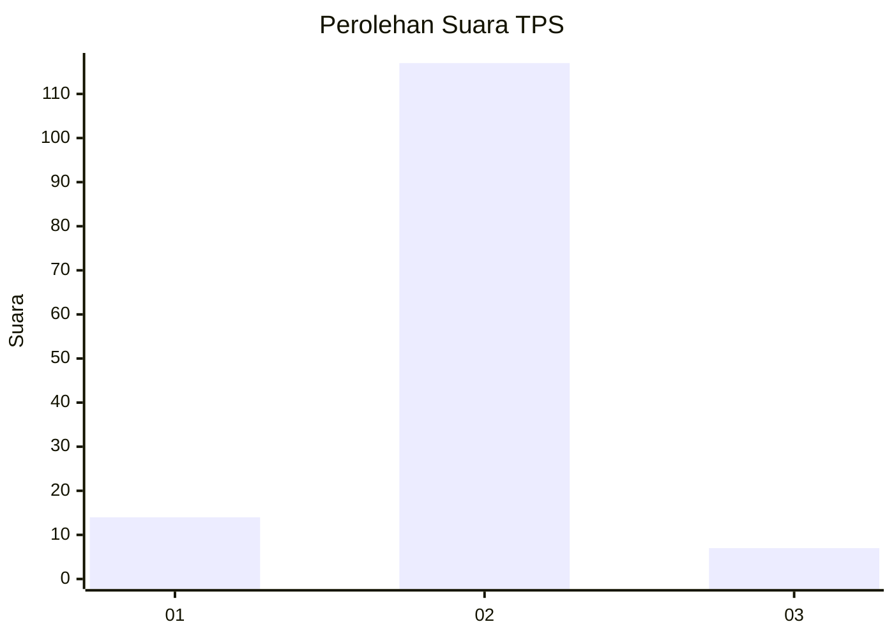
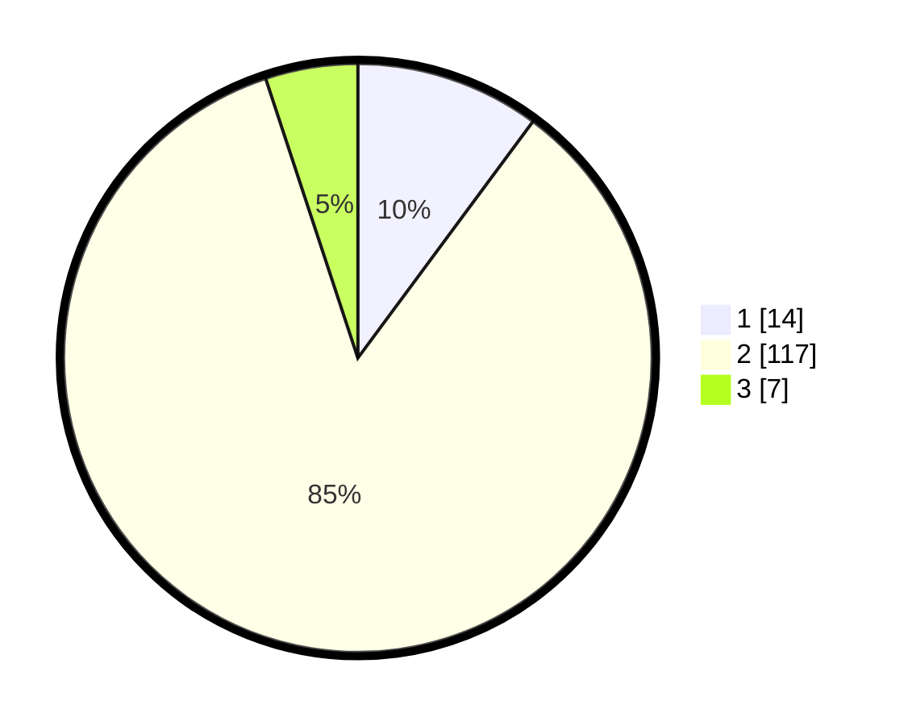

# Hasil

## Grafik

## Tabel

| No. | Nama Paslon    | Suara | Suara (raw) | Persentase |
|:--- |:-------------- | -----:| -----------:| ----------:|
| 1   | ANIES MUHAIMIN | 14    | [14][p-1]   | 10,14      |
| 2   | PRABOWO GIBRAN | 117   | [117][p-2]  | 84,78      |
| 3   | GANJAR MAHFUD  | 7     | [7][p-3]    | 5,07       |

[p-1]: https://github.com/gigit-pemilu/pemilu-2024-35-jawa-timur/blob/main/pilpres/hitung-suara/sub/35-jawa-timur/sub/09-jember/sub/08-puger/sub/2004-pugerkulon/sub/043-tps/sub/paslon-1.txt
[p-2]: https://github.com/gigit-pemilu/pemilu-2024-35-jawa-timur/blob/main/pilpres/hitung-suara/sub/35-jawa-timur/sub/09-jember/sub/08-puger/sub/2004-pugerkulon/sub/043-tps/sub/paslon-2.txt
[p-3]: https://github.com/gigit-pemilu/pemilu-2024-35-jawa-timur/blob/main/pilpres/hitung-suara/sub/35-jawa-timur/sub/09-jember/sub/08-puger/sub/2004-pugerkulon/sub/043-tps/sub/paslon-3.txt

## Foto C Plano

https://sirekap-obj-formc.kpu.go.id/f5bf/pemilu/ppwp/35/09/08/20/04/3509082004043-20240215-000440--d7b43591-460f-406f-af58-7d1375640c6b.jpg

https://sirekap-obj-formc.kpu.go.id/f5bf/pemilu/ppwp/35/09/08/20/04/3509082004043-20240215-000744--f215943b-7442-40c4-8bb1-e1629b00aca0.jpg

https://sirekap-obj-formc.kpu.go.id/f5bf/pemilu/ppwp/35/09/08/20/04/3509082004043-20240215-001023--8ebf1bf0-149f-4c40-9c4b-adcdfb11b232.jpg

## Metadata

| Key        | Value               |
| ---------- | ------------------- |
| Time Stamp | 2024-02-15 16:00:26 |

