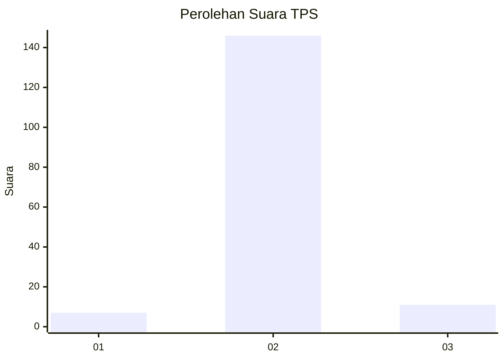
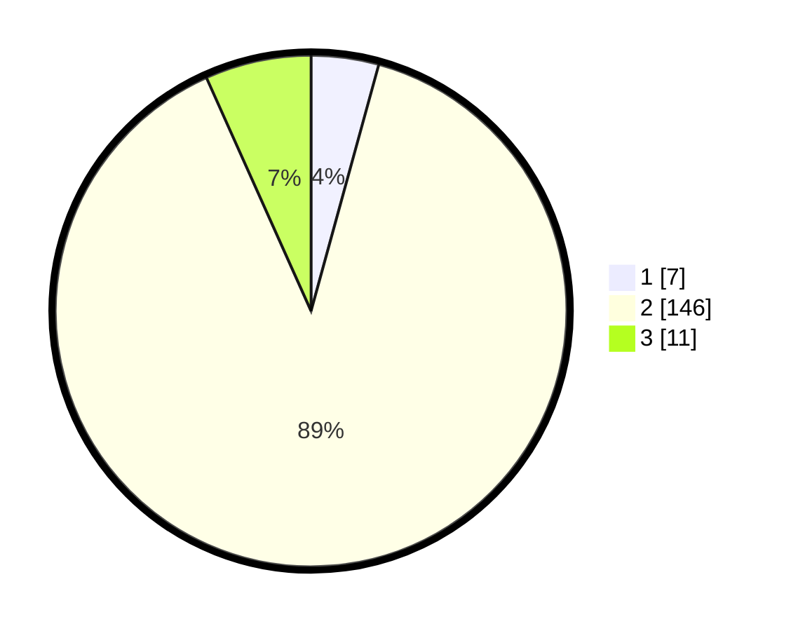

# Hasil

## Grafik

## Tabel

| No. | Nama Paslon    | Suara | Suara (raw) | Persentase |
|:--- |:-------------- | -----:| -----------:| ----------:|
| 1   | ANIES MUHAIMIN | 7     | [7][p-1]    | 4,27       |
| 2   | PRABOWO GIBRAN | 146   | [146][p-2]  | 89,02      |
| 3   | GANJAR MAHFUD  | 11    | [11][p-3]   | 6,71       |

[p-1]: https://github.com/gigit-pemilu/pemilu-2024/blob/main/pilpres/hitung-suara/sub/35-jawa-timur/sub/09-jember/sub/08-puger/sub/2004-pugerkulon/sub/044-tps/sub/paslon-1.txt
[p-2]: https://github.com/gigit-pemilu/pemilu-2024/blob/main/pilpres/hitung-suara/sub/35-jawa-timur/sub/09-jember/sub/08-puger/sub/2004-pugerkulon/sub/044-tps/sub/paslon-2.txt
[p-3]: https://github.com/gigit-pemilu/pemilu-2024/blob/main/pilpres/hitung-suara/sub/35-jawa-timur/sub/09-jember/sub/08-puger/sub/2004-pugerkulon/sub/044-tps/sub/paslon-3.txt

## Foto C Plano

https://sirekap-obj-formc.kpu.go.id/f9d2/pemilu/ppwp/35/09/08/20/04/3509082004044-20240214-233023--64d55a02-3e85-4aec-9e3b-59c107a461db.jpg

https://sirekap-obj-formc.kpu.go.id/f9d2/pemilu/ppwp/35/09/08/20/04/3509082004044-20240214-233204--684735a1-43e8-4933-acf7-29378b74306d.jpg

https://sirekap-obj-formc.kpu.go.id/f9d2/pemilu/ppwp/35/09/08/20/04/3509082004044-20240214-233259--6a9b53b3-8001-4c0b-867d-6933fab7acaa.jpg

## Metadata

| Key        | Value               |
| ---------- | ------------------- |
| Time Stamp | 2024-02-25 11:00:00 |

