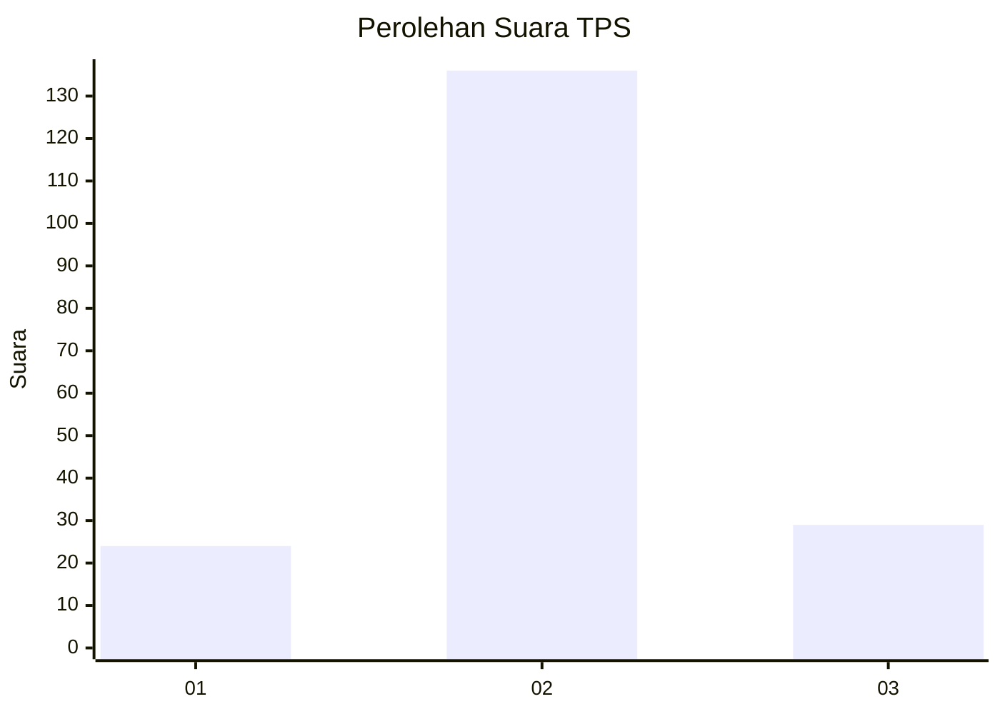
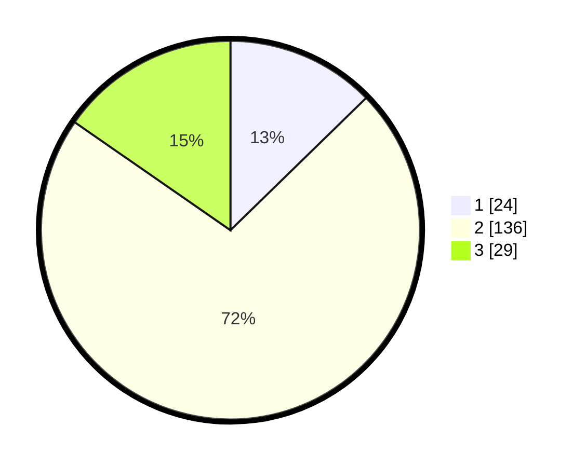

# Hasil

## Grafik

## Tabel

| No. | Nama Paslon    | Suara | Suara (raw) | Persentase |
|:--- |:-------------- | -----:| -----------:| ----------:|
| 1   | ANIES MUHAIMIN | 24    | [24][p-1]   | 12,70      |
| 2   | PRABOWO GIBRAN | 136   | [136][p-2]  | 71,96      |
| 3   | GANJAR MAHFUD  | 29    | [29][p-3]   | 15,34      |

[p-1]: https://github.com/gigit-pemilu/pemilu-2024/blob/main/pilpres/hitung-suara/sub/35-jawa-timur/sub/09-jember/sub/08-puger/sub/2005-wringintelu/sub/007-tps/sub/paslon-1.txt
[p-2]: https://github.com/gigit-pemilu/pemilu-2024/blob/main/pilpres/hitung-suara/sub/35-jawa-timur/sub/09-jember/sub/08-puger/sub/2005-wringintelu/sub/007-tps/sub/paslon-2.txt
[p-3]: https://github.com/gigit-pemilu/pemilu-2024/blob/main/pilpres/hitung-suara/sub/35-jawa-timur/sub/09-jember/sub/08-puger/sub/2005-wringintelu/sub/007-tps/sub/paslon-3.txt

## Foto C Plano

https://sirekap-obj-formc.kpu.go.id/938a/pemilu/ppwp/35/09/08/20/05/3509082005007-20240215-035929--e97a52b1-f541-4cb8-9f97-f078d8147576.jpg

https://sirekap-obj-formc.kpu.go.id/938a/pemilu/ppwp/35/09/08/20/05/3509082005007-20240215-040000--5bf38c5f-5a7d-435f-95bb-306e65579188.jpg

https://sirekap-obj-formc.kpu.go.id/938a/pemilu/ppwp/35/09/08/20/05/3509082005007-20240215-040031--6dcdeb0e-d732-465a-8048-84628704b4ee.jpg

## Metadata

| Key        | Value               |
| ---------- | ------------------- |
| Time Stamp | 2024-02-15 16:00:26 |

## DATA PEMILIH TETAP

Jumlah pemilih dalam DPT: **343**.
 * L: **824**.
 * P: **626**.

## DATA PENGGUNA HAK PILIH

Jumlah pengguna hak pilih dalam DPT: **189**.
 * L: **43**.
 * P: **846**.

Jumlah pengguna hak pilih dalam DPTb: **884**.
 * L: **800**.
 * P: **888**.

Jumlah pengguna hak pilih dalam DPK: **340**.
 * L: **888**.
 * P: **888**.

Jumlah pengguna hak pilih: **385**.
 * L: **893**.
 * P: **35**.

## JUMLAH SUARA SAH DAN TIDAK SAH

JUMLAH SELURUH SUARA SAH: **189**.

JUMLAH SUARA TIDAK SAH: **0**.

JUMLAH SELURUH SUARA SAH DAN SUARA TIDAK SAH: **189**.

