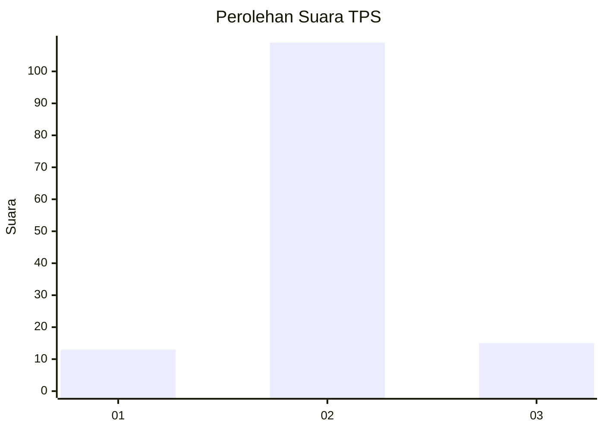
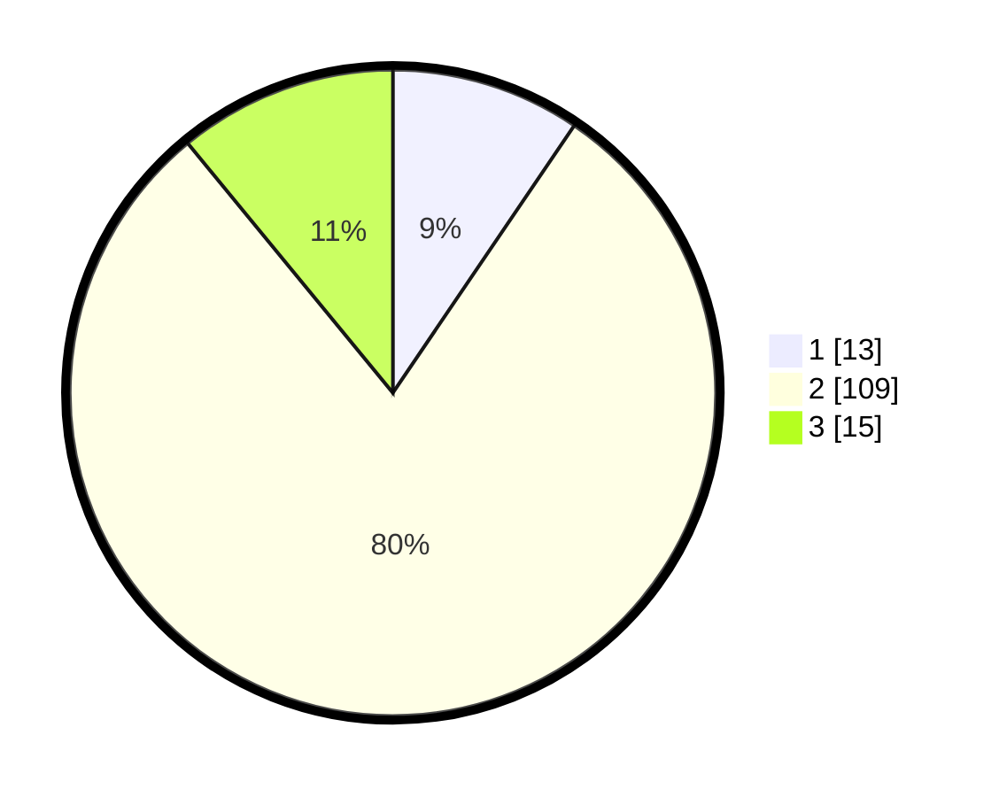

# Hasil

## Grafik

## Tabel

| No. | Nama Paslon    | Suara | Suara (raw) | Persentase |
|:--- |:-------------- | -----:| -----------:| ----------:|
| 1   | ANIES MUHAIMIN | 13    | [13][p-1]   | 9,49       |
| 2   | PRABOWO GIBRAN | 109   | [109][p-2]  | 79,56      |
| 3   | GANJAR MAHFUD  | 15    | [15][p-3]   | 10,95      |

[p-1]: https://github.com/gigit-pemilu/pemilu-2024-35-jawa-timur/blob/main/pilpres/hitung-suara/sub/35-jawa-timur/sub/09-jember/sub/08-puger/sub/2005-wringintelu/sub/008-tps/sub/paslon-1.txt
[p-2]: https://github.com/gigit-pemilu/pemilu-2024-35-jawa-timur/blob/main/pilpres/hitung-suara/sub/35-jawa-timur/sub/09-jember/sub/08-puger/sub/2005-wringintelu/sub/008-tps/sub/paslon-2.txt
[p-3]: https://github.com/gigit-pemilu/pemilu-2024-35-jawa-timur/blob/main/pilpres/hitung-suara/sub/35-jawa-timur/sub/09-jember/sub/08-puger/sub/2005-wringintelu/sub/008-tps/sub/paslon-3.txt

## Foto C Plano

https://sirekap-obj-formc.kpu.go.id/ce23/pemilu/ppwp/35/09/08/20/05/3509082005008-20240215-065237--d6269214-ecce-4ea2-adec-856f05302281.jpg

https://sirekap-obj-formc.kpu.go.id/ce23/pemilu/ppwp/35/09/08/20/05/3509082005008-20240215-065355--ffc808c4-8db5-44a5-a6c2-5bb001422629.jpg

https://sirekap-obj-formc.kpu.go.id/ce23/pemilu/ppwp/35/09/08/20/05/3509082005008-20240215-065515--efb64978-bd0d-4399-93dd-479e32f54b33.jpg

## Metadata

| Key        | Value               |
| ---------- | ------------------- |
| Time Stamp | 2024-02-15 17:30:25 |

