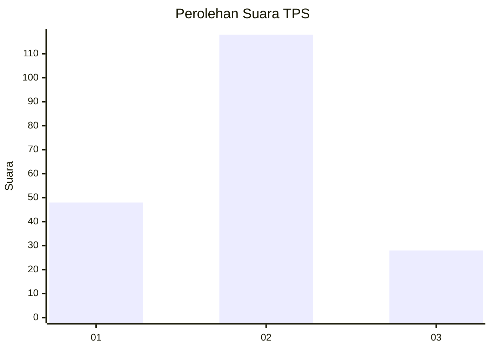
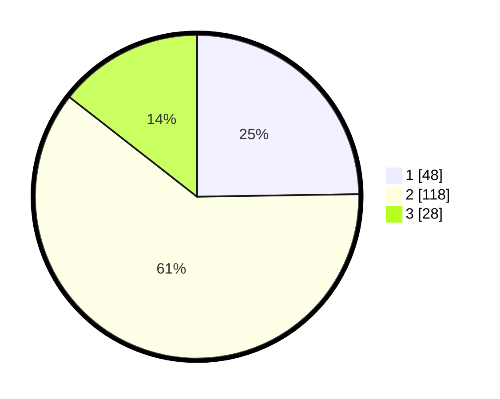

# Hasil

## Grafik

## Tabel

| No. | Nama Paslon    | Suara | Suara (raw) | Persentase |
|:--- |:-------------- | -----:| -----------:| ----------:|
| 1   | ANIES MUHAIMIN | 48    | [48][p-1]   | 24,74      |
| 2   | PRABOWO GIBRAN | 118   | [118][p-2]  | 60,82      |
| 3   | GANJAR MAHFUD  | 28    | [28][p-3]   | 14,43      |

[p-1]: https://github.com/gigit-pemilu/pemilu-2024/blob/main/pilpres/hitung-suara/sub/35-jawa-timur/sub/09-jember/sub/08-puger/sub/2006-kasiyan/sub/007-tps/sub/paslon-1.txt
[p-2]: https://github.com/gigit-pemilu/pemilu-2024/blob/main/pilpres/hitung-suara/sub/35-jawa-timur/sub/09-jember/sub/08-puger/sub/2006-kasiyan/sub/007-tps/sub/paslon-2.txt
[p-3]: https://github.com/gigit-pemilu/pemilu-2024/blob/main/pilpres/hitung-suara/sub/35-jawa-timur/sub/09-jember/sub/08-puger/sub/2006-kasiyan/sub/007-tps/sub/paslon-3.txt

## Foto C Plano

https://sirekap-obj-formc.kpu.go.id/f085/pemilu/ppwp/35/09/08/20/06/3509082006007-20240214-201440--557ffdd4-cc63-426d-a0aa-5510c6e7a2f6.jpg

https://sirekap-obj-formc.kpu.go.id/f085/pemilu/ppwp/35/09/08/20/06/3509082006007-20240214-191910--2941d6dc-a6b4-4953-8663-a529b104d7af.jpg

https://sirekap-obj-formc.kpu.go.id/f085/pemilu/ppwp/35/09/08/20/06/3509082006007-20240214-192840--b0adc838-7809-4fdc-979a-9fd6d9e96ce0.jpg

## Metadata

| Key        | Value               |
| ---------- | ------------------- |
| Time Stamp | 2024-02-25 11:00:00 |

