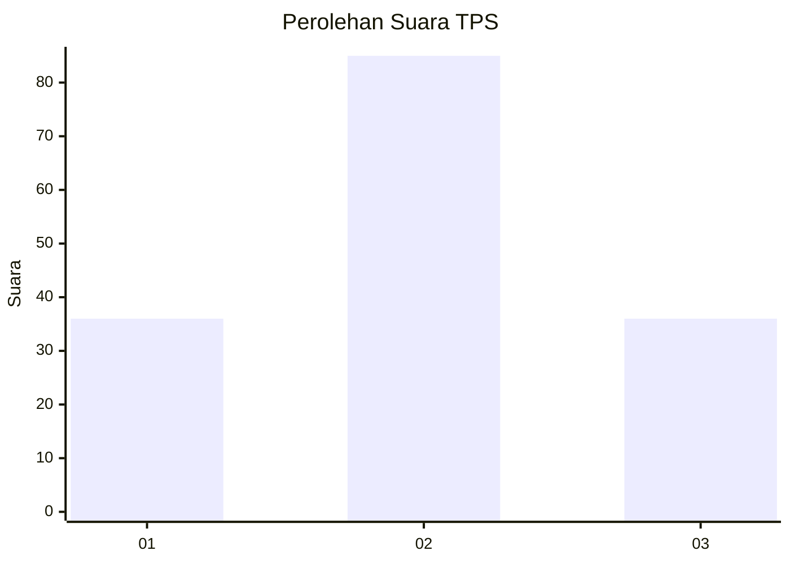
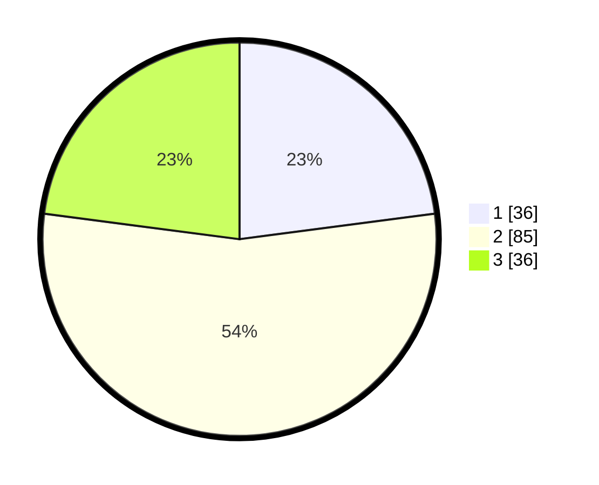

# Hasil

## Grafik

## Tabel

| No. | Nama Paslon    | Suara | Suara (raw) | Persentase |
|:--- |:-------------- | -----:| -----------:| ----------:|
| 1   | ANIES MUHAIMIN | 36    | [36][p-1]   | 22,93      |
| 2   | PRABOWO GIBRAN | 85    | [85][p-2]   | 54,14      |
| 3   | GANJAR MAHFUD  | 36    | [36][p-3]   | 22,93      |

[p-1]: https://github.com/gigit-pemilu/pemilu-2024-35-jawa-timur/blob/main/pilpres/hitung-suara/sub/35-jawa-timur/sub/09-jember/sub/08-puger/sub/2006-kasiyan/sub/010-tps/sub/paslon-1.txt
[p-2]: https://github.com/gigit-pemilu/pemilu-2024-35-jawa-timur/blob/main/pilpres/hitung-suara/sub/35-jawa-timur/sub/09-jember/sub/08-puger/sub/2006-kasiyan/sub/010-tps/sub/paslon-2.txt
[p-3]: https://github.com/gigit-pemilu/pemilu-2024-35-jawa-timur/blob/main/pilpres/hitung-suara/sub/35-jawa-timur/sub/09-jember/sub/08-puger/sub/2006-kasiyan/sub/010-tps/sub/paslon-3.txt

## Foto C Plano

https://sirekap-obj-formc.kpu.go.id/bbfe/pemilu/ppwp/35/09/08/20/06/3509082006010-20240214-235320--6d05c66a-d14c-4274-a156-00bc1c6f2a1c.jpg

https://sirekap-obj-formc.kpu.go.id/bbfe/pemilu/ppwp/35/09/08/20/06/3509082006010-20240214-235527--7d7b932f-c507-4ae6-af4e-c18b52ac8c0a.jpg

https://sirekap-obj-formc.kpu.go.id/bbfe/pemilu/ppwp/35/09/08/20/06/3509082006010-20240214-235521--1ef2cf46-22c2-4c2e-a09e-1e100812aa83.jpg

## Metadata

| Key        | Value               |
| ---------- | ------------------- |
| Time Stamp | 2024-02-15 21:30:27 |

