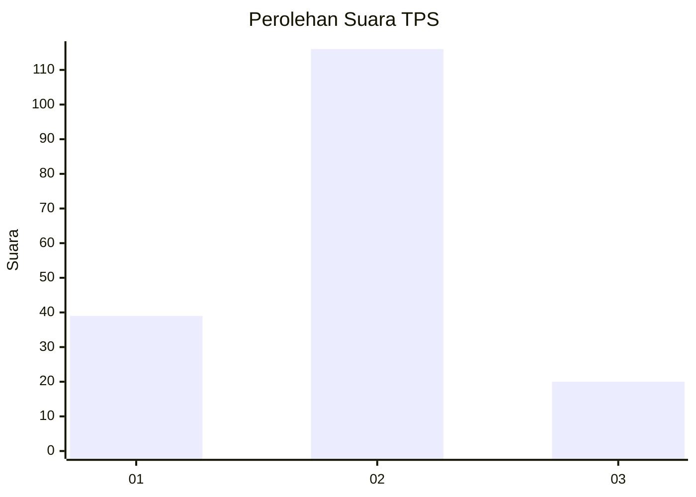
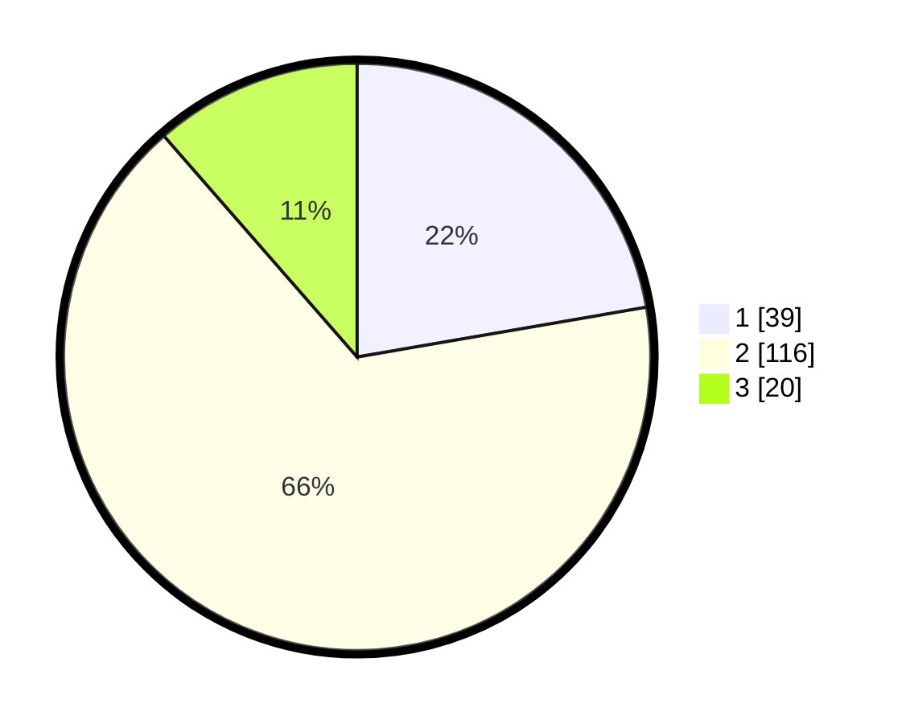

# Hasil

## Grafik

## Tabel

| No. | Nama Paslon    | Suara | Suara (raw) | Persentase |
|:--- |:-------------- | -----:| -----------:| ----------:|
| 1   | ANIES MUHAIMIN | 39    | [39][p-1]   | 22,29      |
| 2   | PRABOWO GIBRAN | 116   | [116][p-2]  | 66,29      |
| 3   | GANJAR MAHFUD  | 20    | [20][p-3]   | 11,43      |

[p-1]: https://github.com/gigit-pemilu/pemilu-2024-35-jawa-timur/blob/main/pilpres/hitung-suara/sub/35-jawa-timur/sub/09-jember/sub/08-puger/sub/2007-bagon/sub/009-tps/sub/paslon-1.txt
[p-2]: https://github.com/gigit-pemilu/pemilu-2024-35-jawa-timur/blob/main/pilpres/hitung-suara/sub/35-jawa-timur/sub/09-jember/sub/08-puger/sub/2007-bagon/sub/009-tps/sub/paslon-2.txt
[p-3]: https://github.com/gigit-pemilu/pemilu-2024-35-jawa-timur/blob/main/pilpres/hitung-suara/sub/35-jawa-timur/sub/09-jember/sub/08-puger/sub/2007-bagon/sub/009-tps/sub/paslon-3.txt

## Foto C Plano

https://sirekap-obj-formc.kpu.go.id/0cee/pemilu/ppwp/35/09/08/20/07/3509082007009-20240214-212534--fe34c351-369d-46bb-bf7d-d85584a74202.jpg

https://sirekap-obj-formc.kpu.go.id/0cee/pemilu/ppwp/35/09/08/20/07/3509082007009-20240214-212726--9301b0b6-44f1-43f1-93c1-e8bc5e4a8fb2.jpg

https://sirekap-obj-formc.kpu.go.id/0cee/pemilu/ppwp/35/09/08/20/07/3509082007009-20240214-212945--9286f50d-0204-473a-bff9-888e766e2efb.jpg

## Metadata

| Key        | Value               |
| ---------- | ------------------- |
| Time Stamp | 2024-02-15 16:00:26 |

