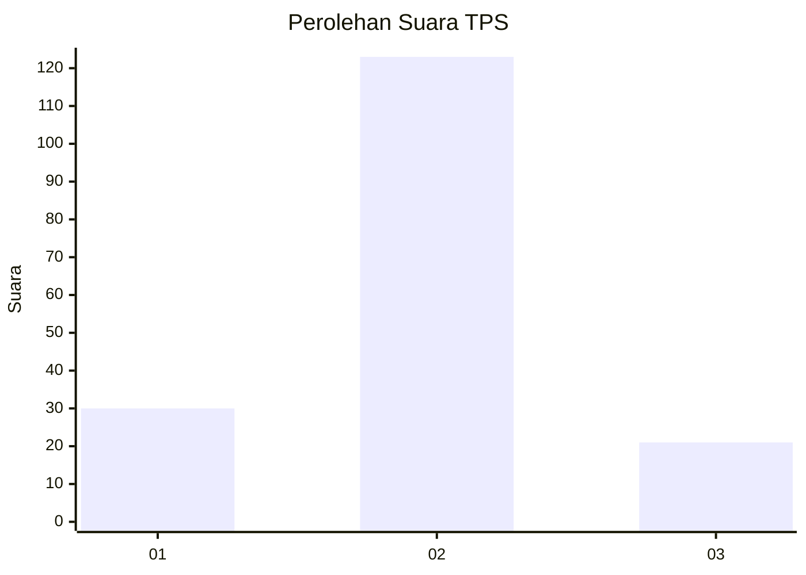
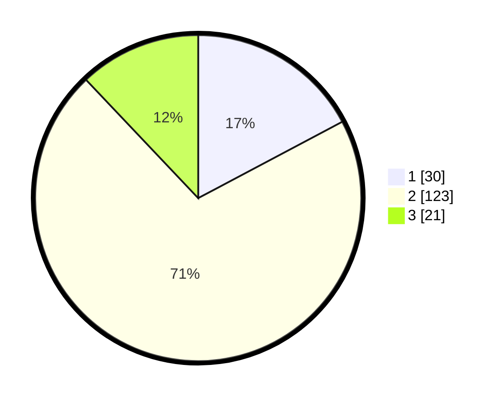

# Hasil

## Grafik

## Tabel

| No. | Nama Paslon    | Suara | Suara (raw) | Persentase |
|:--- |:-------------- | -----:| -----------:| ----------:|
| 1   | ANIES MUHAIMIN | 30    | [30][p-1]   | 17,24      |
| 2   | PRABOWO GIBRAN | 123   | [123][p-2]  | 70,69      |
| 3   | GANJAR MAHFUD  | 21    | [21][p-3]   | 12,07      |

[p-1]: https://github.com/gigit-pemilu/pemilu-2024-35-jawa-timur/blob/main/pilpres/hitung-suara/sub/35-jawa-timur/sub/09-jember/sub/08-puger/sub/2007-bagon/sub/014-tps/sub/paslon-1.txt
[p-2]: https://github.com/gigit-pemilu/pemilu-2024-35-jawa-timur/blob/main/pilpres/hitung-suara/sub/35-jawa-timur/sub/09-jember/sub/08-puger/sub/2007-bagon/sub/014-tps/sub/paslon-2.txt
[p-3]: https://github.com/gigit-pemilu/pemilu-2024-35-jawa-timur/blob/main/pilpres/hitung-suara/sub/35-jawa-timur/sub/09-jember/sub/08-puger/sub/2007-bagon/sub/014-tps/sub/paslon-3.txt

## Foto C Plano

https://sirekap-obj-formc.kpu.go.id/8a38/pemilu/ppwp/35/09/08/20/07/3509082007014-20240215-064533--1d6dd241-3fb0-497b-863a-2fdaa5c4adad.jpg

https://sirekap-obj-formc.kpu.go.id/8a38/pemilu/ppwp/35/09/08/20/07/3509082007014-20240215-064719--d02b26bc-9e06-4503-a3f6-79b8a43bb2c8.jpg

https://sirekap-obj-formc.kpu.go.id/8a38/pemilu/ppwp/35/09/08/20/07/3509082007014-20240215-064828--78c41c91-489b-4ec2-bf10-819699ada5cf.jpg

## Metadata

| Key        | Value               |
| ---------- | ------------------- |
| Time Stamp | 2024-02-25 16:00:00 |

