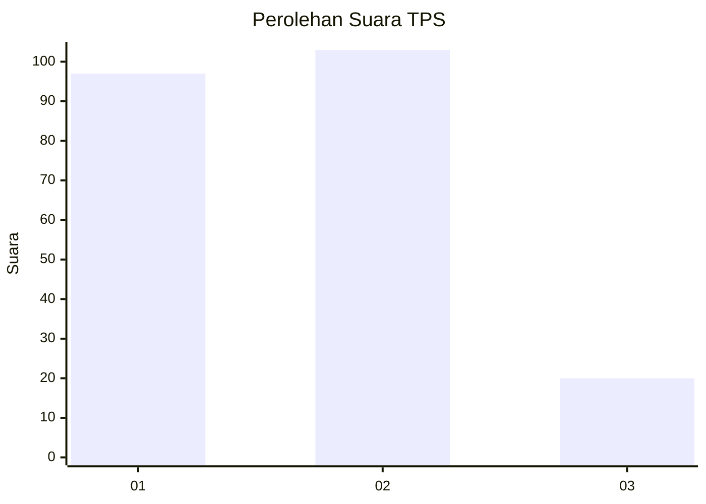
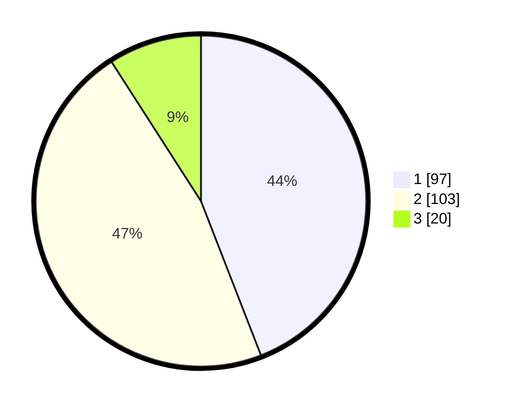

# Hasil

## Grafik

## Tabel

| No. | Nama Paslon    | Suara | Suara (raw) | Persentase |
|:--- |:-------------- | -----:| -----------:| ----------:|
| 1   | ANIES MUHAIMIN | 97    | [97][p-1]   | 44,09      |
| 2   | PRABOWO GIBRAN | 103   | [103][p-2]  | 46,82      |
| 3   | GANJAR MAHFUD  | 20    | [20][p-3]   | 9,09       |

[p-1]: https://github.com/gigit-pemilu/pemilu-2024-35-jawa-timur/blob/main/pilpres/hitung-suara/sub/35-jawa-timur/sub/09-jember/sub/08-puger/sub/2007-bagon/sub/016-tps/sub/paslon-1.txt
[p-2]: https://github.com/gigit-pemilu/pemilu-2024-35-jawa-timur/blob/main/pilpres/hitung-suara/sub/35-jawa-timur/sub/09-jember/sub/08-puger/sub/2007-bagon/sub/016-tps/sub/paslon-2.txt
[p-3]: https://github.com/gigit-pemilu/pemilu-2024-35-jawa-timur/blob/main/pilpres/hitung-suara/sub/35-jawa-timur/sub/09-jember/sub/08-puger/sub/2007-bagon/sub/016-tps/sub/paslon-3.txt

## Foto C Plano

https://sirekap-obj-formc.kpu.go.id/1c38/pemilu/ppwp/35/09/08/20/07/3509082007016-20240215-020854--5454f517-9da2-4231-b6cb-11d7753e774c.jpg

https://sirekap-obj-formc.kpu.go.id/1c38/pemilu/ppwp/35/09/08/20/07/3509082007016-20240215-020934--8abee17f-9b15-42bc-9d61-e921629f50d8.jpg

https://sirekap-obj-formc.kpu.go.id/1c38/pemilu/ppwp/35/09/08/20/07/3509082007016-20240215-021020--56fd56c0-6bb9-4aee-bfed-68e4329b4246.jpg

## Metadata

| Key        | Value               |
| ---------- | ------------------- |
| Time Stamp | 2024-02-24 22:31:28 |

