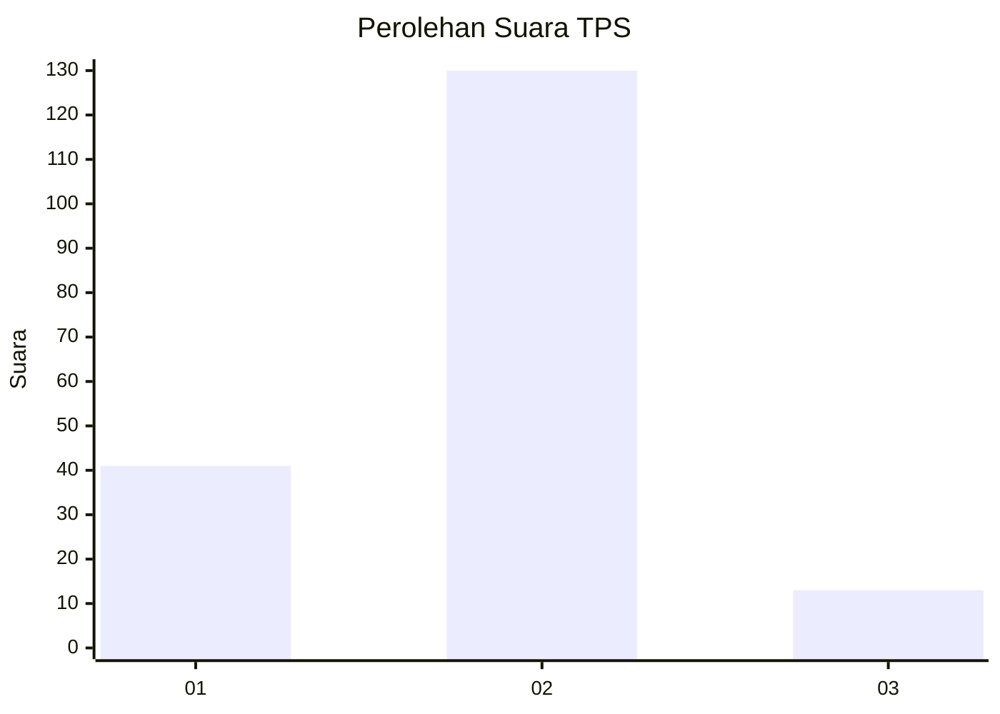
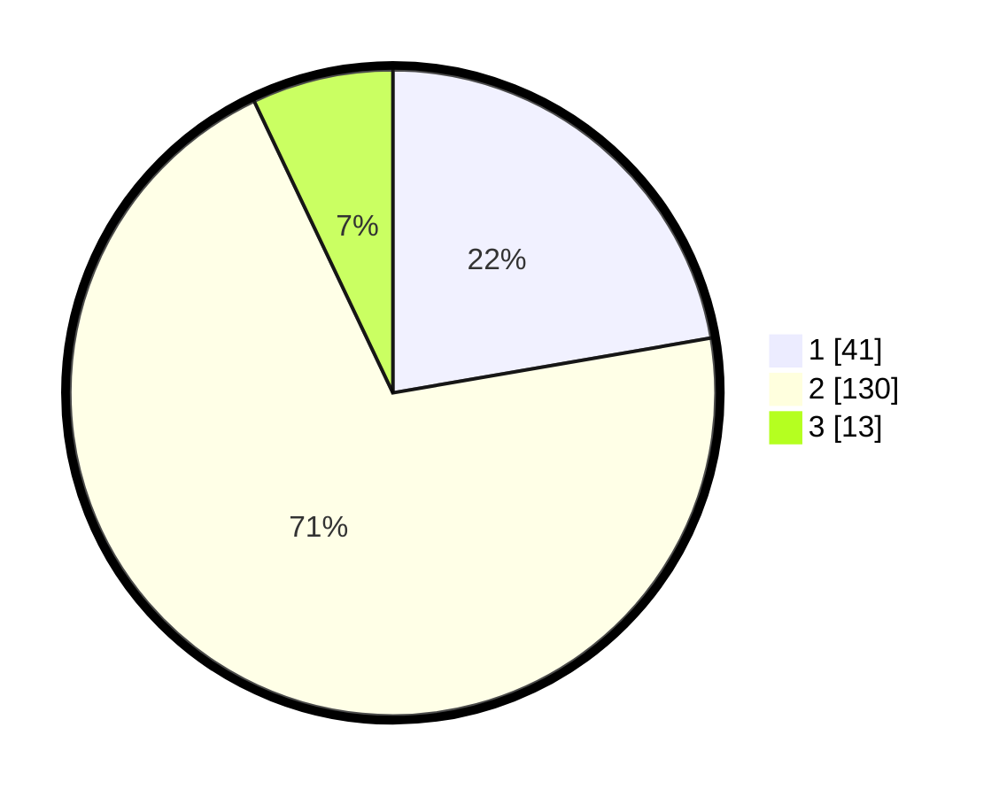

# Hasil

## Grafik

## Tabel

| No. | Nama Paslon    | Suara | Suara (raw) | Persentase |
|:--- |:-------------- | -----:| -----------:| ----------:|
| 1   | ANIES MUHAIMIN | 41    | [41][p-1]   | 22,28      |
| 2   | PRABOWO GIBRAN | 130   | [130][p-2]  | 70,65      |
| 3   | GANJAR MAHFUD  | 13    | [13][p-3]   | 7,07       |

[p-1]: https://github.com/gigit-pemilu/pemilu-2024/blob/main/pilpres/hitung-suara/sub/35-jawa-timur/sub/09-jember/sub/08-puger/sub/2007-bagon/sub/017-tps/sub/paslon-1.txt
[p-2]: https://github.com/gigit-pemilu/pemilu-2024/blob/main/pilpres/hitung-suara/sub/35-jawa-timur/sub/09-jember/sub/08-puger/sub/2007-bagon/sub/017-tps/sub/paslon-2.txt
[p-3]: https://github.com/gigit-pemilu/pemilu-2024/blob/main/pilpres/hitung-suara/sub/35-jawa-timur/sub/09-jember/sub/08-puger/sub/2007-bagon/sub/017-tps/sub/paslon-3.txt

## Foto C Plano

https://sirekap-obj-formc.kpu.go.id/3197/pemilu/ppwp/35/09/08/20/07/3509082007017-20240215-084712--7319b0e5-2ecb-4d1d-9afd-244df0e764d1.jpg

https://sirekap-obj-formc.kpu.go.id/3197/pemilu/ppwp/35/09/08/20/07/3509082007017-20240215-084836--498260fe-6ed8-4bee-a3cb-cd84c4e4241b.jpg

https://sirekap-obj-formc.kpu.go.id/3197/pemilu/ppwp/35/09/08/20/07/3509082007017-20240215-084927--0aed2d51-2360-4fb1-91d3-774d4c3864f6.jpg

## Metadata

| Key        | Value               |
| ---------- | ------------------- |
| Time Stamp | 2024-02-25 12:00:00 |

