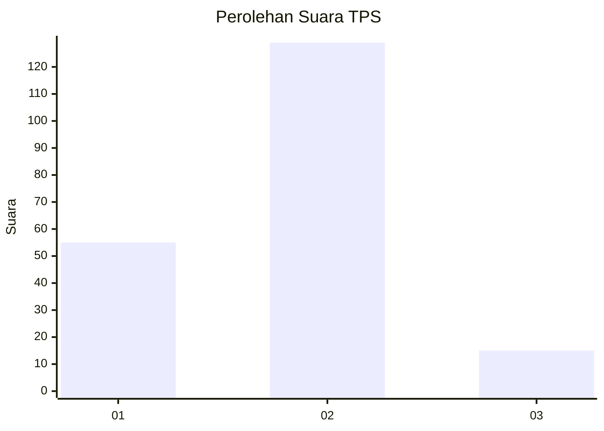
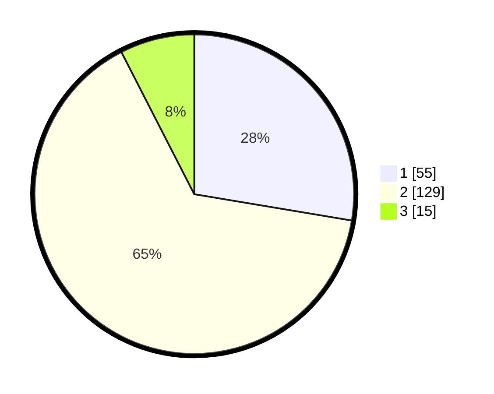

# Hasil

## Grafik

## Tabel

| No. | Nama Paslon    | Suara | Suara (raw) | Persentase |
|:--- |:-------------- | -----:| -----------:| ----------:|
| 1   | ANIES MUHAIMIN | 55    | [55][p-1]   | 27,64      |
| 2   | PRABOWO GIBRAN | 129   | [129][p-2]  | 64,82      |
| 3   | GANJAR MAHFUD  | 15    | [15][p-3]   | 7,54       |

[p-1]: https://github.com/gigit-pemilu/pemilu-2024-35-jawa-timur/blob/main/pilpres/hitung-suara/sub/35-jawa-timur/sub/09-jember/sub/08-puger/sub/2008-kasiyan-timur/sub/006-tps/sub/paslon-1.txt
[p-2]: https://github.com/gigit-pemilu/pemilu-2024-35-jawa-timur/blob/main/pilpres/hitung-suara/sub/35-jawa-timur/sub/09-jember/sub/08-puger/sub/2008-kasiyan-timur/sub/006-tps/sub/paslon-2.txt
[p-3]: https://github.com/gigit-pemilu/pemilu-2024-35-jawa-timur/blob/main/pilpres/hitung-suara/sub/35-jawa-timur/sub/09-jember/sub/08-puger/sub/2008-kasiyan-timur/sub/006-tps/sub/paslon-3.txt

## Foto C Plano

https://sirekap-obj-formc.kpu.go.id/2ba5/pemilu/ppwp/35/09/08/20/08/3509082008006-20240214-231737--30133863-b4d9-4467-92a7-6c2a84158ce6.jpg

https://sirekap-obj-formc.kpu.go.id/2ba5/pemilu/ppwp/35/09/08/20/08/3509082008006-20240214-232302--b76e09f2-0bc0-44ae-8bde-d37abe2d1939.jpg

https://sirekap-obj-formc.kpu.go.id/2ba5/pemilu/ppwp/35/09/08/20/08/3509082008006-20240214-232042--3b3d9b46-b849-4b09-9d53-73903705b29f.jpg

## Metadata

| Key        | Value               |
| ---------- | ------------------- |
| Time Stamp | 2024-02-24 22:31:28 |

