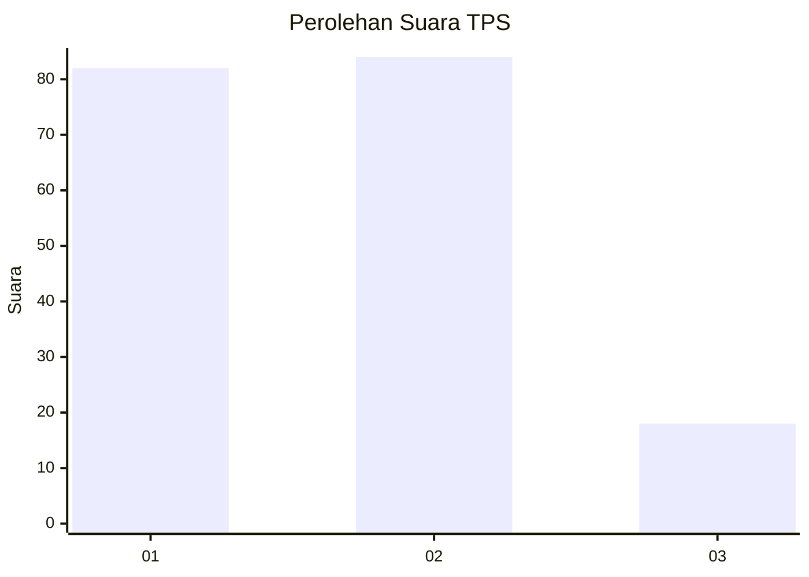
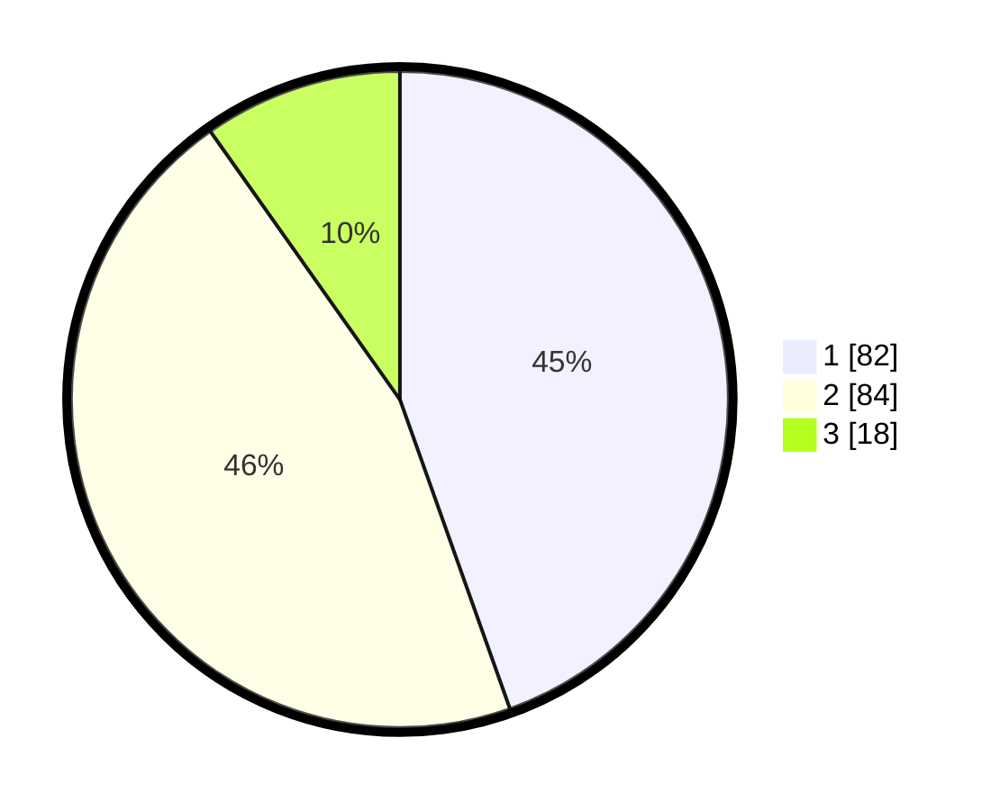

# Hasil

## Grafik

## Tabel

| No. | Nama Paslon    | Suara | Suara (raw) | Persentase |
|:--- |:-------------- | -----:| -----------:| ----------:|
| 1   | ANIES MUHAIMIN | 82    | [82][p-1]   | 44,57      |
| 2   | PRABOWO GIBRAN | 84    | [84][p-2]   | 45,65      |
| 3   | GANJAR MAHFUD  | 18    | [18][p-3]   | 9,78       |

[p-1]: https://github.com/gigit-pemilu/pemilu-2024/blob/main/pilpres/hitung-suara/sub/35-jawa-timur/sub/09-jember/sub/08-puger/sub/2008-kasiyan-timur/sub/011-tps/sub/paslon-1.txt
[p-2]: https://github.com/gigit-pemilu/pemilu-2024/blob/main/pilpres/hitung-suara/sub/35-jawa-timur/sub/09-jember/sub/08-puger/sub/2008-kasiyan-timur/sub/011-tps/sub/paslon-2.txt
[p-3]: https://github.com/gigit-pemilu/pemilu-2024/blob/main/pilpres/hitung-suara/sub/35-jawa-timur/sub/09-jember/sub/08-puger/sub/2008-kasiyan-timur/sub/011-tps/sub/paslon-3.txt

## Foto C Plano

https://sirekap-obj-formc.kpu.go.id/cdcd/pemilu/ppwp/35/09/08/20/08/3509082008011-20240214-194025--3fe8ad84-05b5-49e0-98a4-eec2b07a7257.jpg

https://sirekap-obj-formc.kpu.go.id/cdcd/pemilu/ppwp/35/09/08/20/08/3509082008011-20240214-194436--5764d737-4479-49ea-bb89-240d200fe679.jpg

https://sirekap-obj-formc.kpu.go.id/cdcd/pemilu/ppwp/35/09/08/20/08/3509082008011-20240214-194603--d1563d3d-0499-47b6-a135-87767d00446e.jpg

## Metadata

| Key        | Value               |
| ---------- | ------------------- |
| Time Stamp | 2024-02-24 22:31:28 |

