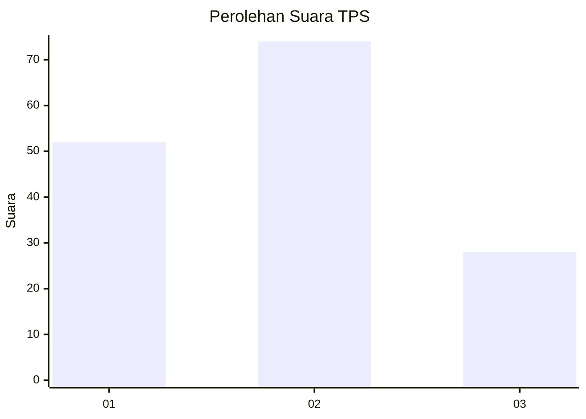
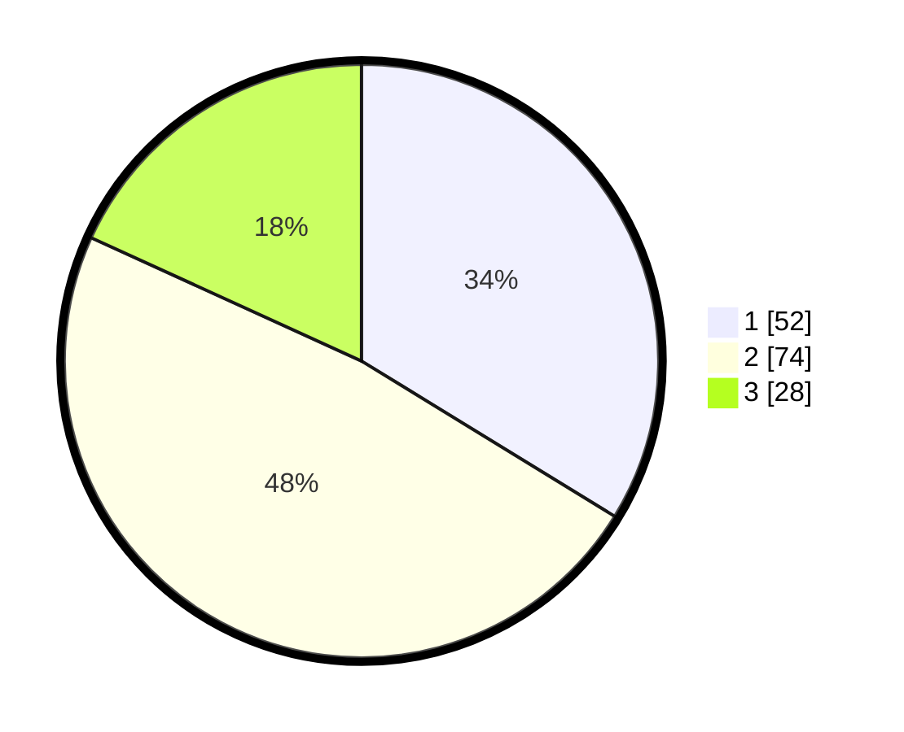

# Hasil

## Grafik

## Tabel

| No. | Nama Paslon    | Suara | Suara (raw) | Persentase |
|:--- |:-------------- | -----:| -----------:| ----------:|
| 1   | ANIES MUHAIMIN | 52    | [52][p-1]   | 33,77      |
| 2   | PRABOWO GIBRAN | 74    | [74][p-2]   | 48,05      |
| 3   | GANJAR MAHFUD  | 28    | [28][p-3]   | 18,18      |

[p-1]: https://github.com/gigit-pemilu/pemilu-2024-35-jawa-timur/blob/main/pilpres/hitung-suara/sub/35-jawa-timur/sub/09-jember/sub/08-puger/sub/2008-kasiyan-timur/sub/012-tps/sub/paslon-1.txt
[p-2]: https://github.com/gigit-pemilu/pemilu-2024-35-jawa-timur/blob/main/pilpres/hitung-suara/sub/35-jawa-timur/sub/09-jember/sub/08-puger/sub/2008-kasiyan-timur/sub/012-tps/sub/paslon-2.txt
[p-3]: https://github.com/gigit-pemilu/pemilu-2024-35-jawa-timur/blob/main/pilpres/hitung-suara/sub/35-jawa-timur/sub/09-jember/sub/08-puger/sub/2008-kasiyan-timur/sub/012-tps/sub/paslon-3.txt

## Foto C Plano

https://sirekap-obj-formc.kpu.go.id/2af0/pemilu/ppwp/35/09/08/20/08/3509082008012-20240215-161357--9c871baa-c216-49d8-9e8b-176e372a145b.jpg

https://sirekap-obj-formc.kpu.go.id/2af0/pemilu/ppwp/35/09/08/20/08/3509082008012-20240215-161501--e75db089-8c37-42bb-874c-295251293884.jpg

https://sirekap-obj-formc.kpu.go.id/2af0/pemilu/ppwp/35/09/08/20/08/3509082008012-20240215-161535--d9fa2b17-e73c-4725-b4ff-fc9089fe7d94.jpg

## Metadata

| Key        | Value               |
| ---------- | ------------------- |
| Time Stamp | 2024-02-24 22:31:28 |

