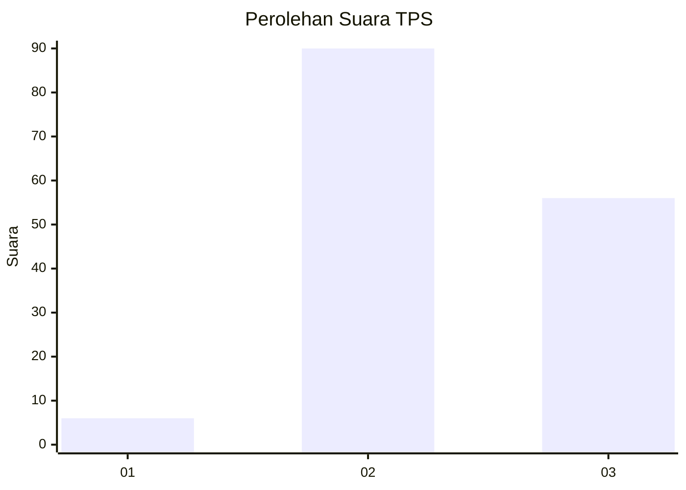
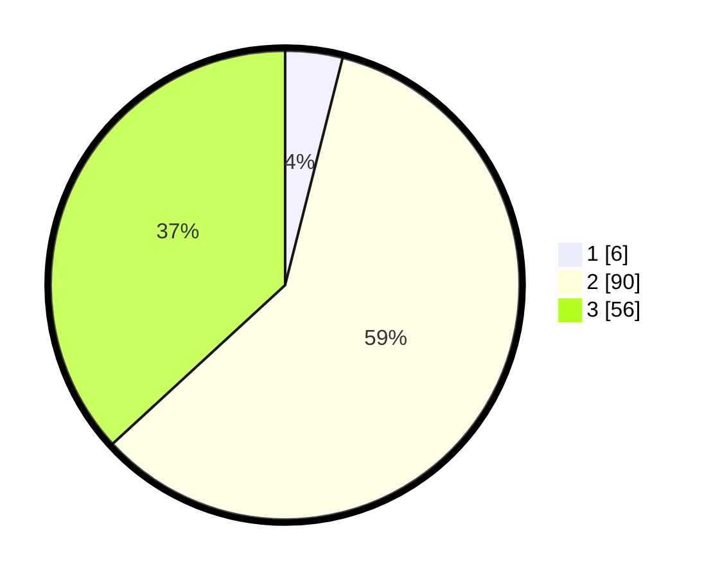

# Hasil

## Grafik

## Tabel

| No. | Nama Paslon    | Suara | Suara (raw) | Persentase |
|:--- |:-------------- | -----:| -----------:| ----------:|
| 1   | ANIES MUHAIMIN | 6     | [6][p-1]    | 3,95       |
| 2   | PRABOWO GIBRAN | 90    | [90][p-2]   | 59,21      |
| 3   | GANJAR MAHFUD  | 56    | [56][p-3]   | 36,84      |

[p-1]: https://github.com/gigit-pemilu/pemilu-2024/blob/main/pilpres/hitung-suara/sub/35-jawa-timur/sub/09-jember/sub/08-puger/sub/2008-kasiyan-timur/sub/034-tps/sub/paslon-1.txt
[p-2]: https://github.com/gigit-pemilu/pemilu-2024/blob/main/pilpres/hitung-suara/sub/35-jawa-timur/sub/09-jember/sub/08-puger/sub/2008-kasiyan-timur/sub/034-tps/sub/paslon-2.txt
[p-3]: https://github.com/gigit-pemilu/pemilu-2024/blob/main/pilpres/hitung-suara/sub/35-jawa-timur/sub/09-jember/sub/08-puger/sub/2008-kasiyan-timur/sub/034-tps/sub/paslon-3.txt

## Foto C Plano

https://sirekap-obj-formc.kpu.go.id/a939/pemilu/ppwp/35/09/08/20/08/3509082008034-20240215-004824--d3f38e1f-726c-4103-8516-76acb00bf1a0.jpg

https://sirekap-obj-formc.kpu.go.id/a939/pemilu/ppwp/35/09/08/20/08/3509082008034-20240215-005520--c0a53ef1-c3ac-454f-b5a0-8cd1b46f868b.jpg

https://sirekap-obj-formc.kpu.go.id/a939/pemilu/ppwp/35/09/08/20/08/3509082008034-20240215-005705--16590501-0227-4a24-99d7-8cb4b179d1e6.jpg

## Metadata

| Key        | Value               |
| ---------- | ------------------- |
| Time Stamp | 2024-02-25 00:00:00 |

