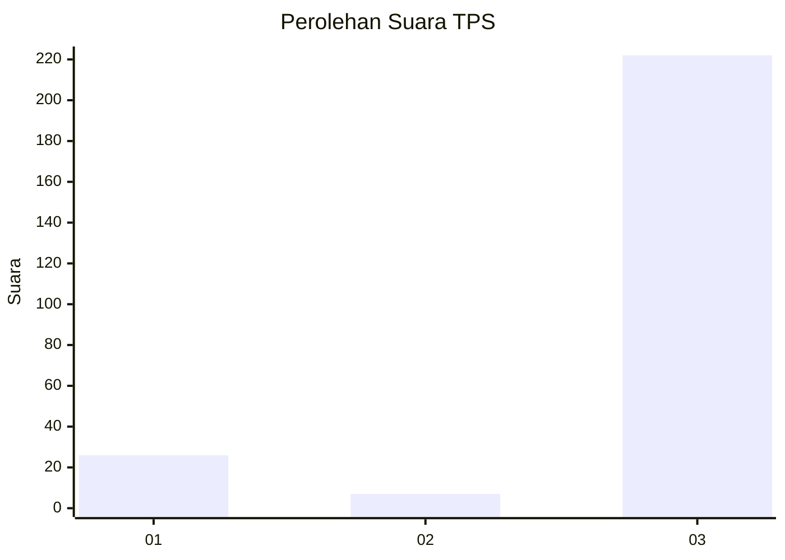
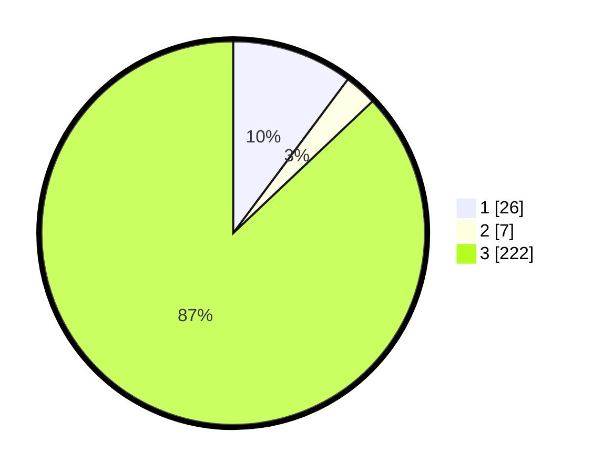

# Hasil

## Grafik

## Tabel

| No. | Nama Paslon    | Suara | Suara (raw) | Persentase |
|:--- |:-------------- | -----:| -----------:| ----------:|
| 1   | ANIES MUHAIMIN | 26    | [26][p-1]   | 10,20      |
| 2   | PRABOWO GIBRAN | 7     | [7][p-2]    | 2,75       |
| 3   | GANJAR MAHFUD  | 222   | [222][p-3]  | 87,06      |

[p-1]: https://github.com/gigit-pemilu/pemilu-2024-35-jawa-timur/blob/main/pilpres/hitung-suara/sub/35-jawa-timur/sub/09-jember/sub/08-puger/sub/2008-kasiyan-timur/sub/036-tps/sub/paslon-1.txt
[p-2]: https://github.com/gigit-pemilu/pemilu-2024-35-jawa-timur/blob/main/pilpres/hitung-suara/sub/35-jawa-timur/sub/09-jember/sub/08-puger/sub/2008-kasiyan-timur/sub/036-tps/sub/paslon-2.txt
[p-3]: https://github.com/gigit-pemilu/pemilu-2024-35-jawa-timur/blob/main/pilpres/hitung-suara/sub/35-jawa-timur/sub/09-jember/sub/08-puger/sub/2008-kasiyan-timur/sub/036-tps/sub/paslon-3.txt

## Foto C Plano

https://sirekap-obj-formc.kpu.go.id/5aee/pemilu/ppwp/35/09/08/20/08/3509082008036-20240220-100239--38e518df-ecce-4959-8b62-81e48e2aab47.jpg

https://sirekap-obj-formc.kpu.go.id/5aee/pemilu/ppwp/35/09/08/20/08/3509082008036-20240220-100323--0f5060a0-b27b-4e9f-8d52-8a1460fdac8a.jpg

https://sirekap-obj-formc.kpu.go.id/5aee/pemilu/ppwp/35/09/08/20/08/3509082008036-20240220-100406--3bb6cad1-b5a9-45bb-97df-cb50bc43a8e9.jpg

## Metadata

| Key        | Value               |
| ---------- | ------------------- |
| Time Stamp | 2024-02-20 11:00:00 |

## DATA PEMILIH TETAP

Jumlah pemilih dalam DPT: **0**.
 * L: **0**.
 * P: **0**.

## DATA PENGGUNA HAK PILIH

Jumlah pengguna hak pilih dalam DPT: **0**.
 * L: **0**.
 * P: **0**.

Jumlah pengguna hak pilih dalam DPTb: **178**.
 * L: **255**.
 * P: **96**.

Jumlah pengguna hak pilih dalam DPK: **5**.
 * L: **0**.
 * P: **0**.

Jumlah pengguna hak pilih: **55**.
 * L: **0**.
 * P: **0**.

## JUMLAH SUARA SAH DAN TIDAK SAH

JUMLAH SELURUH SUARA SAH: **179**.

JUMLAH SUARA TIDAK SAH: **5**.

JUMLAH SELURUH SUARA SAH DAN SUARA TIDAK SAH: **179**.

