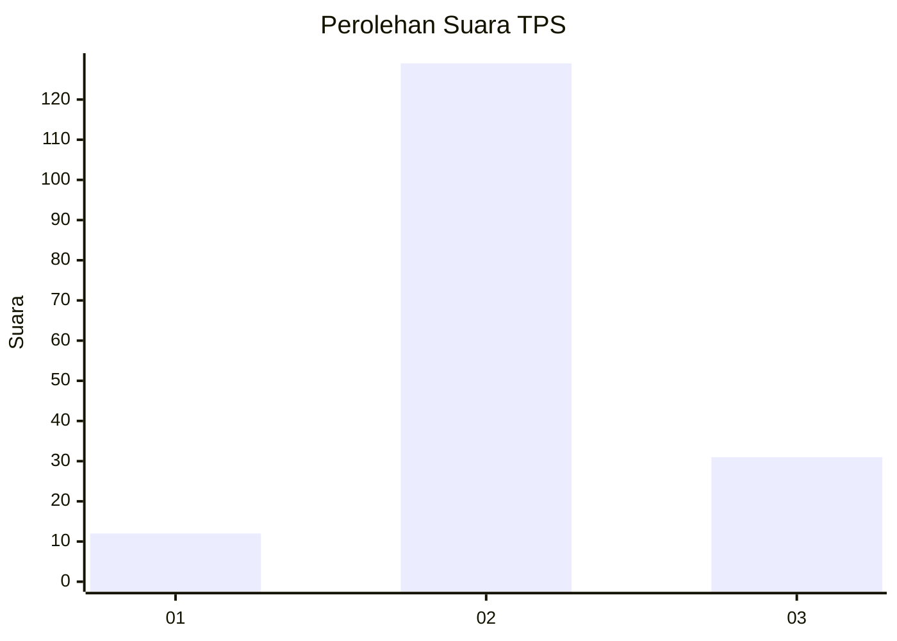

# Hasil

## Grafik

## Tabel

| No. | Nama Paslon    | Suara | Suara (raw) | Persentase |
|:--- |:-------------- | -----:| -----------:| ----------:|
| 1   | ANIES MUHAIMIN | 12    | [12][p-1]   | 6,98       |
| 2   | PRABOWO GIBRAN | 129   | [129][p-2]  | 75,00      |
| 3   | GANJAR MAHFUD  | 31    | [31][p-3]   | 18,02      |

[p-1]: https://github.com/gigit-pemilu/pemilu-2024/blob/main/pilpres/hitung-suara/sub/35-jawa-timur/sub/09-jember/sub/08-puger/sub/2009-wonosari/sub/001-tps/sub/paslon-1.txt
[p-2]: https://github.com/gigit-pemilu/pemilu-2024/blob/main/pilpres/hitung-suara/sub/35-jawa-timur/sub/09-jember/sub/08-puger/sub/2009-wonosari/sub/001-tps/sub/paslon-2.txt
[p-3]: https://github.com/gigit-pemilu/pemilu-2024/blob/main/pilpres/hitung-suara/sub/35-jawa-timur/sub/09-jember/sub/08-puger/sub/2009-wonosari/sub/001-tps/sub/paslon-3.txt

## Foto C Plano

https://sirekap-obj-formc.kpu.go.id/803e/pemilu/ppwp/35/09/08/20/09/3509082009001-20240215-010544--7914e84c-ffdb-498f-a19c-e67b0aeea241.jpg

https://sirekap-obj-formc.kpu.go.id/803e/pemilu/ppwp/35/09/08/20/09/3509082009001-20240215-010727--b5196626-2dcc-45ea-b946-ef2a979e5fd1.jpg

https://sirekap-obj-formc.kpu.go.id/803e/pemilu/ppwp/35/09/08/20/09/3509082009001-20240215-010833--54a4da90-3f58-4610-821f-71f69ea38e45.jpg

## Metadata

| Key        | Value               |
| ---------- | ------------------- |
| Time Stamp | 2024-02-25 11:00:00 |

