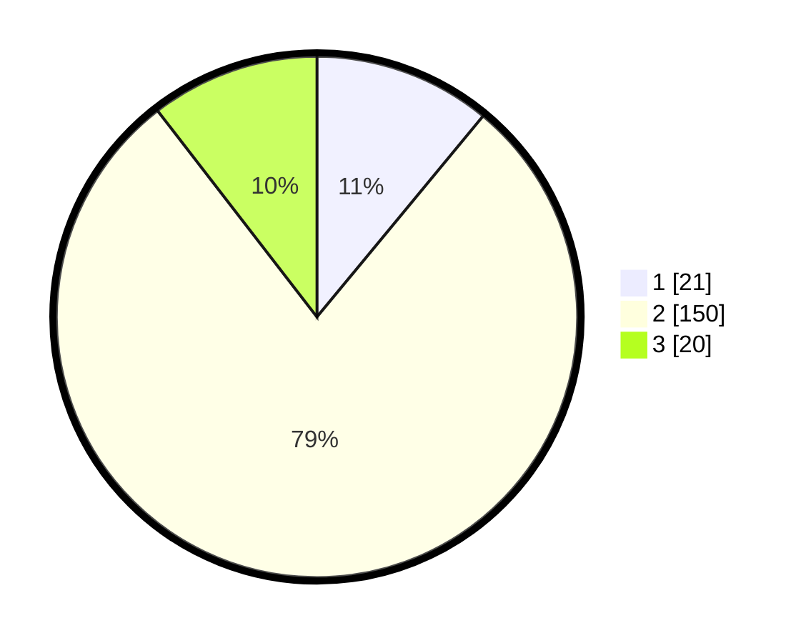

# Hasil

## Grafik

## Tabel

| No. | Nama Paslon    | Suara | Suara (raw) | Persentase |
|:--- |:-------------- | -----:| -----------:| ----------:|
| 1   | ANIES MUHAIMIN | 21    | [21][p-1]   | 10,99      |
| 2   | PRABOWO GIBRAN | 150   | [150][p-2]  | 78,53      |
| 3   | GANJAR MAHFUD  | 20    | [20][p-3]   | 10,47      |

[p-1]: https://github.com/gigit-pemilu/pemilu-2024/blob/main/pilpres/hitung-suara/sub/35-jawa-timur/sub/09-jember/sub/08-puger/sub/2009-wonosari/sub/002-tps/sub/paslon-1.txt
[p-2]: https://github.com/gigit-pemilu/pemilu-2024/blob/main/pilpres/hitung-suara/sub/35-jawa-timur/sub/09-jember/sub/08-puger/sub/2009-wonosari/sub/002-tps/sub/paslon-2.txt
[p-3]: https://github.com/gigit-pemilu/pemilu-2024/blob/main/pilpres/hitung-suara/sub/35-jawa-timur/sub/09-jember/sub/08-puger/sub/2009-wonosari/sub/002-tps/sub/paslon-3.txt

## Foto C Plano

https://sirekap-obj-formc.kpu.go.id/460d/pemilu/ppwp/35/09/08/20/09/3509082009002-20240223-160525--827273e7-e57f-4903-b5f4-50de67851b09.jpg

https://sirekap-obj-formc.kpu.go.id/460d/pemilu/ppwp/35/09/08/20/09/3509082009002-20240223-160721--f7359a5c-7b9b-49af-93b8-c5fd32a127e2.jpg

https://sirekap-obj-formc.kpu.go.id/460d/pemilu/ppwp/35/09/08/20/09/3509082009002-20240223-160921--538ce84b-f435-4e7a-859d-61a5ff5f35b8.jpg

## Metadata

| Key        | Value               |
| ---------- | ------------------- |
| Time Stamp | 2024-02-24 22:31:28 |

