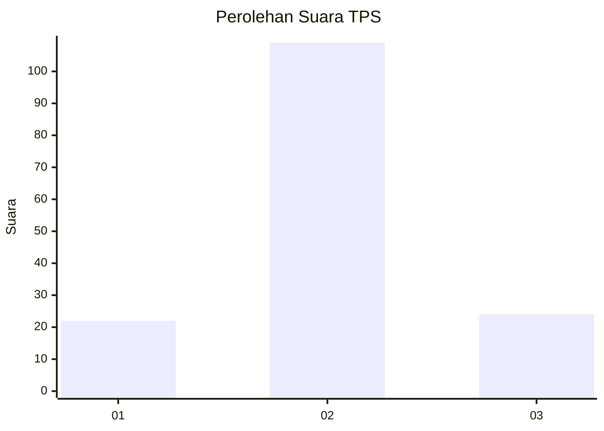

# Hasil

## Grafik

## Tabel

| No. | Nama Paslon    | Suara | Suara (raw) | Persentase |
|:--- |:-------------- | -----:| -----------:| ----------:|
| 1   | ANIES MUHAIMIN | 22    | [22][p-1]   | 14,19      |
| 2   | PRABOWO GIBRAN | 109   | [109][p-2]  | 70,32      |
| 3   | GANJAR MAHFUD  | 24    | [24][p-3]   | 15,48      |

[p-1]: https://github.com/gigit-pemilu/pemilu-2024-35-jawa-timur/blob/main/pilpres/hitung-suara/sub/35-jawa-timur/sub/09-jember/sub/08-puger/sub/2009-wonosari/sub/004-tps/sub/paslon-1.txt
[p-2]: https://github.com/gigit-pemilu/pemilu-2024-35-jawa-timur/blob/main/pilpres/hitung-suara/sub/35-jawa-timur/sub/09-jember/sub/08-puger/sub/2009-wonosari/sub/004-tps/sub/paslon-2.txt
[p-3]: https://github.com/gigit-pemilu/pemilu-2024-35-jawa-timur/blob/main/pilpres/hitung-suara/sub/35-jawa-timur/sub/09-jember/sub/08-puger/sub/2009-wonosari/sub/004-tps/sub/paslon-3.txt

## Foto C Plano

https://sirekap-obj-formc.kpu.go.id/c43c/pemilu/ppwp/35/09/08/20/09/3509082009004-20240223-161502--f87bf47e-0ed7-400b-ab8f-b2f1d3e3403f.jpg

https://sirekap-obj-formc.kpu.go.id/c43c/pemilu/ppwp/35/09/08/20/09/3509082009004-20240223-161717--16a6f179-361c-422a-a2f4-5cfa5f19bed1.jpg

https://sirekap-obj-formc.kpu.go.id/c43c/pemilu/ppwp/35/09/08/20/09/3509082009004-20240223-161843--63a6a2d7-72ec-470a-907b-b35f86d41073.jpg

## Metadata

| Key        | Value               |
| ---------- | ------------------- |
| Time Stamp | 2024-02-25 16:00:00 |

