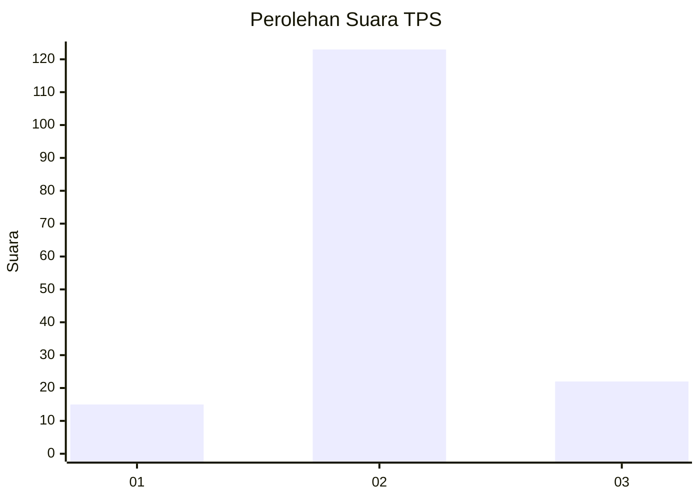
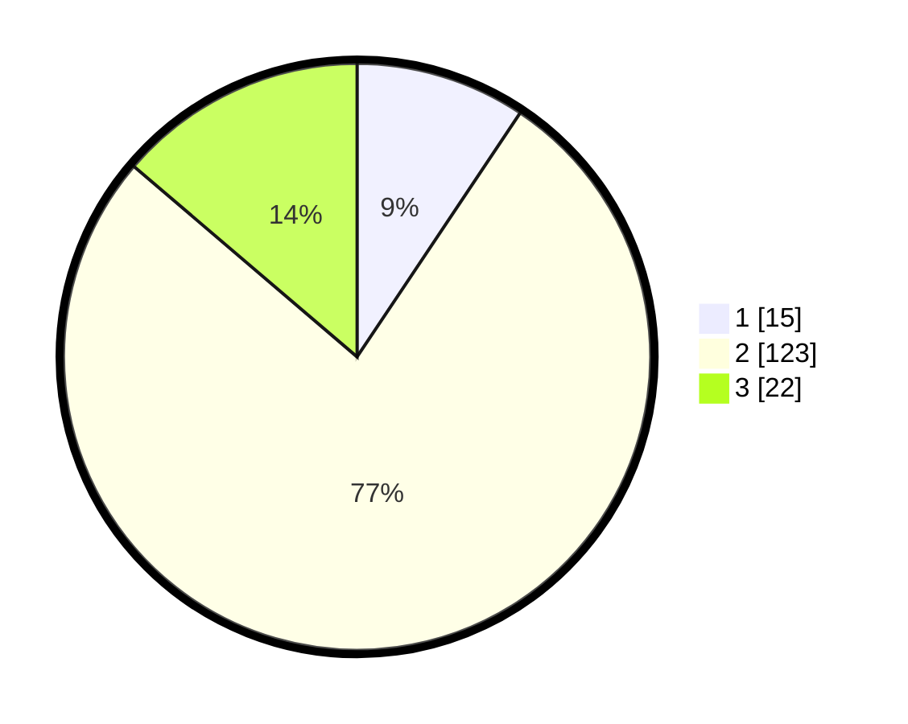

# Hasil

## Grafik

## Tabel

| No. | Nama Paslon    | Suara | Suara (raw) | Persentase |
|:--- |:-------------- | -----:| -----------:| ----------:|
| 1   | ANIES MUHAIMIN | 15    | [15][p-1]   | 9,38       |
| 2   | PRABOWO GIBRAN | 123   | [123][p-2]  | 76,88      |
| 3   | GANJAR MAHFUD  | 22    | [22][p-3]   | 13,75      |

[p-1]: https://github.com/gigit-pemilu/pemilu-2024/blob/main/pilpres/hitung-suara/sub/35-jawa-timur/sub/09-jember/sub/08-puger/sub/2009-wonosari/sub/006-tps/sub/paslon-1.txt
[p-2]: https://github.com/gigit-pemilu/pemilu-2024/blob/main/pilpres/hitung-suara/sub/35-jawa-timur/sub/09-jember/sub/08-puger/sub/2009-wonosari/sub/006-tps/sub/paslon-2.txt
[p-3]: https://github.com/gigit-pemilu/pemilu-2024/blob/main/pilpres/hitung-suara/sub/35-jawa-timur/sub/09-jember/sub/08-puger/sub/2009-wonosari/sub/006-tps/sub/paslon-3.txt

## Foto C Plano

https://sirekap-obj-formc.kpu.go.id/6704/pemilu/ppwp/35/09/08/20/09/3509082009006-20240223-215259--493438c2-8499-4920-a0a6-28daa8b2548d.jpg

https://sirekap-obj-formc.kpu.go.id/6704/pemilu/ppwp/35/09/08/20/09/3509082009006-20240223-215402--6ccaa123-ddde-47ab-80c6-470a337eadbd.jpg

https://sirekap-obj-formc.kpu.go.id/6704/pemilu/ppwp/35/09/08/20/09/3509082009006-20240223-215529--9386b23a-c107-4156-b62d-de9d71e5e48f.jpg

## Metadata

| Key        | Value               |
| ---------- | ------------------- |
| Time Stamp | 2024-02-25 11:00:00 |

