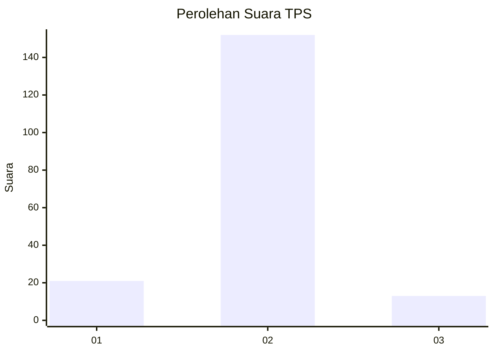
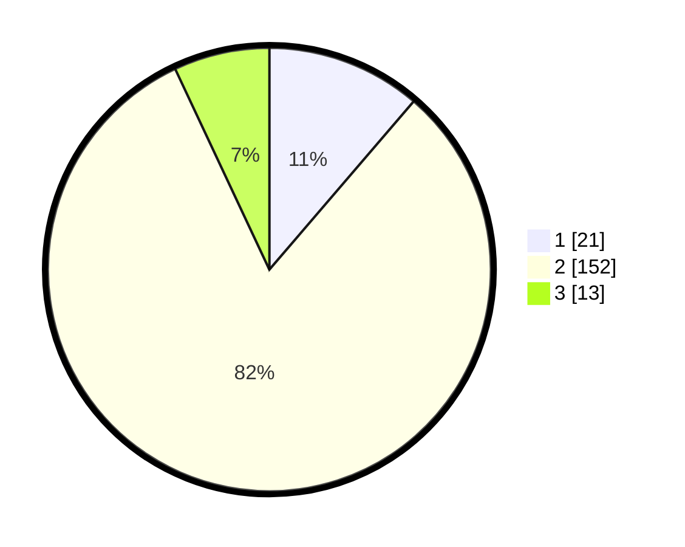

# Hasil

## Grafik

## Tabel

| No. | Nama Paslon    | Suara | Suara (raw) | Persentase |
|:--- |:-------------- | -----:| -----------:| ----------:|
| 1   | ANIES MUHAIMIN | 21    | [21][p-1]   | 11,29      |
| 2   | PRABOWO GIBRAN | 152   | [152][p-2]  | 81,72      |
| 3   | GANJAR MAHFUD  | 13    | [13][p-3]   | 6,99       |

[p-1]: https://github.com/gigit-pemilu/pemilu-2024/blob/main/pilpres/hitung-suara/sub/35-jawa-timur/sub/09-jember/sub/08-puger/sub/2009-wonosari/sub/011-tps/sub/paslon-1.txt
[p-2]: https://github.com/gigit-pemilu/pemilu-2024/blob/main/pilpres/hitung-suara/sub/35-jawa-timur/sub/09-jember/sub/08-puger/sub/2009-wonosari/sub/011-tps/sub/paslon-2.txt
[p-3]: https://github.com/gigit-pemilu/pemilu-2024/blob/main/pilpres/hitung-suara/sub/35-jawa-timur/sub/09-jember/sub/08-puger/sub/2009-wonosari/sub/011-tps/sub/paslon-3.txt

## Foto C Plano

https://sirekap-obj-formc.kpu.go.id/add3/pemilu/ppwp/35/09/08/20/09/3509082009011-20240214-221245--315c356e-013b-46da-8fa9-7dfec77b41a7.jpg

https://sirekap-obj-formc.kpu.go.id/add3/pemilu/ppwp/35/09/08/20/09/3509082009011-20240214-221156--aa55b4e3-49f2-42e7-a824-b488112ebc08.jpg

https://sirekap-obj-formc.kpu.go.id/add3/pemilu/ppwp/35/09/08/20/09/3509082009011-20240214-221333--0d2660a2-1f5c-4957-bc3d-9c36bb4caf6f.jpg

## Metadata

| Key        | Value               |
| ---------- | ------------------- |
| Time Stamp | 2024-02-25 21:00:00 |

