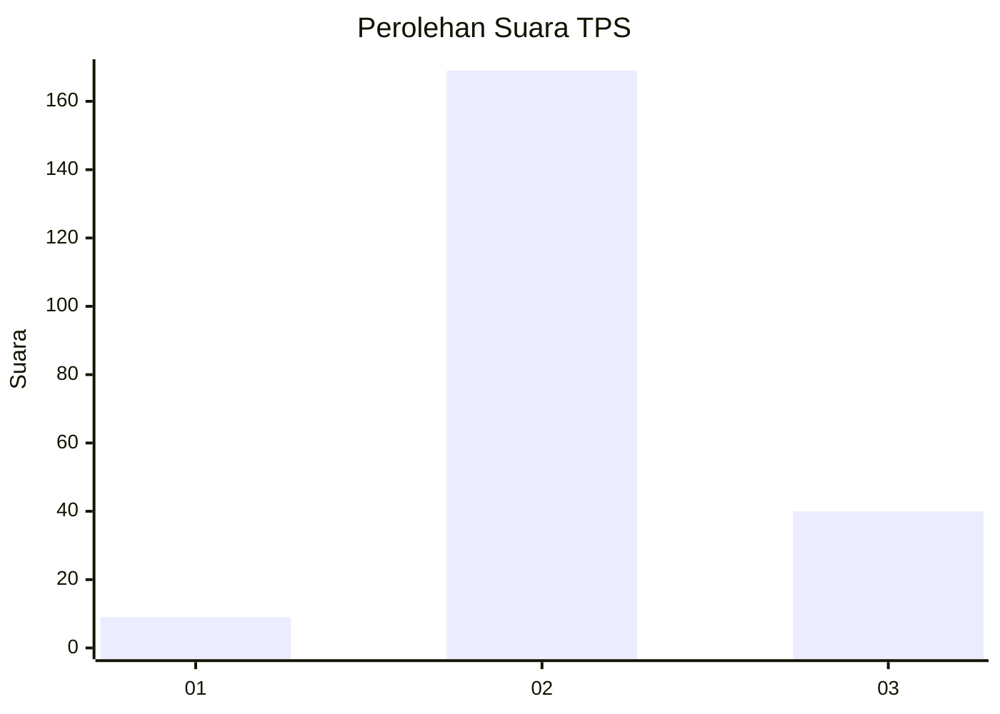

# Hasil

## Grafik

## Tabel

| No. | Nama Paslon    | Suara | Suara (raw) | Persentase |
|:--- |:-------------- | -----:| -----------:| ----------:|
| 1   | ANIES MUHAIMIN | 9     | [9][p-1]    | 4,13       |
| 2   | PRABOWO GIBRAN | 169   | [169][p-2]  | 77,52      |
| 3   | GANJAR MAHFUD  | 40    | [40][p-3]   | 18,35      |

[p-1]: https://github.com/gigit-pemilu/pemilu-2024/blob/main/pilpres/hitung-suara/sub/35-jawa-timur/sub/09-jember/sub/08-puger/sub/2009-wonosari/sub/013-tps/sub/paslon-1.txt
[p-2]: https://github.com/gigit-pemilu/pemilu-2024/blob/main/pilpres/hitung-suara/sub/35-jawa-timur/sub/09-jember/sub/08-puger/sub/2009-wonosari/sub/013-tps/sub/paslon-2.txt
[p-3]: https://github.com/gigit-pemilu/pemilu-2024/blob/main/pilpres/hitung-suara/sub/35-jawa-timur/sub/09-jember/sub/08-puger/sub/2009-wonosari/sub/013-tps/sub/paslon-3.txt

## Foto C Plano

https://sirekap-obj-formc.kpu.go.id/cb12/pemilu/ppwp/35/09/08/20/09/3509082009013-20240223-221336--1d2a505d-8030-41aa-bf3d-afae8e1c5efc.jpg

https://sirekap-obj-formc.kpu.go.id/cb12/pemilu/ppwp/35/09/08/20/09/3509082009013-20240223-221439--1b0c815b-1eea-4e93-bfcb-5600c94c1293.jpg

https://sirekap-obj-formc.kpu.go.id/cb12/pemilu/ppwp/35/09/08/20/09/3509082009013-20240223-221610--2680e26f-7fa4-43a2-ac65-581cd71901ce.jpg

## Metadata

| Key        | Value               |
| ---------- | ------------------- |
| Time Stamp | 2024-02-24 22:31:28 |

