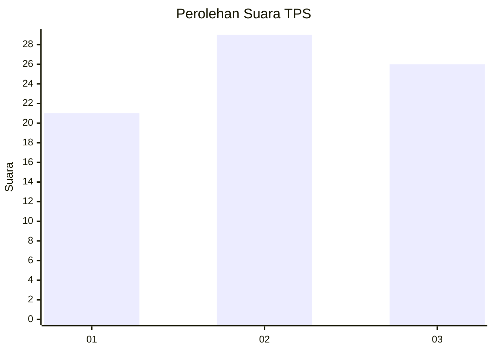
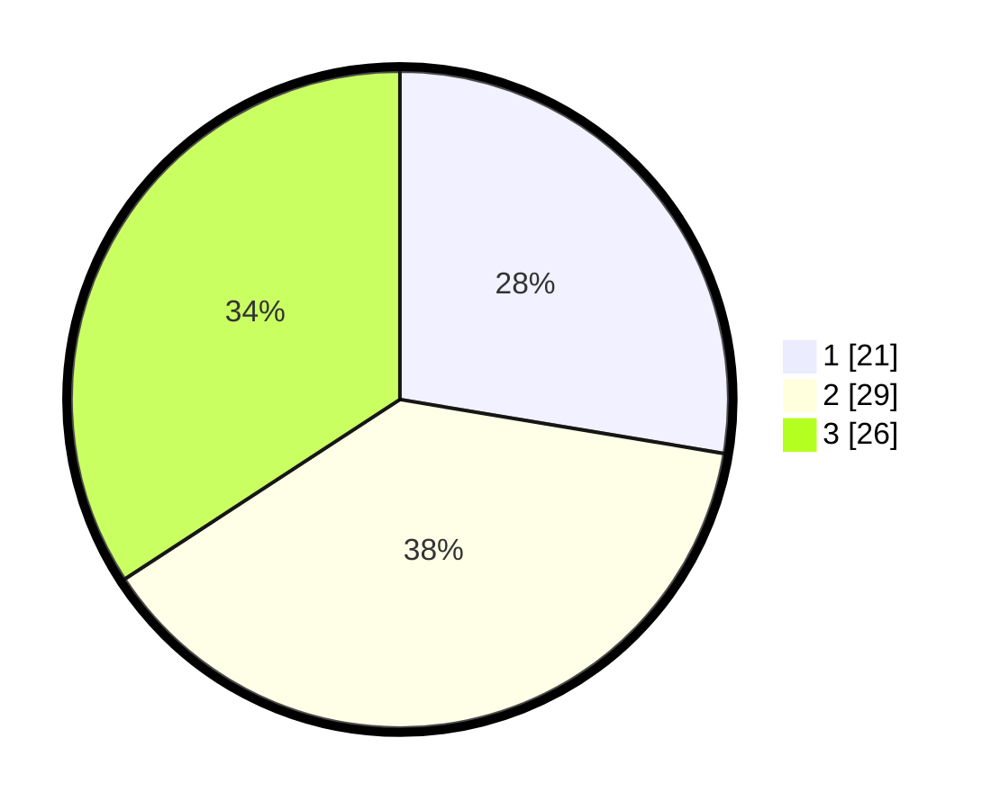

# Hasil

## Grafik

## Tabel

| No. | Nama Paslon    | Suara | Suara (raw) | Persentase |
|:--- |:-------------- | -----:| -----------:| ----------:|
| 1   | ANIES MUHAIMIN | 21    | [21][p-1]   | 27,63      |
| 2   | PRABOWO GIBRAN | 29    | [29][p-2]   | 38,16      |
| 3   | GANJAR MAHFUD  | 26    | [26][p-3]   | 34,21      |

[p-1]: https://github.com/gigit-pemilu/pemilu-2024-35-jawa-timur/blob/main/pilpres/hitung-suara/sub/35-jawa-timur/sub/09-jember/sub/08-puger/sub/2009-wonosari/sub/025-tps/sub/paslon-1.txt
[p-2]: https://github.com/gigit-pemilu/pemilu-2024-35-jawa-timur/blob/main/pilpres/hitung-suara/sub/35-jawa-timur/sub/09-jember/sub/08-puger/sub/2009-wonosari/sub/025-tps/sub/paslon-2.txt
[p-3]: https://github.com/gigit-pemilu/pemilu-2024-35-jawa-timur/blob/main/pilpres/hitung-suara/sub/35-jawa-timur/sub/09-jember/sub/08-puger/sub/2009-wonosari/sub/025-tps/sub/paslon-3.txt

## Foto C Plano

https://sirekap-obj-formc.kpu.go.id/426c/pemilu/ppwp/35/09/08/20/09/3509082009025-20240224-115526--30973073-2044-4864-a015-f43a6985ae38.jpg

https://sirekap-obj-formc.kpu.go.id/426c/pemilu/ppwp/35/09/08/20/09/3509082009025-20240224-115353--1543e2bb-cf68-4571-94e1-1cd8a72f5475.jpg

https://sirekap-obj-formc.kpu.go.id/426c/pemilu/ppwp/35/09/08/20/09/3509082009025-20240224-115438--0ac7dc7e-5610-47f4-b506-60556101ffce.jpg

## Metadata

| Key        | Value               |
| ---------- | ------------------- |
| Time Stamp | 2024-02-25 21:00:00 |

