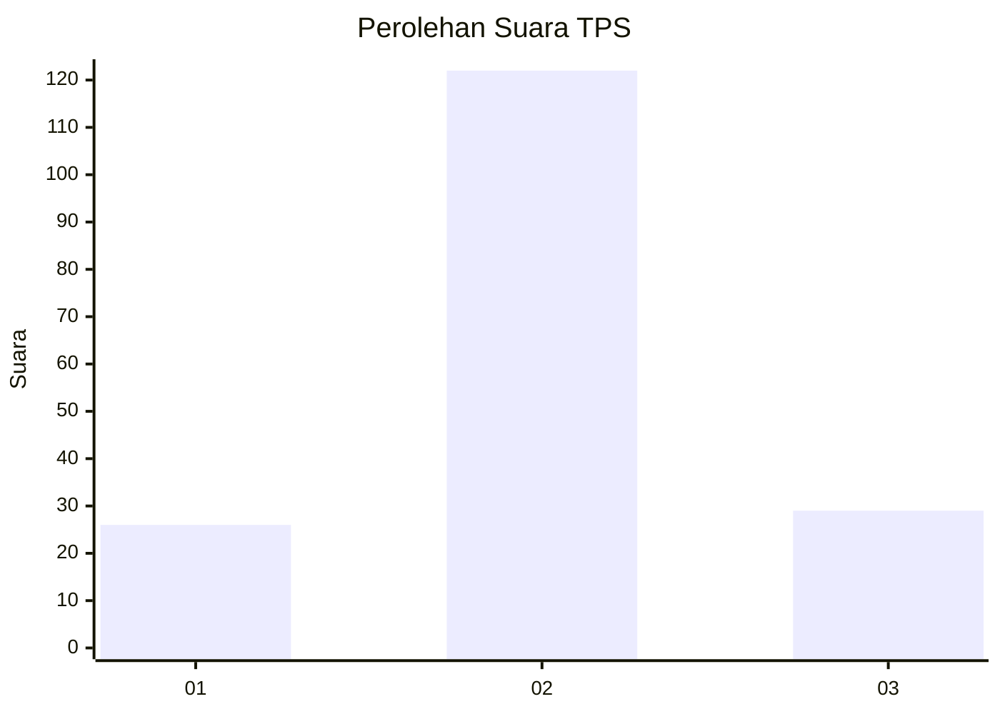
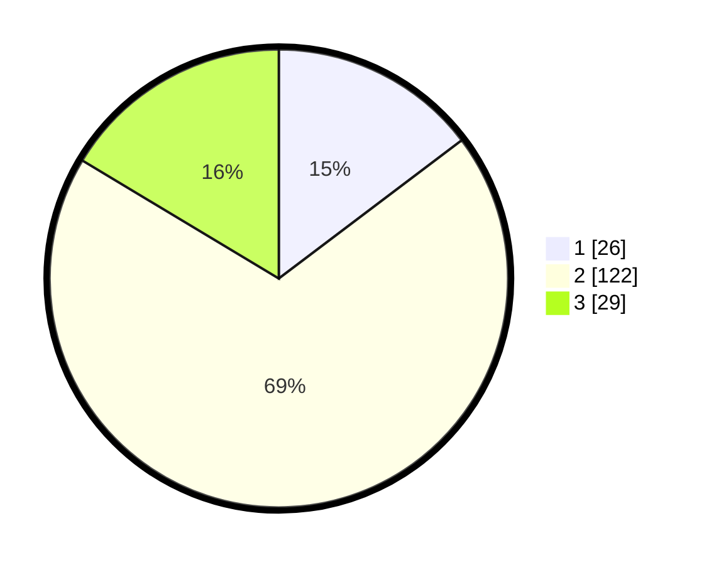

# Hasil

## Grafik

## Tabel

| No. | Nama Paslon    | Suara | Suara (raw) | Persentase |
|:--- |:-------------- | -----:| -----------:| ----------:|
| 1   | ANIES MUHAIMIN | 26    | [26][p-1]   | 14,69      |
| 2   | PRABOWO GIBRAN | 122   | [122][p-2]  | 68,93      |
| 3   | GANJAR MAHFUD  | 29    | [29][p-3]   | 16,38      |

[p-1]: https://github.com/gigit-pemilu/pemilu-2024/blob/main/pilpres/hitung-suara/sub/35-jawa-timur/sub/09-jember/sub/08-puger/sub/2011-grenden/sub/037-tps/sub/paslon-1.txt
[p-2]: https://github.com/gigit-pemilu/pemilu-2024/blob/main/pilpres/hitung-suara/sub/35-jawa-timur/sub/09-jember/sub/08-puger/sub/2011-grenden/sub/037-tps/sub/paslon-2.txt
[p-3]: https://github.com/gigit-pemilu/pemilu-2024/blob/main/pilpres/hitung-suara/sub/35-jawa-timur/sub/09-jember/sub/08-puger/sub/2011-grenden/sub/037-tps/sub/paslon-3.txt

## Foto C Plano

https://sirekap-obj-formc.kpu.go.id/9daf/pemilu/ppwp/35/09/08/20/11/3509082011037-20240214-234755--0319468b-5db7-4375-bbb2-394ee6de2f50.jpg

https://sirekap-obj-formc.kpu.go.id/9daf/pemilu/ppwp/35/09/08/20/11/3509082011037-20240214-235502--b8fb8b86-e761-40a3-ae36-ba51c022084e.jpg

https://sirekap-obj-formc.kpu.go.id/9daf/pemilu/ppwp/35/09/08/20/11/3509082011037-20240214-235822--bd619d0a-e8ff-4d7c-8c5a-8e2bb73e47dc.jpg

## Metadata

| Key        | Value               |
| ---------- | ------------------- |
| Time Stamp | 2024-02-24 22:31:28 |

