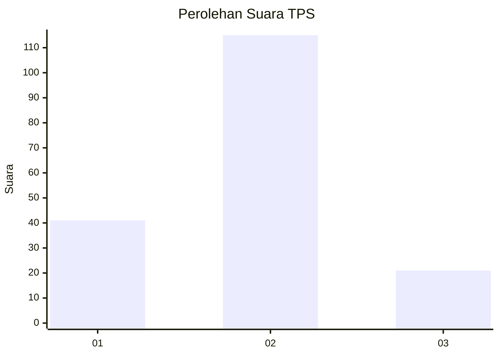
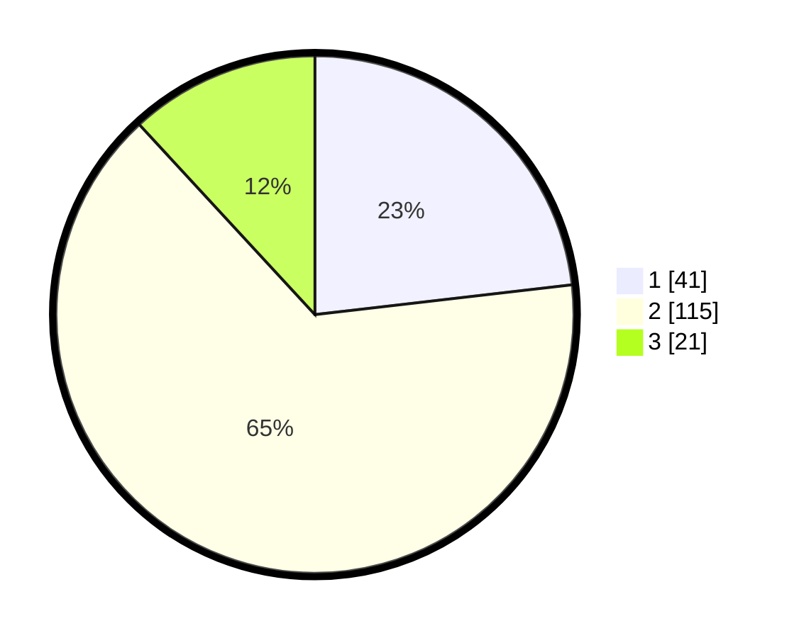

# Hasil

## Grafik

## Tabel

| No. | Nama Paslon    | Suara | Suara (raw) | Persentase |
|:--- |:-------------- | -----:| -----------:| ----------:|
| 1   | ANIES MUHAIMIN | 41    | [41][p-1]   | 23,16      |
| 2   | PRABOWO GIBRAN | 115   | [115][p-2]  | 64,97      |
| 3   | GANJAR MAHFUD  | 21    | [21][p-3]   | 11,86      |

[p-1]: https://github.com/gigit-pemilu/pemilu-2024/blob/main/pilpres/hitung-suara/sub/35-jawa-timur/sub/09-jember/sub/08-puger/sub/2012-pugerwetan/sub/002-tps/sub/paslon-1.txt
[p-2]: https://github.com/gigit-pemilu/pemilu-2024/blob/main/pilpres/hitung-suara/sub/35-jawa-timur/sub/09-jember/sub/08-puger/sub/2012-pugerwetan/sub/002-tps/sub/paslon-2.txt
[p-3]: https://github.com/gigit-pemilu/pemilu-2024/blob/main/pilpres/hitung-suara/sub/35-jawa-timur/sub/09-jember/sub/08-puger/sub/2012-pugerwetan/sub/002-tps/sub/paslon-3.txt

## Foto C Plano

https://sirekap-obj-formc.kpu.go.id/433b/pemilu/ppwp/35/09/08/20/12/3509082012002-20240222-185447--7c556045-a9a2-4395-846b-6c25864f73eb.jpg

https://sirekap-obj-formc.kpu.go.id/433b/pemilu/ppwp/35/09/08/20/12/3509082012002-20240214-141855--721d2cb0-5760-4a8c-8bf9-23421abdef90.jpg

https://sirekap-obj-formc.kpu.go.id/433b/pemilu/ppwp/35/09/08/20/12/3509082012002-20240214-220557--82b948d0-7349-4b17-a498-bf5ab298d9b2.jpg

## Metadata

| Key        | Value               |
| ---------- | ------------------- |
| Time Stamp | 2024-02-22 19:00:00 |

