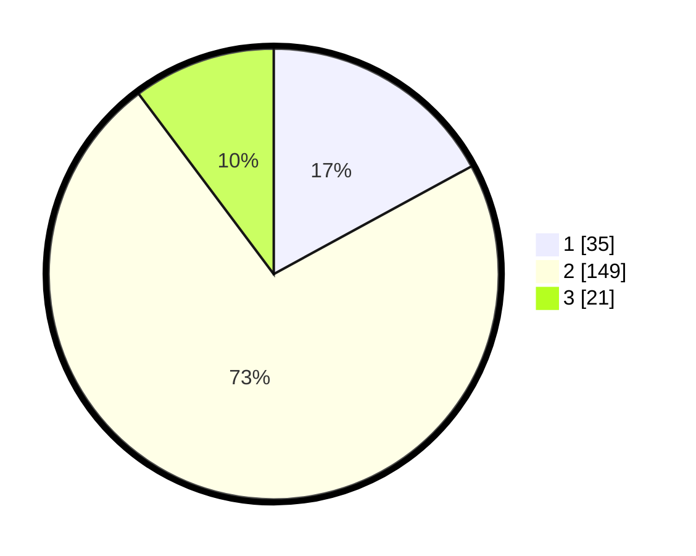

# Hasil

## Grafik

## Tabel

| No. | Nama Paslon    | Suara | Suara (raw) | Persentase |
|:--- |:-------------- | -----:| -----------:| ----------:|
| 1   | ANIES MUHAIMIN | 35    | [35][p-1]   | 17,07      |
| 2   | PRABOWO GIBRAN | 149   | [149][p-2]  | 72,68      |
| 3   | GANJAR MAHFUD  | 21    | [21][p-3]   | 10,24      |

[p-1]: https://github.com/gigit-pemilu/pemilu-2024-35-jawa-timur/blob/main/pilpres/hitung-suara/sub/35-jawa-timur/sub/09-jember/sub/08-puger/sub/2012-pugerwetan/sub/003-tps/sub/paslon-1.txt
[p-2]: https://github.com/gigit-pemilu/pemilu-2024-35-jawa-timur/blob/main/pilpres/hitung-suara/sub/35-jawa-timur/sub/09-jember/sub/08-puger/sub/2012-pugerwetan/sub/003-tps/sub/paslon-2.txt
[p-3]: https://github.com/gigit-pemilu/pemilu-2024-35-jawa-timur/blob/main/pilpres/hitung-suara/sub/35-jawa-timur/sub/09-jember/sub/08-puger/sub/2012-pugerwetan/sub/003-tps/sub/paslon-3.txt

## Foto C Plano

https://sirekap-obj-formc.kpu.go.id/51ad/pemilu/ppwp/35/09/08/20/12/3509082012003-20240215-014716--63ebf7fe-74ee-47db-99ad-a510ccd47744.jpg

https://sirekap-obj-formc.kpu.go.id/51ad/pemilu/ppwp/35/09/08/20/12/3509082012003-20240215-014806--2b7a4e14-a152-45b7-a129-993962a8cd29.jpg

https://sirekap-obj-formc.kpu.go.id/51ad/pemilu/ppwp/35/09/08/20/12/3509082012003-20240215-014912--d79645e2-b34c-4b68-9a37-a96fef88ae47.jpg

## Metadata

| Key        | Value               |
| ---------- | ------------------- |
| Time Stamp | 2024-02-15 17:00:25 |

