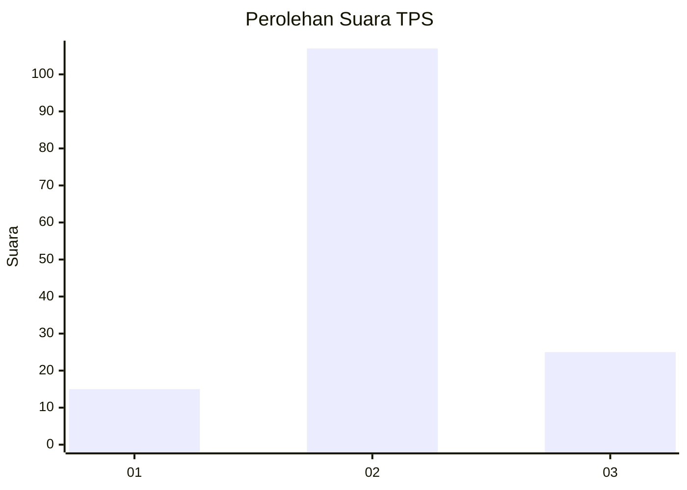
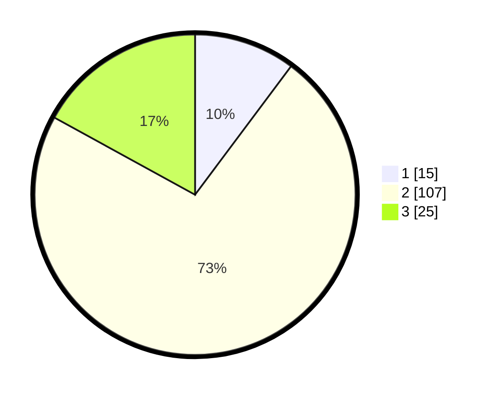

# Hasil

## Grafik

## Tabel

| No. | Nama Paslon    | Suara | Suara (raw) | Persentase |
|:--- |:-------------- | -----:| -----------:| ----------:|
| 1   | ANIES MUHAIMIN | 15    | [15][p-1]   | 10,20      |
| 2   | PRABOWO GIBRAN | 107   | [107][p-2]  | 72,79      |
| 3   | GANJAR MAHFUD  | 25    | [25][p-3]   | 17,01      |

[p-1]: https://github.com/gigit-pemilu/pemilu-2024-35-jawa-timur/blob/main/pilpres/hitung-suara/sub/35-jawa-timur/sub/09-jember/sub/08-puger/sub/2012-pugerwetan/sub/009-tps/sub/paslon-1.txt
[p-2]: https://github.com/gigit-pemilu/pemilu-2024-35-jawa-timur/blob/main/pilpres/hitung-suara/sub/35-jawa-timur/sub/09-jember/sub/08-puger/sub/2012-pugerwetan/sub/009-tps/sub/paslon-2.txt
[p-3]: https://github.com/gigit-pemilu/pemilu-2024-35-jawa-timur/blob/main/pilpres/hitung-suara/sub/35-jawa-timur/sub/09-jember/sub/08-puger/sub/2012-pugerwetan/sub/009-tps/sub/paslon-3.txt

## Foto C Plano

https://sirekap-obj-formc.kpu.go.id/347e/pemilu/ppwp/35/09/08/20/12/3509082012009-20240222-171850--e905a302-7355-4727-8a8f-e5c3ac8c4180.jpg

https://sirekap-obj-formc.kpu.go.id/347e/pemilu/ppwp/35/09/08/20/12/3509082012009-20240222-212459--9eb2d9f2-e623-41dd-b1fa-1d3057091cd1.jpg

https://sirekap-obj-formc.kpu.go.id/347e/pemilu/ppwp/35/09/08/20/12/3509082012009-20240222-184508--11793065-21cc-4e52-abc7-08c02d1d4e43.jpg

## Metadata

| Key        | Value               |
| ---------- | ------------------- |
| Time Stamp | 2024-02-25 12:00:00 |

