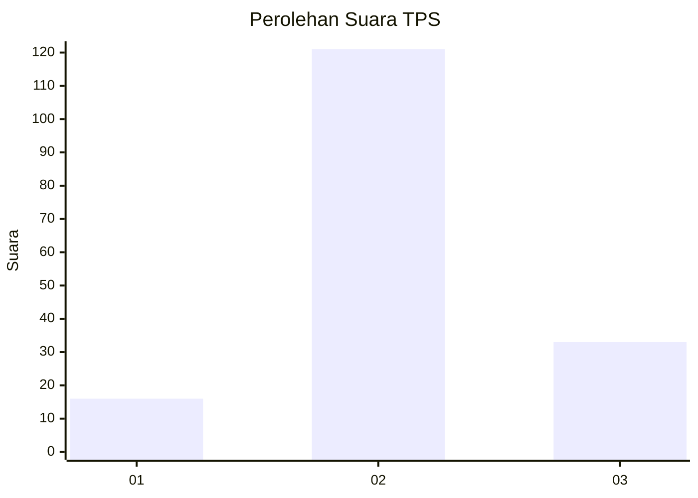
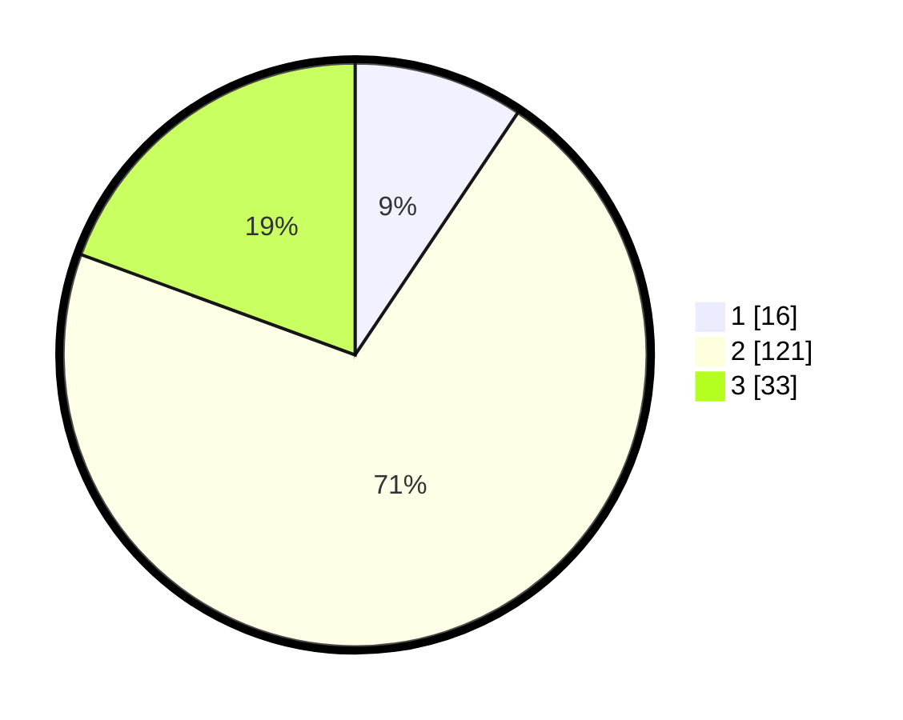

# Hasil

## Grafik

## Tabel

| No. | Nama Paslon    | Suara | Suara (raw) | Persentase |
|:--- |:-------------- | -----:| -----------:| ----------:|
| 1   | ANIES MUHAIMIN | 16    | [16][p-1]   | 9,41       |
| 2   | PRABOWO GIBRAN | 121   | [121][p-2]  | 71,18      |
| 3   | GANJAR MAHFUD  | 33    | [33][p-3]   | 19,41      |

[p-1]: https://github.com/gigit-pemilu/pemilu-2024/blob/main/pilpres/hitung-suara/sub/35-jawa-timur/sub/09-jember/sub/08-puger/sub/2012-pugerwetan/sub/021-tps/sub/paslon-1.txt
[p-2]: https://github.com/gigit-pemilu/pemilu-2024/blob/main/pilpres/hitung-suara/sub/35-jawa-timur/sub/09-jember/sub/08-puger/sub/2012-pugerwetan/sub/021-tps/sub/paslon-2.txt
[p-3]: https://github.com/gigit-pemilu/pemilu-2024/blob/main/pilpres/hitung-suara/sub/35-jawa-timur/sub/09-jember/sub/08-puger/sub/2012-pugerwetan/sub/021-tps/sub/paslon-3.txt

## Foto C Plano

https://sirekap-obj-formc.kpu.go.id/8d55/pemilu/ppwp/35/09/08/20/12/3509082012021-20240214-211148--4890b3ae-7a7c-4de9-ac9d-3294f8aff9e5.jpg

https://sirekap-obj-formc.kpu.go.id/8d55/pemilu/ppwp/35/09/08/20/12/3509082012021-20240214-211821--3a4aaf27-6c89-4ec3-ba89-1ab5fbfcc91a.jpg

https://sirekap-obj-formc.kpu.go.id/8d55/pemilu/ppwp/35/09/08/20/12/3509082012021-20240214-211914--12d57aa3-9db8-4cfd-b573-9c0be3668ca0.jpg

## Metadata

| Key        | Value               |
| ---------- | ------------------- |
| Time Stamp | 2024-02-25 12:00:00 |

