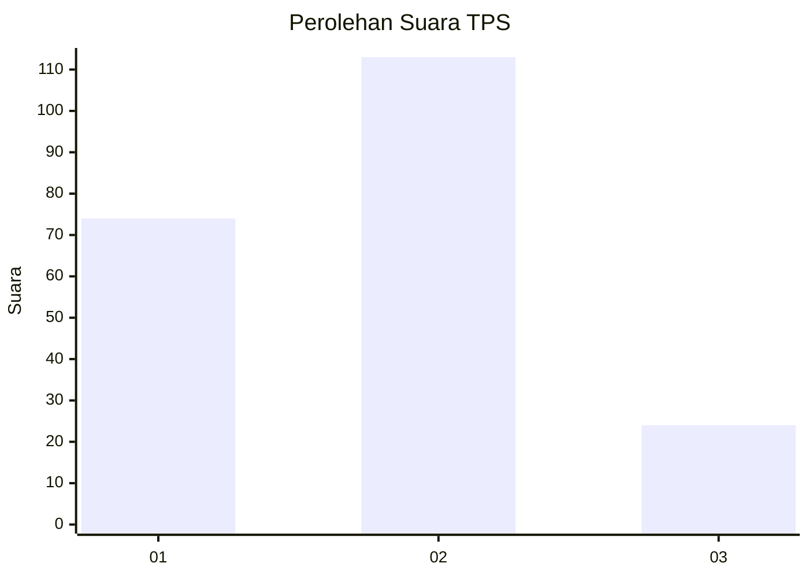
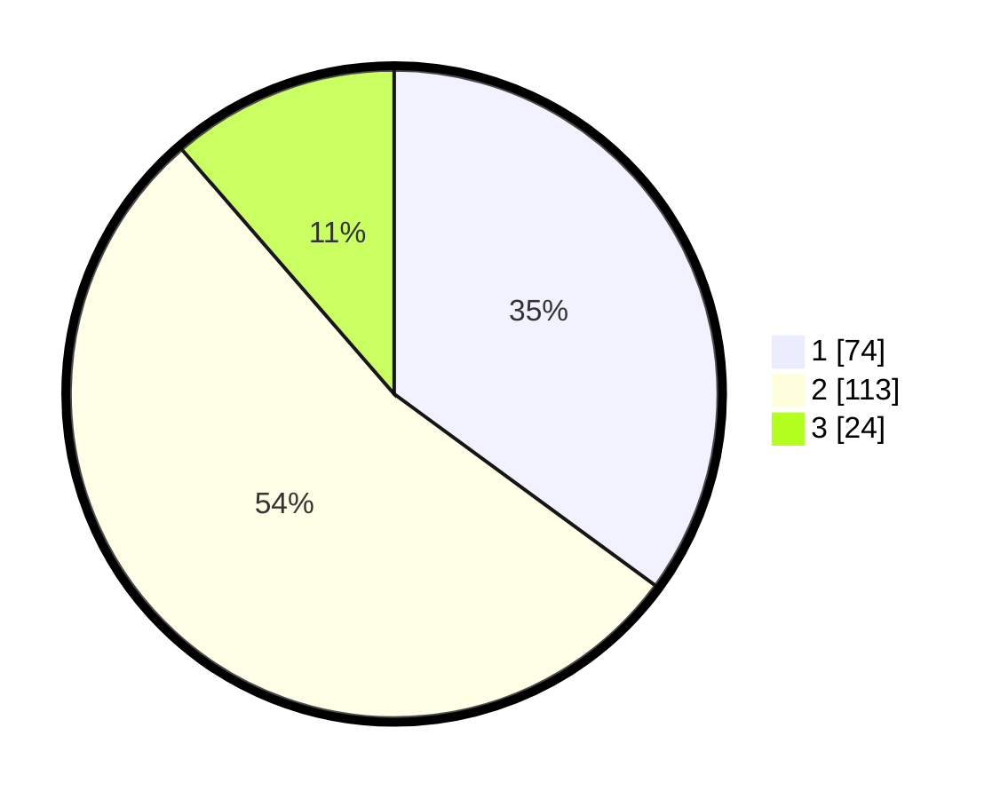

# Hasil

## Grafik

## Tabel

| No. | Nama Paslon    | Suara | Suara (raw) | Persentase |
|:--- |:-------------- | -----:| -----------:| ----------:|
| 1   | ANIES MUHAIMIN | 74    | [74][p-1]   | 35,07      |
| 2   | PRABOWO GIBRAN | 113   | [113][p-2]  | 53,55      |
| 3   | GANJAR MAHFUD  | 24    | [24][p-3]   | 11,37      |

[p-1]: https://github.com/gigit-pemilu/pemilu-2024/blob/main/pilpres/hitung-suara/sub/35-jawa-timur/sub/09-jember/sub/09-bangsalsari/sub/2001-curahkalong/sub/001-tps/sub/paslon-1.txt
[p-2]: https://github.com/gigit-pemilu/pemilu-2024/blob/main/pilpres/hitung-suara/sub/35-jawa-timur/sub/09-jember/sub/09-bangsalsari/sub/2001-curahkalong/sub/001-tps/sub/paslon-2.txt
[p-3]: https://github.com/gigit-pemilu/pemilu-2024/blob/main/pilpres/hitung-suara/sub/35-jawa-timur/sub/09-jember/sub/09-bangsalsari/sub/2001-curahkalong/sub/001-tps/sub/paslon-3.txt

## Foto C Plano

https://sirekap-obj-formc.kpu.go.id/f2cd/pemilu/ppwp/35/09/09/20/01/3509092001001-20240215-014711--58ee354a-50f2-464d-8286-e47a3d0f8cfc.jpg

https://sirekap-obj-formc.kpu.go.id/f2cd/pemilu/ppwp/35/09/09/20/01/3509092001001-20240215-014913--e3a624c6-ae01-4993-b58e-02bc8f45b153.jpg

https://sirekap-obj-formc.kpu.go.id/f2cd/pemilu/ppwp/35/09/09/20/01/3509092001001-20240215-015148--0f93dc5c-fa6b-4da3-bf9f-0deadeacd350.jpg

## Metadata

| Key        | Value               |
| ---------- | ------------------- |
| Time Stamp | 2024-02-16 23:30:00 |

