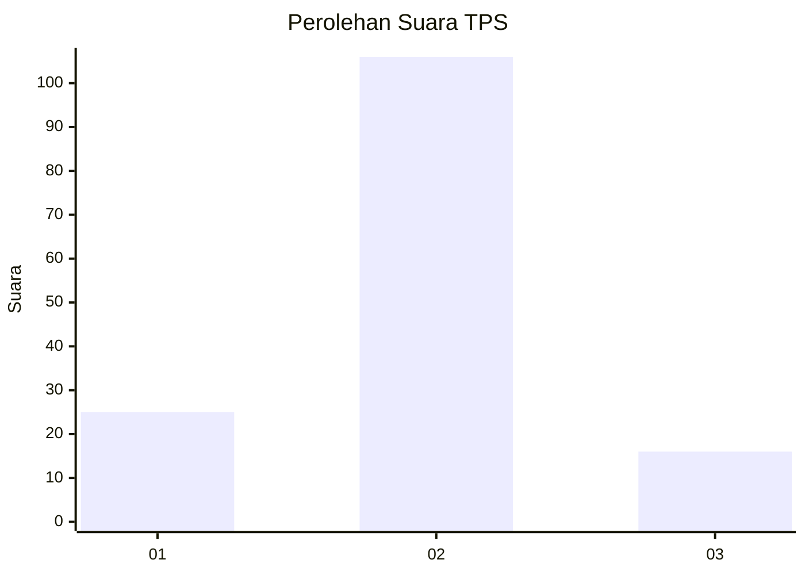
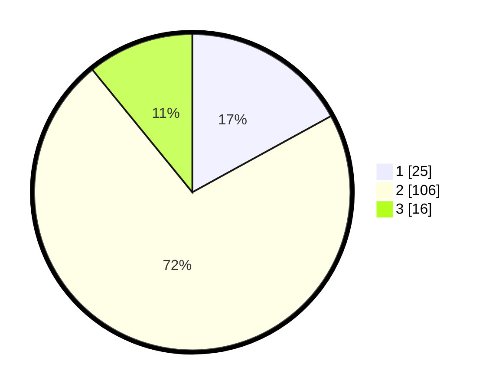

# Hasil

## Grafik

## Tabel

| No. | Nama Paslon    | Suara | Suara (raw) | Persentase |
|:--- |:-------------- | -----:| -----------:| ----------:|
| 1   | ANIES MUHAIMIN | 25    | [25][p-1]   | 17,01      |
| 2   | PRABOWO GIBRAN | 106   | [106][p-2]  | 72,11      |
| 3   | GANJAR MAHFUD  | 16    | [16][p-3]   | 10,88      |

[p-1]: https://github.com/gigit-pemilu/pemilu-2024-35-jawa-timur/blob/main/pilpres/hitung-suara/sub/35-jawa-timur/sub/09-jember/sub/09-bangsalsari/sub/2001-curahkalong/sub/002-tps/sub/paslon-1.txt
[p-2]: https://github.com/gigit-pemilu/pemilu-2024-35-jawa-timur/blob/main/pilpres/hitung-suara/sub/35-jawa-timur/sub/09-jember/sub/09-bangsalsari/sub/2001-curahkalong/sub/002-tps/sub/paslon-2.txt
[p-3]: https://github.com/gigit-pemilu/pemilu-2024-35-jawa-timur/blob/main/pilpres/hitung-suara/sub/35-jawa-timur/sub/09-jember/sub/09-bangsalsari/sub/2001-curahkalong/sub/002-tps/sub/paslon-3.txt

## Foto C Plano

https://sirekap-obj-formc.kpu.go.id/005a/pemilu/ppwp/35/09/09/20/01/3509092001002-20240214-204544--e962b91a-1790-4b34-aa31-0239c4e98c5b.jpg

https://sirekap-obj-formc.kpu.go.id/005a/pemilu/ppwp/35/09/09/20/01/3509092001002-20240214-204740--0a8b96ce-7b54-4481-9378-854f12d08eee.jpg

https://sirekap-obj-formc.kpu.go.id/005a/pemilu/ppwp/35/09/09/20/01/3509092001002-20240214-204923--488f129f-06d4-4513-b0ce-b87ae885ab89.jpg

## Metadata

| Key        | Value               |
| ---------- | ------------------- |
| Time Stamp | 2024-02-15 15:00:29 |

