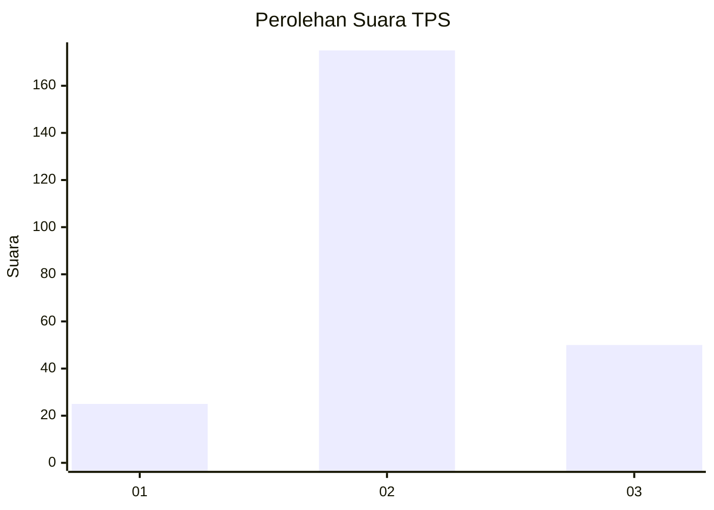
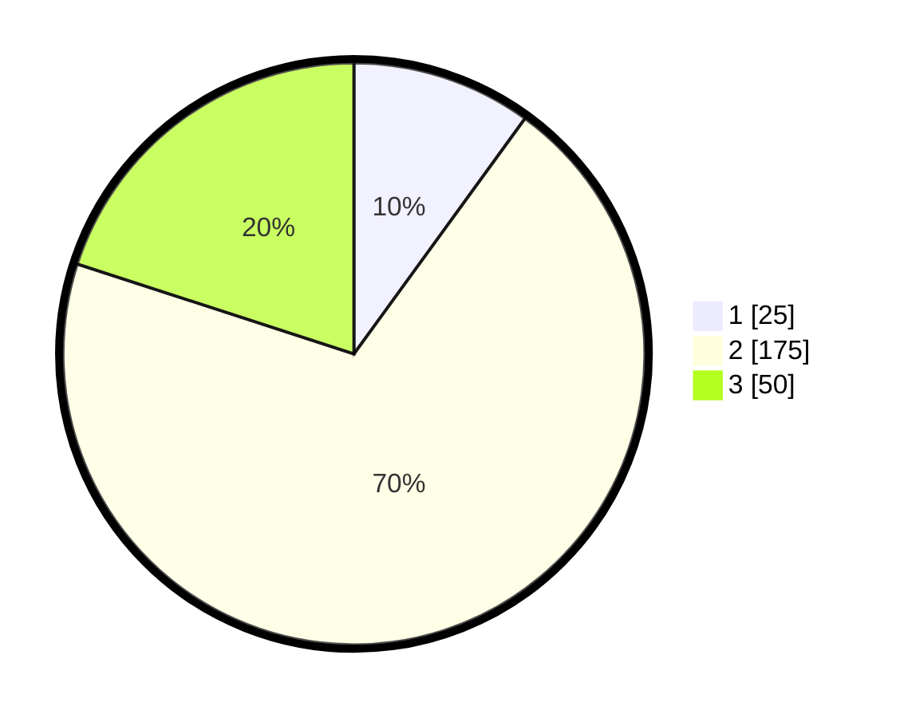

# Hasil

## Grafik

## Tabel

| No. | Nama Paslon    | Suara | Suara (raw) | Persentase |
|:--- |:-------------- | -----:| -----------:| ----------:|
| 1   | ANIES MUHAIMIN | 25    | [25][p-1]   | 10,00      |
| 2   | PRABOWO GIBRAN | 175   | [175][p-2]  | 70,00      |
| 3   | GANJAR MAHFUD  | 50    | [50][p-3]   | 20,00      |

[p-1]: https://github.com/gigit-pemilu/pemilu-2024/blob/main/pilpres/hitung-suara/sub/35-jawa-timur/sub/09-jember/sub/09-bangsalsari/sub/2001-curahkalong/sub/006-tps/sub/paslon-1.txt
[p-2]: https://github.com/gigit-pemilu/pemilu-2024/blob/main/pilpres/hitung-suara/sub/35-jawa-timur/sub/09-jember/sub/09-bangsalsari/sub/2001-curahkalong/sub/006-tps/sub/paslon-2.txt
[p-3]: https://github.com/gigit-pemilu/pemilu-2024/blob/main/pilpres/hitung-suara/sub/35-jawa-timur/sub/09-jember/sub/09-bangsalsari/sub/2001-curahkalong/sub/006-tps/sub/paslon-3.txt

## Foto C Plano

https://sirekap-obj-formc.kpu.go.id/95f8/pemilu/ppwp/35/09/09/20/01/3509092001006-20240218-184956--8edf39b9-d099-4777-98f2-aafaa33f7dbc.jpg

https://sirekap-obj-formc.kpu.go.id/95f8/pemilu/ppwp/35/09/09/20/01/3509092001006-20240218-164706--d04ad7a2-e8bf-4631-9e9d-d6b361c76911.jpg

https://sirekap-obj-formc.kpu.go.id/95f8/pemilu/ppwp/35/09/09/20/01/3509092001006-20240218-164742--54fdd5f3-76cc-42a6-9a73-e1c31fbfcba0.jpg

## Metadata

| Key        | Value               |
| ---------- | ------------------- |
| Time Stamp | 2024-02-19 06:16:00 |

## DATA PEMILIH TETAP

Jumlah pemilih dalam DPT: **299**.
 * L: **151**.
 * P: **148**.

## DATA PENGGUNA HAK PILIH

Jumlah pengguna hak pilih dalam DPT: **202**.
 * L: **87**.
 * P: **115**.

Jumlah pengguna hak pilih dalam DPTb: **0**.
 * L: **0**.
 * P: **0**.

Jumlah pengguna hak pilih dalam DPK: **0**.
 * L: **0**.
 * P: **0**.

Jumlah pengguna hak pilih: **202**.
 * L: **87**.
 * P: **115**.

## JUMLAH SUARA SAH DAN TIDAK SAH

JUMLAH SELURUH SUARA SAH: **200**.

JUMLAH SUARA TIDAK SAH: **2**.

JUMLAH SELURUH SUARA SAH DAN SUARA TIDAK SAH: **202**.

