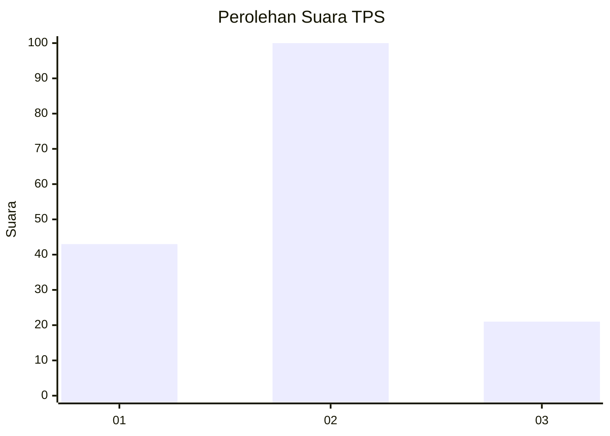
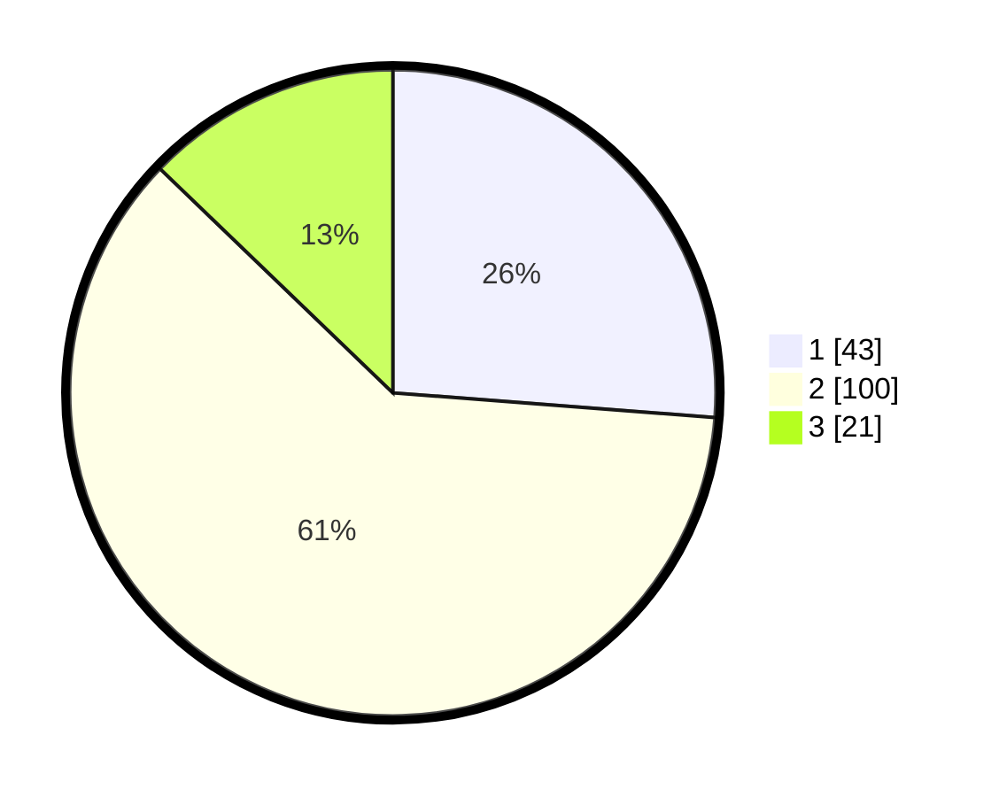

# Hasil

## Grafik

## Tabel

| No. | Nama Paslon    | Suara | Suara (raw) | Persentase |
|:--- |:-------------- | -----:| -----------:| ----------:|
| 1   | ANIES MUHAIMIN | 43    | [43][p-1]   | 26,22      |
| 2   | PRABOWO GIBRAN | 100   | [100][p-2]  | 60,98      |
| 3   | GANJAR MAHFUD  | 21    | [21][p-3]   | 12,80      |

[p-1]: https://github.com/gigit-pemilu/pemilu-2024/blob/main/pilpres/hitung-suara/sub/35-jawa-timur/sub/09-jember/sub/09-bangsalsari/sub/2001-curahkalong/sub/007-tps/sub/paslon-1.txt
[p-2]: https://github.com/gigit-pemilu/pemilu-2024/blob/main/pilpres/hitung-suara/sub/35-jawa-timur/sub/09-jember/sub/09-bangsalsari/sub/2001-curahkalong/sub/007-tps/sub/paslon-2.txt
[p-3]: https://github.com/gigit-pemilu/pemilu-2024/blob/main/pilpres/hitung-suara/sub/35-jawa-timur/sub/09-jember/sub/09-bangsalsari/sub/2001-curahkalong/sub/007-tps/sub/paslon-3.txt

## Foto C Plano

https://sirekap-obj-formc.kpu.go.id/66d7/pemilu/ppwp/35/09/09/20/01/3509092001007-20240214-215105--57daad70-ae46-4578-beeb-8f7fe2ef49a0.jpg

https://sirekap-obj-formc.kpu.go.id/66d7/pemilu/ppwp/35/09/09/20/01/3509092001007-20240214-215316--4cedcec9-76b0-459a-9f1c-fc77f04d9bf8.jpg

https://sirekap-obj-formc.kpu.go.id/66d7/pemilu/ppwp/35/09/09/20/01/3509092001007-20240214-215521--c0edf437-cb63-45b0-bc83-f4f917b2f12e.jpg

## Metadata

| Key        | Value               |
| ---------- | ------------------- |
| Time Stamp | 2024-02-15 23:29:50 |

