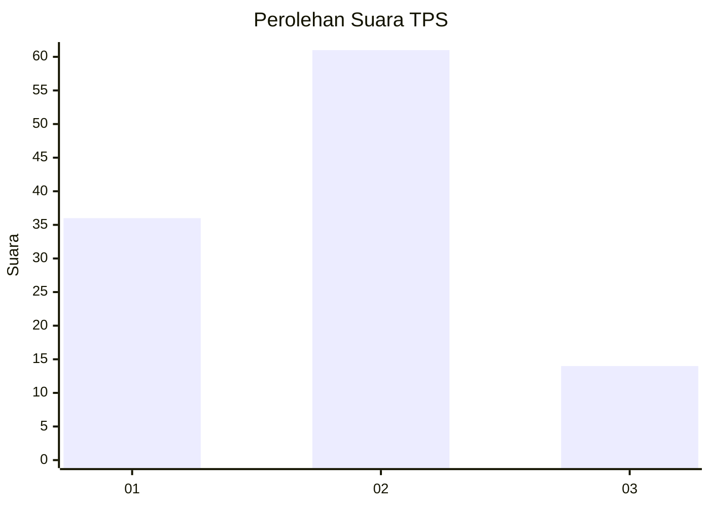
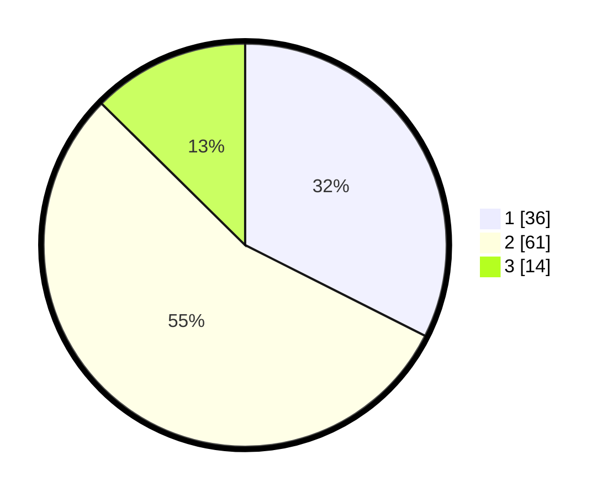

# Hasil

## Grafik

## Tabel

| No. | Nama Paslon    | Suara | Suara (raw) | Persentase |
|:--- |:-------------- | -----:| -----------:| ----------:|
| 1   | ANIES MUHAIMIN | 36    | [36][p-1]   | 32,43      |
| 2   | PRABOWO GIBRAN | 61    | [61][p-2]   | 54,95      |
| 3   | GANJAR MAHFUD  | 14    | [14][p-3]   | 12,61      |

[p-1]: https://github.com/gigit-pemilu/pemilu-2024-35-jawa-timur/blob/main/pilpres/hitung-suara/sub/35-jawa-timur/sub/09-jember/sub/09-bangsalsari/sub/2001-curahkalong/sub/021-tps/sub/paslon-1.txt
[p-2]: https://github.com/gigit-pemilu/pemilu-2024-35-jawa-timur/blob/main/pilpres/hitung-suara/sub/35-jawa-timur/sub/09-jember/sub/09-bangsalsari/sub/2001-curahkalong/sub/021-tps/sub/paslon-2.txt
[p-3]: https://github.com/gigit-pemilu/pemilu-2024-35-jawa-timur/blob/main/pilpres/hitung-suara/sub/35-jawa-timur/sub/09-jember/sub/09-bangsalsari/sub/2001-curahkalong/sub/021-tps/sub/paslon-3.txt

## Foto C Plano

https://sirekap-obj-formc.kpu.go.id/1a36/pemilu/ppwp/35/09/09/20/01/3509092001021-20240214-213257--a8bd21df-9500-4e02-984f-fff27766349f.jpg

https://sirekap-obj-formc.kpu.go.id/1a36/pemilu/ppwp/35/09/09/20/01/3509092001021-20240214-220723--657cd00a-061e-4c81-b7b2-9c6e5033fde5.jpg

https://sirekap-obj-formc.kpu.go.id/1a36/pemilu/ppwp/35/09/09/20/01/3509092001021-20240214-213453--958022cd-1b5d-43ef-9388-5b490bd5ebec.jpg

## Metadata

| Key        | Value               |
| ---------- | ------------------- |
| Time Stamp | 2024-02-15 23:29:50 |

