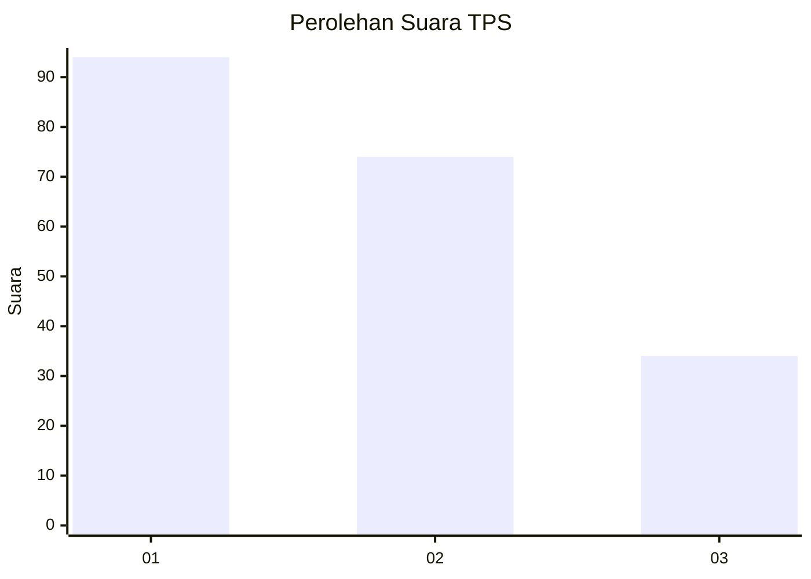
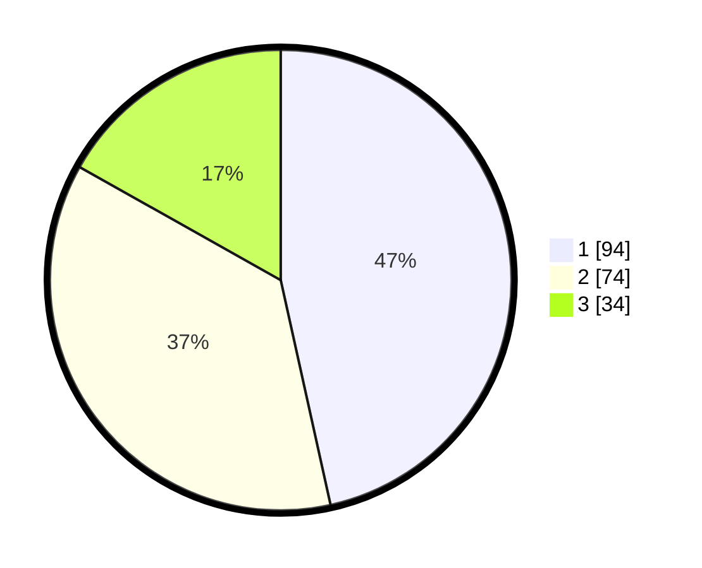

# Hasil

## Grafik

## Tabel

| No. | Nama Paslon    | Suara | Suara (raw) | Persentase |
|:--- |:-------------- | -----:| -----------:| ----------:|
| 1   | ANIES MUHAIMIN | 94    | [94][p-1]   | 46,53      |
| 2   | PRABOWO GIBRAN | 74    | [74][p-2]   | 36,63      |
| 3   | GANJAR MAHFUD  | 34    | [34][p-3]   | 16,83      |

[p-1]: https://github.com/gigit-pemilu/pemilu-2024-35-jawa-timur/blob/main/pilpres/hitung-suara/sub/35-jawa-timur/sub/09-jember/sub/09-bangsalsari/sub/2001-curahkalong/sub/022-tps/sub/paslon-1.txt
[p-2]: https://github.com/gigit-pemilu/pemilu-2024-35-jawa-timur/blob/main/pilpres/hitung-suara/sub/35-jawa-timur/sub/09-jember/sub/09-bangsalsari/sub/2001-curahkalong/sub/022-tps/sub/paslon-2.txt
[p-3]: https://github.com/gigit-pemilu/pemilu-2024-35-jawa-timur/blob/main/pilpres/hitung-suara/sub/35-jawa-timur/sub/09-jember/sub/09-bangsalsari/sub/2001-curahkalong/sub/022-tps/sub/paslon-3.txt

## Foto C Plano

https://sirekap-obj-formc.kpu.go.id/3e0e/pemilu/ppwp/35/09/09/20/01/3509092001022-20240215-023700--3e1e053e-36ea-440d-aff5-0863ca59fabd.jpg

https://sirekap-obj-formc.kpu.go.id/3e0e/pemilu/ppwp/35/09/09/20/01/3509092001022-20240215-023846--d019e35b-7f25-4e00-95d1-ea25a2b9cb79.jpg

https://sirekap-obj-formc.kpu.go.id/3e0e/pemilu/ppwp/35/09/09/20/01/3509092001022-20240215-035555--7b6cbd6c-f515-46d1-835b-7e525f0f1020.jpg

## Metadata

| Key        | Value               |
| ---------- | ------------------- |
| Time Stamp | 2024-02-15 23:29:50 |

