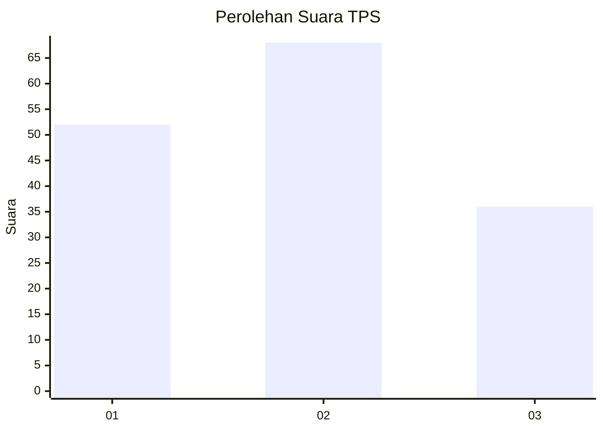
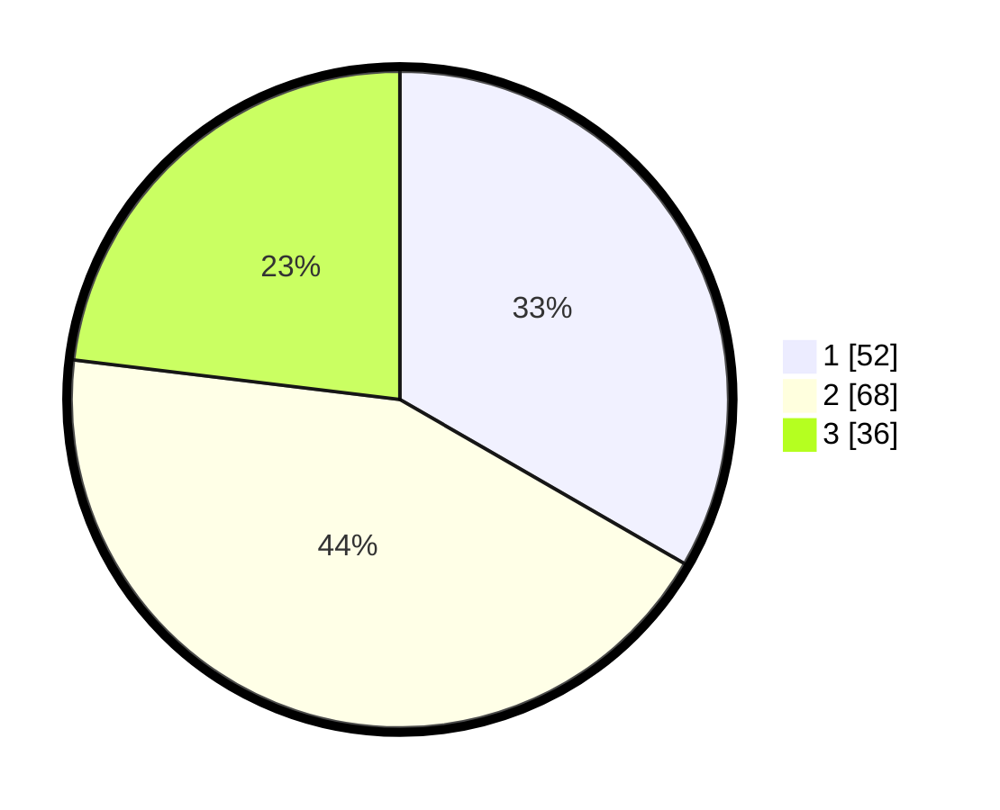

# Hasil

## Grafik

## Tabel

| No. | Nama Paslon    | Suara | Suara (raw) | Persentase |
|:--- |:-------------- | -----:| -----------:| ----------:|
| 1   | ANIES MUHAIMIN | 52    | [52][p-1]   | 33,33      |
| 2   | PRABOWO GIBRAN | 68    | [68][p-2]   | 43,59      |
| 3   | GANJAR MAHFUD  | 36    | [36][p-3]   | 23,08      |

[p-1]: https://github.com/gigit-pemilu/pemilu-2024-35-jawa-timur/blob/main/pilpres/hitung-suara/sub/35-jawa-timur/sub/09-jember/sub/09-bangsalsari/sub/2001-curahkalong/sub/026-tps/sub/paslon-1.txt
[p-2]: https://github.com/gigit-pemilu/pemilu-2024-35-jawa-timur/blob/main/pilpres/hitung-suara/sub/35-jawa-timur/sub/09-jember/sub/09-bangsalsari/sub/2001-curahkalong/sub/026-tps/sub/paslon-2.txt
[p-3]: https://github.com/gigit-pemilu/pemilu-2024-35-jawa-timur/blob/main/pilpres/hitung-suara/sub/35-jawa-timur/sub/09-jember/sub/09-bangsalsari/sub/2001-curahkalong/sub/026-tps/sub/paslon-3.txt

## Foto C Plano

https://sirekap-obj-formc.kpu.go.id/f1cb/pemilu/ppwp/35/09/09/20/01/3509092001026-20240214-234632--05b4c987-728e-4f4b-86eb-ca65dd555fe4.jpg

https://sirekap-obj-formc.kpu.go.id/f1cb/pemilu/ppwp/35/09/09/20/01/3509092001026-20240214-234702--e50eb902-3aa8-426a-a586-003c97a6e835.jpg

https://sirekap-obj-formc.kpu.go.id/f1cb/pemilu/ppwp/35/09/09/20/01/3509092001026-20240214-234738--87093219-a50a-455f-bc09-7f5be5652561.jpg

## Metadata

| Key        | Value               |
| ---------- | ------------------- |
| Time Stamp | 2024-02-15 12:00:28 |

