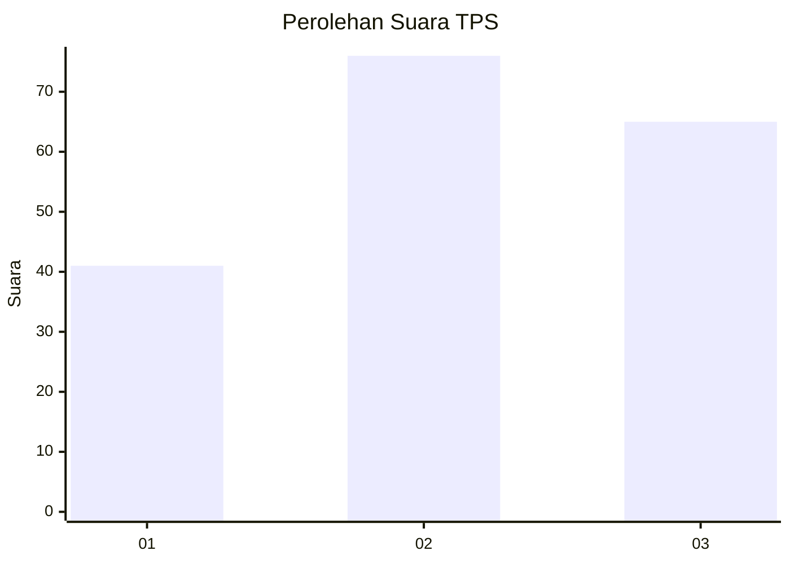
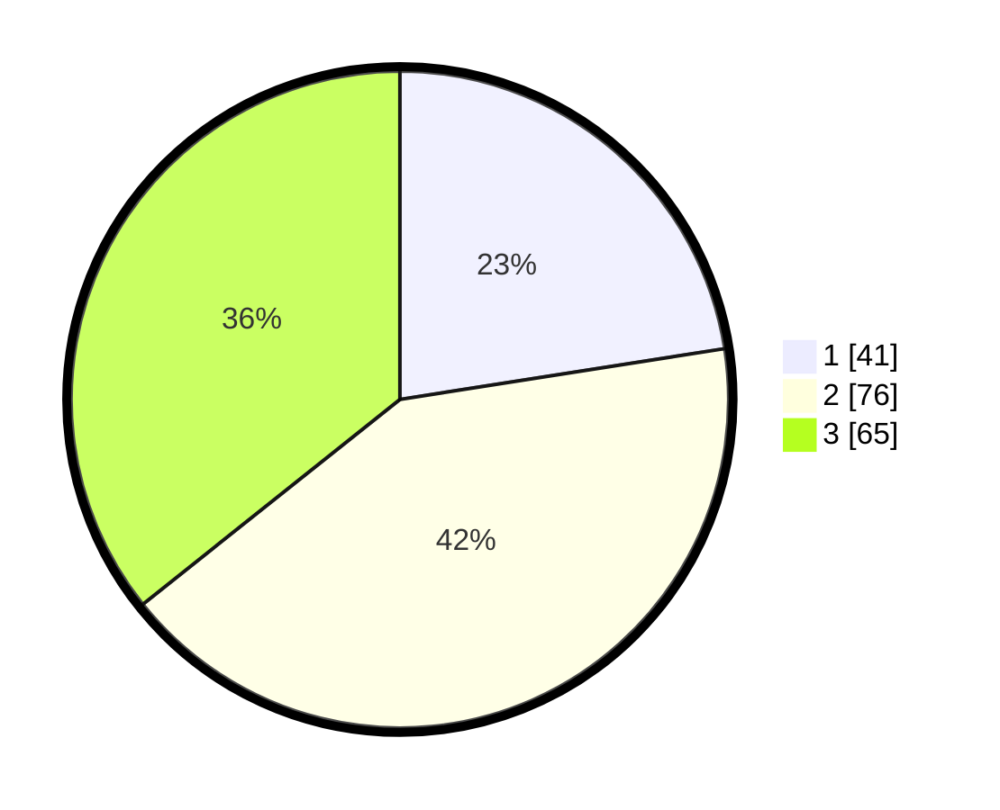

# Hasil

## Grafik

## Tabel

| No. | Nama Paslon    | Suara | Suara (raw) | Persentase |
|:--- |:-------------- | -----:| -----------:| ----------:|
| 1   | ANIES MUHAIMIN | 41    | [41][p-1]   | 22,53      |
| 2   | PRABOWO GIBRAN | 76    | [76][p-2]   | 41,76      |
| 3   | GANJAR MAHFUD  | 65    | [65][p-3]   | 35,71      |

[p-1]: https://github.com/gigit-pemilu/pemilu-2024-35-jawa-timur/blob/main/pilpres/hitung-suara/sub/35-jawa-timur/sub/09-jember/sub/09-bangsalsari/sub/2001-curahkalong/sub/037-tps/sub/paslon-1.txt
[p-2]: https://github.com/gigit-pemilu/pemilu-2024-35-jawa-timur/blob/main/pilpres/hitung-suara/sub/35-jawa-timur/sub/09-jember/sub/09-bangsalsari/sub/2001-curahkalong/sub/037-tps/sub/paslon-2.txt
[p-3]: https://github.com/gigit-pemilu/pemilu-2024-35-jawa-timur/blob/main/pilpres/hitung-suara/sub/35-jawa-timur/sub/09-jember/sub/09-bangsalsari/sub/2001-curahkalong/sub/037-tps/sub/paslon-3.txt

## Foto C Plano

https://sirekap-obj-formc.kpu.go.id/2164/pemilu/ppwp/35/09/09/20/01/3509092001037-20240215-023130--bf787f9b-5f2c-4209-adce-697812a50c69.jpg

https://sirekap-obj-formc.kpu.go.id/2164/pemilu/ppwp/35/09/09/20/01/3509092001037-20240215-023221--2440e7f7-6fba-485d-8a70-37b0dcc11169.jpg

https://sirekap-obj-formc.kpu.go.id/2164/pemilu/ppwp/35/09/09/20/01/3509092001037-20240215-023330--d3e3a474-1b6f-465d-b310-6885ddcf993c.jpg

## Metadata

| Key        | Value               |
| ---------- | ------------------- |
| Time Stamp | 2024-02-15 12:00:28 |

