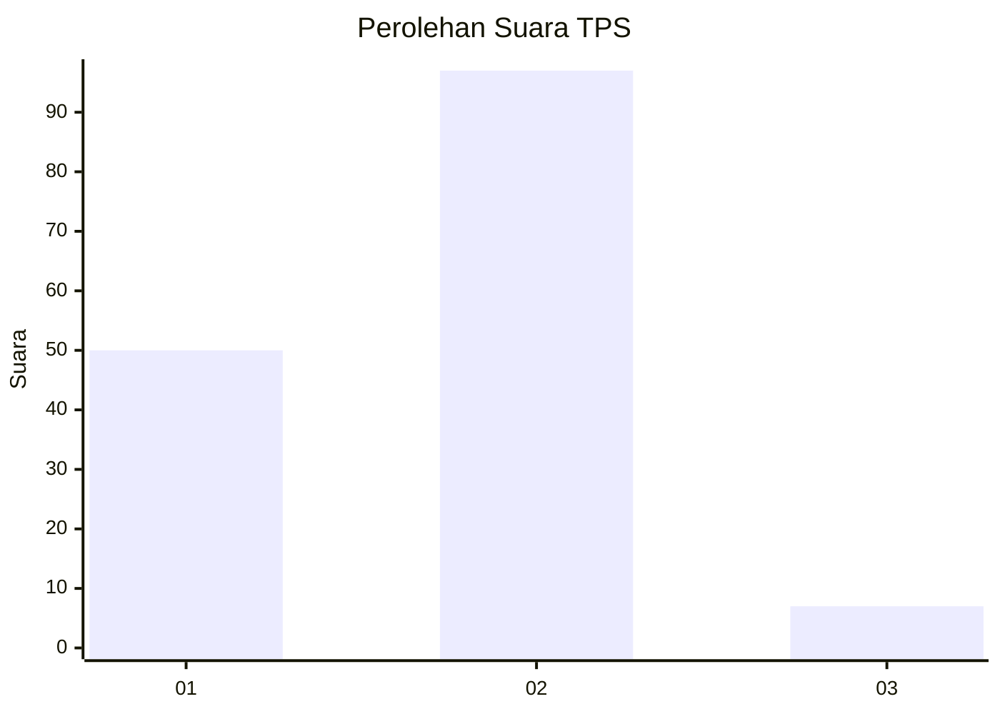
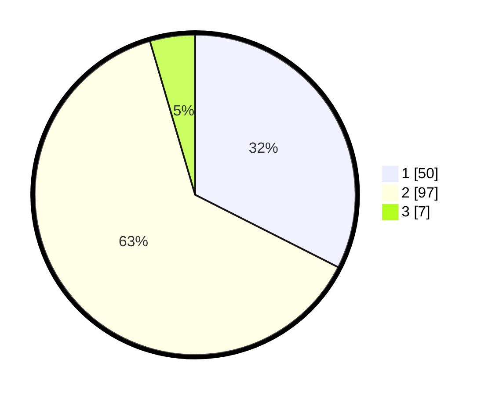

# Hasil

## Grafik

## Tabel

| No. | Nama Paslon    | Suara | Suara (raw) | Persentase |
|:--- |:-------------- | -----:| -----------:| ----------:|
| 1   | ANIES MUHAIMIN | 50    | [50][p-1]   | 32,47      |
| 2   | PRABOWO GIBRAN | 97    | [97][p-2]   | 62,99      |
| 3   | GANJAR MAHFUD  | 7     | [7][p-3]    | 4,55       |

[p-1]: https://github.com/gigit-pemilu/pemilu-2024-35-jawa-timur/blob/main/pilpres/hitung-suara/sub/35-jawa-timur/sub/09-jember/sub/09-bangsalsari/sub/2001-curahkalong/sub/040-tps/sub/paslon-1.txt
[p-2]: https://github.com/gigit-pemilu/pemilu-2024-35-jawa-timur/blob/main/pilpres/hitung-suara/sub/35-jawa-timur/sub/09-jember/sub/09-bangsalsari/sub/2001-curahkalong/sub/040-tps/sub/paslon-2.txt
[p-3]: https://github.com/gigit-pemilu/pemilu-2024-35-jawa-timur/blob/main/pilpres/hitung-suara/sub/35-jawa-timur/sub/09-jember/sub/09-bangsalsari/sub/2001-curahkalong/sub/040-tps/sub/paslon-3.txt

## Foto C Plano

https://sirekap-obj-formc.kpu.go.id/4dd8/pemilu/ppwp/35/09/09/20/01/3509092001040-20240214-141321--2528027f-d879-4082-b41f-605b7f703134.jpg

https://sirekap-obj-formc.kpu.go.id/4dd8/pemilu/ppwp/35/09/09/20/01/3509092001040-20240214-141927--80d1ea09-f100-4d9f-a855-ddc44813a14f.jpg

https://sirekap-obj-formc.kpu.go.id/4dd8/pemilu/ppwp/35/09/09/20/01/3509092001040-20240214-230037--cb8fa8eb-dc46-491d-88ec-5ccc11df1be8.jpg

## Metadata

| Key        | Value               |
| ---------- | ------------------- |
| Time Stamp | 2024-02-15 03:06:03 |

