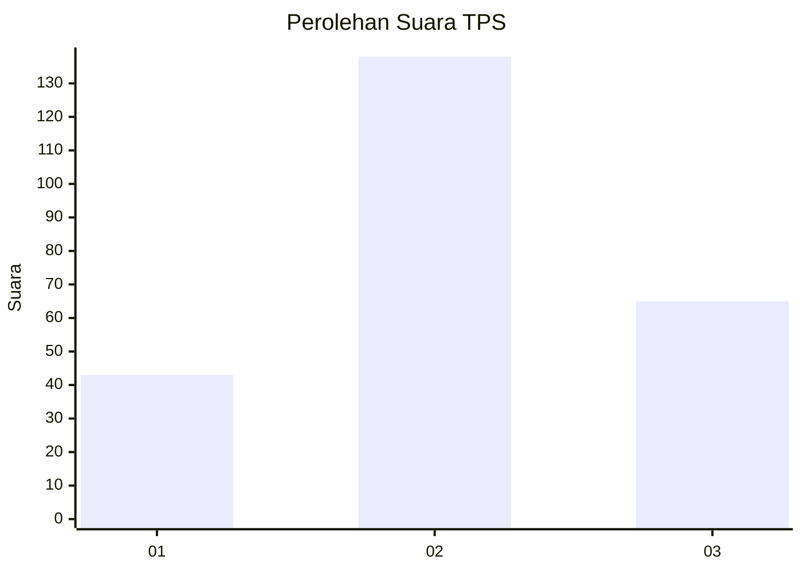
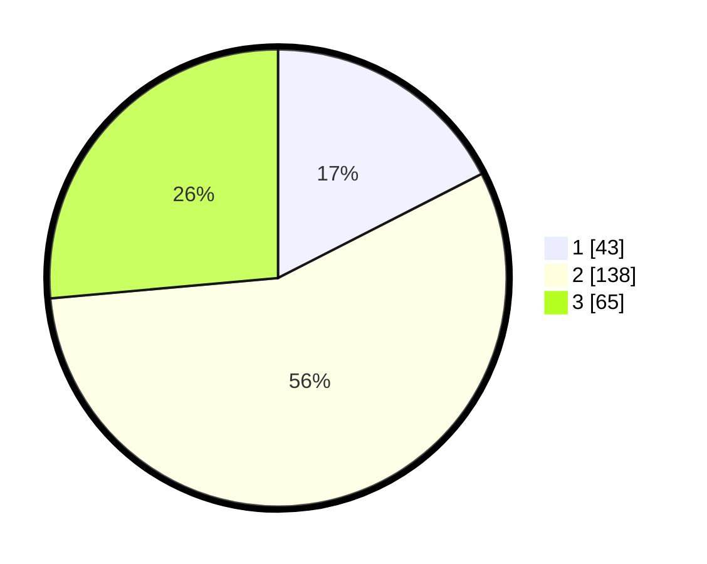

# Hasil

## Grafik

## Tabel

| No. | Nama Paslon    | Suara | Suara (raw) | Persentase |
|:--- |:-------------- | -----:| -----------:| ----------:|
| 1   | ANIES MUHAIMIN | 43    | [43][p-1]   | 17,48      |
| 2   | PRABOWO GIBRAN | 138   | [138][p-2]  | 56,10      |
| 3   | GANJAR MAHFUD  | 65    | [65][p-3]   | 26,42      |

[p-1]: https://github.com/gigit-pemilu/pemilu-2024-35-jawa-timur/blob/main/pilpres/hitung-suara/sub/35-jawa-timur/sub/09-jember/sub/09-bangsalsari/sub/2001-curahkalong/sub/042-tps/sub/paslon-1.txt
[p-2]: https://github.com/gigit-pemilu/pemilu-2024-35-jawa-timur/blob/main/pilpres/hitung-suara/sub/35-jawa-timur/sub/09-jember/sub/09-bangsalsari/sub/2001-curahkalong/sub/042-tps/sub/paslon-2.txt
[p-3]: https://github.com/gigit-pemilu/pemilu-2024-35-jawa-timur/blob/main/pilpres/hitung-suara/sub/35-jawa-timur/sub/09-jember/sub/09-bangsalsari/sub/2001-curahkalong/sub/042-tps/sub/paslon-3.txt

## Foto C Plano

https://sirekap-obj-formc.kpu.go.id/f897/pemilu/ppwp/35/09/09/20/01/3509092001042-20240214-224142--a23c7a45-83d8-4087-9a1e-5177aea5f145.jpg

https://sirekap-obj-formc.kpu.go.id/f897/pemilu/ppwp/35/09/09/20/01/3509092001042-20240214-230017--4e48d13d-2aab-4546-8133-e071e486916f.jpg

https://sirekap-obj-formc.kpu.go.id/f897/pemilu/ppwp/35/09/09/20/01/3509092001042-20240214-224414--d369d81a-b022-42ab-8459-c80a3b3ef199.jpg

## Metadata

| Key        | Value               |
| ---------- | ------------------- |
| Time Stamp | 2024-02-15 23:29:50 |

