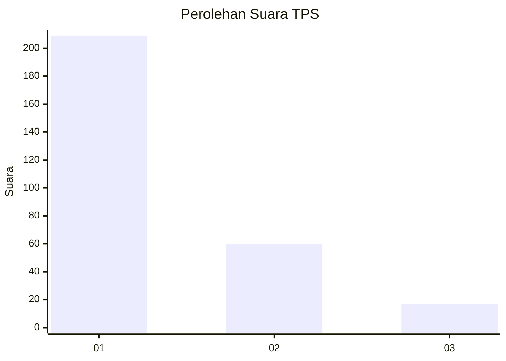
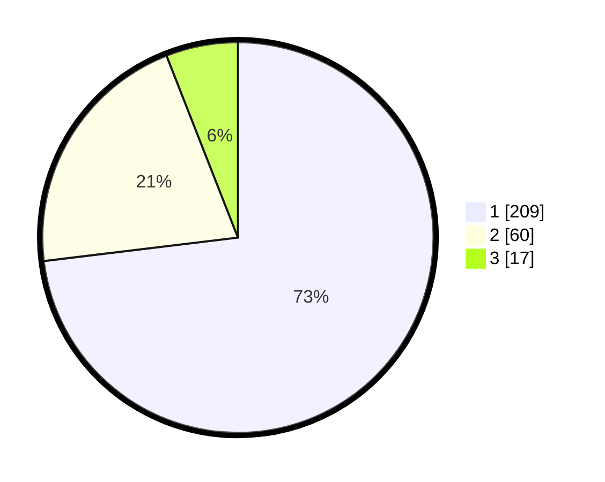

# Hasil

## Grafik

## Tabel

| No. | Nama Paslon    | Suara | Suara (raw) | Persentase |
|:--- |:-------------- | -----:| -----------:| ----------:|
| 1   | ANIES MUHAIMIN | 209   | [209][p-1]  | 73,08      |
| 2   | PRABOWO GIBRAN | 60    | [60][p-2]   | 20,98      |
| 3   | GANJAR MAHFUD  | 17    | [17][p-3]   | 5,94       |

[p-1]: https://github.com/gigit-pemilu/pemilu-2024-35-jawa-timur/blob/main/pilpres/hitung-suara/sub/35-jawa-timur/sub/09-jember/sub/09-bangsalsari/sub/2001-curahkalong/sub/046-tps/sub/paslon-1.txt
[p-2]: https://github.com/gigit-pemilu/pemilu-2024-35-jawa-timur/blob/main/pilpres/hitung-suara/sub/35-jawa-timur/sub/09-jember/sub/09-bangsalsari/sub/2001-curahkalong/sub/046-tps/sub/paslon-2.txt
[p-3]: https://github.com/gigit-pemilu/pemilu-2024-35-jawa-timur/blob/main/pilpres/hitung-suara/sub/35-jawa-timur/sub/09-jember/sub/09-bangsalsari/sub/2001-curahkalong/sub/046-tps/sub/paslon-3.txt

## Foto C Plano

https://sirekap-obj-formc.kpu.go.id/c3a5/pemilu/ppwp/35/09/09/20/01/3509092001046-20240215-002946--093db154-a6fc-4b28-9131-2c655a5aac76.jpg

https://sirekap-obj-formc.kpu.go.id/c3a5/pemilu/ppwp/35/09/09/20/01/3509092001046-20240215-003130--ed19a834-0738-4d98-9902-3ae6f1c96a01.jpg

https://sirekap-obj-formc.kpu.go.id/c3a5/pemilu/ppwp/35/09/09/20/01/3509092001046-20240215-003308--4adf76b8-fc67-4495-9676-c9574ebb3e1f.jpg

## Metadata

| Key        | Value               |
| ---------- | ------------------- |
| Time Stamp | 2024-02-15 15:00:29 |

