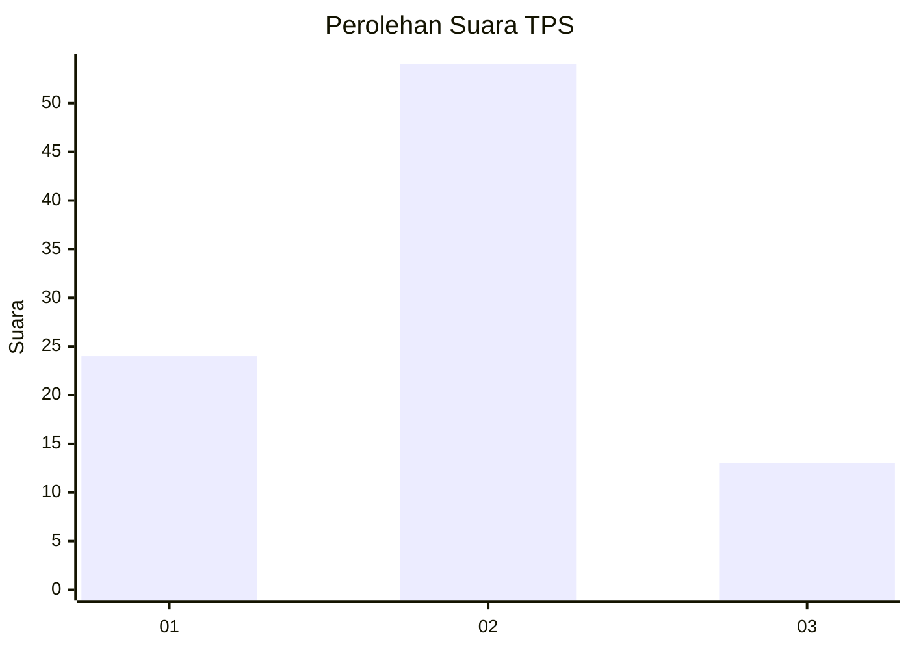
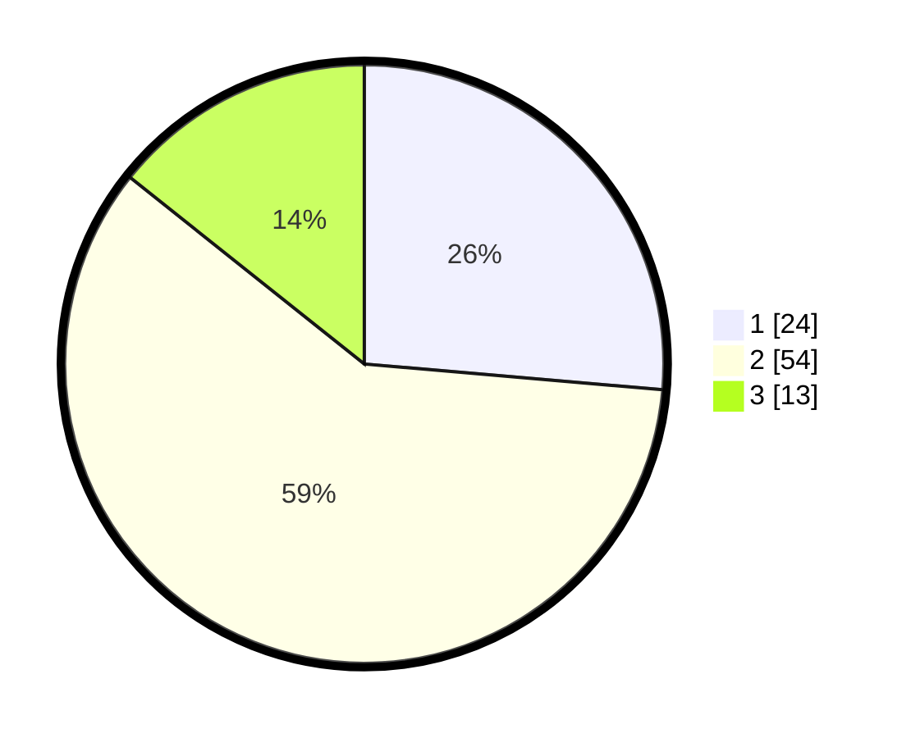

# Hasil

## Grafik

## Tabel

| No. | Nama Paslon    | Suara | Suara (raw) | Persentase |
|:--- |:-------------- | -----:| -----------:| ----------:|
| 1   | ANIES MUHAIMIN | 24    | [24][p-1]   | 26,37      |
| 2   | PRABOWO GIBRAN | 54    | [54][p-2]   | 59,34      |
| 3   | GANJAR MAHFUD  | 13    | [13][p-3]   | 14,29      |

[p-1]: https://github.com/gigit-pemilu/pemilu-2024/blob/main/pilpres/hitung-suara/sub/35-jawa-timur/sub/09-jember/sub/09-bangsalsari/sub/2002-gambirono/sub/006-tps/sub/paslon-1.txt
[p-2]: https://github.com/gigit-pemilu/pemilu-2024/blob/main/pilpres/hitung-suara/sub/35-jawa-timur/sub/09-jember/sub/09-bangsalsari/sub/2002-gambirono/sub/006-tps/sub/paslon-2.txt
[p-3]: https://github.com/gigit-pemilu/pemilu-2024/blob/main/pilpres/hitung-suara/sub/35-jawa-timur/sub/09-jember/sub/09-bangsalsari/sub/2002-gambirono/sub/006-tps/sub/paslon-3.txt

## Foto C Plano

https://sirekap-obj-formc.kpu.go.id/3329/pemilu/ppwp/35/09/09/20/02/3509092002006-20240214-141044--65afb69c-fa58-490e-8017-c7a861f879d9.jpg

https://sirekap-obj-formc.kpu.go.id/3329/pemilu/ppwp/35/09/09/20/02/3509092002006-20240214-201558--76b80945-8e9e-48ec-9fe2-4f56aed7d3e0.jpg

## Metadata

| Key        | Value               |
| ---------- | ------------------- |
| Time Stamp | 2024-02-16 23:30:00 |

