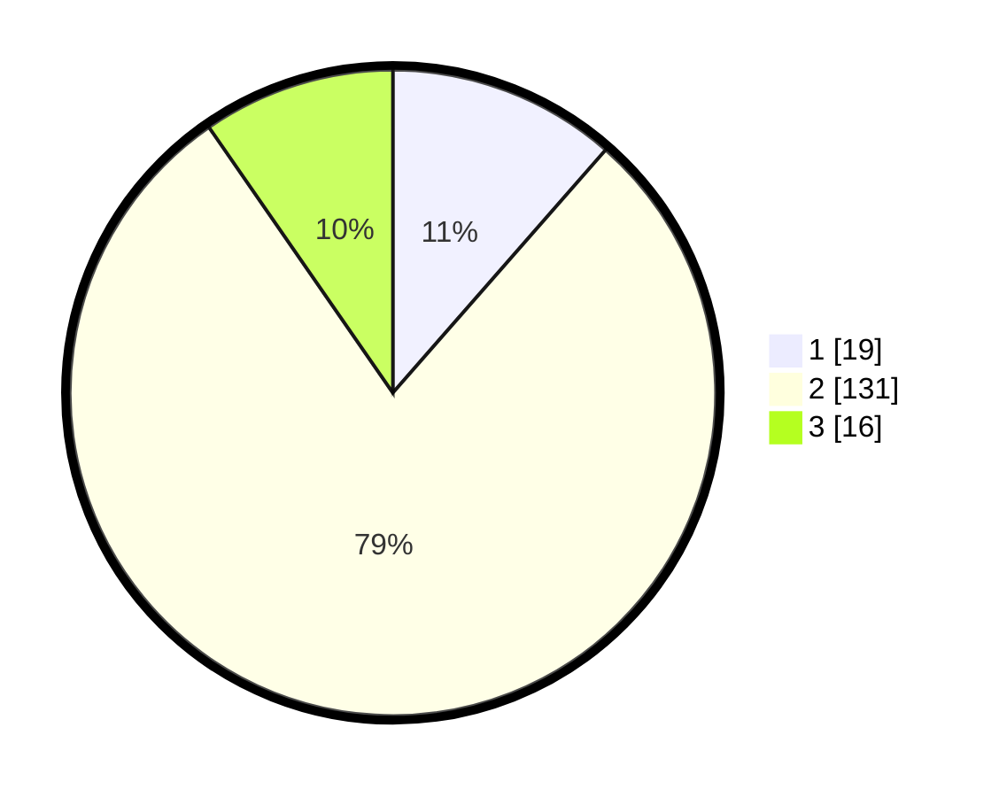

# Hasil

## Grafik

## Tabel

| No. | Nama Paslon    | Suara | Suara (raw) | Persentase |
|:--- |:-------------- | -----:| -----------:| ----------:|
| 1   | ANIES MUHAIMIN | 19    | [19][p-1]   | 11,45      |
| 2   | PRABOWO GIBRAN | 131   | [131][p-2]  | 78,92      |
| 3   | GANJAR MAHFUD  | 16    | [16][p-3]   | 9,64       |

[p-1]: https://github.com/gigit-pemilu/pemilu-2024/blob/main/pilpres/hitung-suara/sub/35-jawa-timur/sub/09-jember/sub/09-bangsalsari/sub/2002-gambirono/sub/016-tps/sub/paslon-1.txt
[p-2]: https://github.com/gigit-pemilu/pemilu-2024/blob/main/pilpres/hitung-suara/sub/35-jawa-timur/sub/09-jember/sub/09-bangsalsari/sub/2002-gambirono/sub/016-tps/sub/paslon-2.txt
[p-3]: https://github.com/gigit-pemilu/pemilu-2024/blob/main/pilpres/hitung-suara/sub/35-jawa-timur/sub/09-jember/sub/09-bangsalsari/sub/2002-gambirono/sub/016-tps/sub/paslon-3.txt

## Foto C Plano

https://sirekap-obj-formc.kpu.go.id/958d/pemilu/ppwp/35/09/09/20/02/3509092002016-20240214-220308--7c84c494-588b-46e2-9970-524b4df708a4.jpg

https://sirekap-obj-formc.kpu.go.id/958d/pemilu/ppwp/35/09/09/20/02/3509092002016-20240214-220513--ed8641f0-ee62-4182-b579-66d637ca6f27.jpg

https://sirekap-obj-formc.kpu.go.id/958d/pemilu/ppwp/35/09/09/20/02/3509092002016-20240214-220740--748818e2-ae03-4830-a575-a990e541b686.jpg

## Metadata

| Key        | Value               |
| ---------- | ------------------- |
| Time Stamp | 2024-02-15 12:00:28 |

