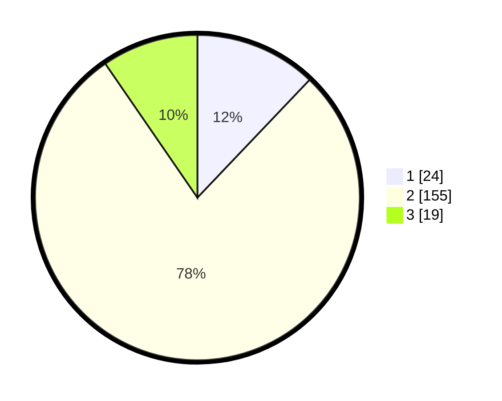

# Hasil

## Grafik

## Tabel

| No. | Nama Paslon    | Suara | Suara (raw) | Persentase |
|:--- |:-------------- | -----:| -----------:| ----------:|
| 1   | ANIES MUHAIMIN | 24    | [24][p-1]   | 12,12      |
| 2   | PRABOWO GIBRAN | 155   | [155][p-2]  | 78,28      |
| 3   | GANJAR MAHFUD  | 19    | [19][p-3]   | 9,60       |

[p-1]: https://github.com/gigit-pemilu/pemilu-2024-35-jawa-timur/blob/main/pilpres/hitung-suara/sub/35-jawa-timur/sub/09-jember/sub/09-bangsalsari/sub/2002-gambirono/sub/021-tps/sub/paslon-1.txt
[p-2]: https://github.com/gigit-pemilu/pemilu-2024-35-jawa-timur/blob/main/pilpres/hitung-suara/sub/35-jawa-timur/sub/09-jember/sub/09-bangsalsari/sub/2002-gambirono/sub/021-tps/sub/paslon-2.txt
[p-3]: https://github.com/gigit-pemilu/pemilu-2024-35-jawa-timur/blob/main/pilpres/hitung-suara/sub/35-jawa-timur/sub/09-jember/sub/09-bangsalsari/sub/2002-gambirono/sub/021-tps/sub/paslon-3.txt

## Foto C Plano

https://sirekap-obj-formc.kpu.go.id/4f26/pemilu/ppwp/35/09/09/20/02/3509092002021-20240214-213055--c0dae168-8e24-419f-bd44-67c1bbc556da.jpg

https://sirekap-obj-formc.kpu.go.id/4f26/pemilu/ppwp/35/09/09/20/02/3509092002021-20240214-213559--a798a3fc-342b-4af4-b4bb-d267ca917ef0.jpg

https://sirekap-obj-formc.kpu.go.id/4f26/pemilu/ppwp/35/09/09/20/02/3509092002021-20240214-224046--5952a55c-151a-46c6-a64f-9071cdc8d2f7.jpg

## Metadata

| Key        | Value               |
| ---------- | ------------------- |
| Time Stamp | 2024-02-15 12:00:28 |

