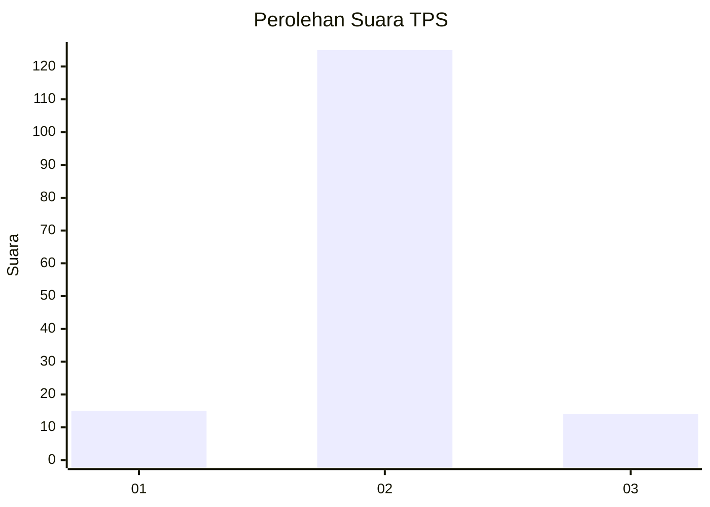
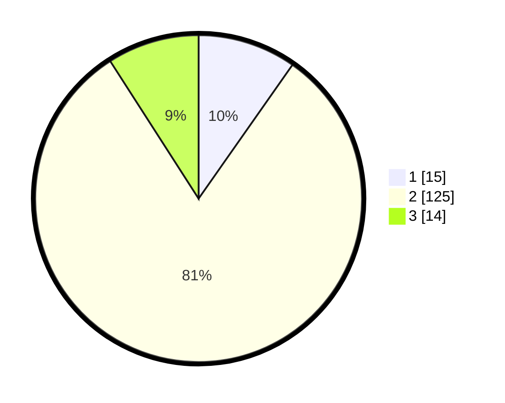

# Hasil

## Grafik

## Tabel

| No. | Nama Paslon    | Suara | Suara (raw) | Persentase |
|:--- |:-------------- | -----:| -----------:| ----------:|
| 1   | ANIES MUHAIMIN | 15    | [15][p-1]   | 9,74       |
| 2   | PRABOWO GIBRAN | 125   | [125][p-2]  | 81,17      |
| 3   | GANJAR MAHFUD  | 14    | [14][p-3]   | 9,09       |

[p-1]: https://github.com/gigit-pemilu/pemilu-2024/blob/main/pilpres/hitung-suara/sub/35-jawa-timur/sub/09-jember/sub/09-bangsalsari/sub/2002-gambirono/sub/023-tps/sub/paslon-1.txt
[p-2]: https://github.com/gigit-pemilu/pemilu-2024/blob/main/pilpres/hitung-suara/sub/35-jawa-timur/sub/09-jember/sub/09-bangsalsari/sub/2002-gambirono/sub/023-tps/sub/paslon-2.txt
[p-3]: https://github.com/gigit-pemilu/pemilu-2024/blob/main/pilpres/hitung-suara/sub/35-jawa-timur/sub/09-jember/sub/09-bangsalsari/sub/2002-gambirono/sub/023-tps/sub/paslon-3.txt

## Foto C Plano

https://sirekap-obj-formc.kpu.go.id/55bb/pemilu/ppwp/35/09/09/20/02/3509092002023-20240214-213023--d42abaee-bfa7-4d47-8065-37646c3b4ee3.jpg

https://sirekap-obj-formc.kpu.go.id/55bb/pemilu/ppwp/35/09/09/20/02/3509092002023-20240214-213120--63328f67-9fae-4747-9a55-d1cab0ac9340.jpg

https://sirekap-obj-formc.kpu.go.id/55bb/pemilu/ppwp/35/09/09/20/02/3509092002023-20240214-213211--fb24a364-ebbd-4cac-8bf2-bceec16ef76a.jpg

## Metadata

| Key        | Value               |
| ---------- | ------------------- |
| Time Stamp | 2024-02-15 23:29:50 |

