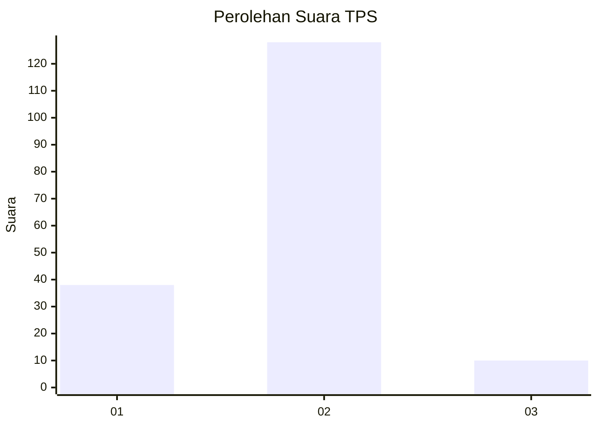
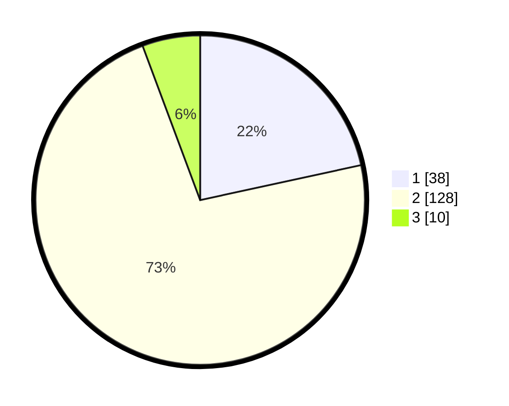

# Hasil

## Grafik

## Tabel

| No. | Nama Paslon    | Suara | Suara (raw) | Persentase |
|:--- |:-------------- | -----:| -----------:| ----------:|
| 1   | ANIES MUHAIMIN | 38    | [38][p-1]   | 21,59      |
| 2   | PRABOWO GIBRAN | 128   | [128][p-2]  | 72,73      |
| 3   | GANJAR MAHFUD  | 10    | [10][p-3]   | 5,68       |

[p-1]: https://github.com/gigit-pemilu/pemilu-2024-35-jawa-timur/blob/main/pilpres/hitung-suara/sub/35-jawa-timur/sub/09-jember/sub/09-bangsalsari/sub/2002-gambirono/sub/024-tps/sub/paslon-1.txt
[p-2]: https://github.com/gigit-pemilu/pemilu-2024-35-jawa-timur/blob/main/pilpres/hitung-suara/sub/35-jawa-timur/sub/09-jember/sub/09-bangsalsari/sub/2002-gambirono/sub/024-tps/sub/paslon-2.txt
[p-3]: https://github.com/gigit-pemilu/pemilu-2024-35-jawa-timur/blob/main/pilpres/hitung-suara/sub/35-jawa-timur/sub/09-jember/sub/09-bangsalsari/sub/2002-gambirono/sub/024-tps/sub/paslon-3.txt

## Foto C Plano

https://sirekap-obj-formc.kpu.go.id/6700/pemilu/ppwp/35/09/09/20/02/3509092002024-20240216-192600--1dc5a1db-ab2e-4683-8fa0-2e043d551519.jpg

https://sirekap-obj-formc.kpu.go.id/6700/pemilu/ppwp/35/09/09/20/02/3509092002024-20240215-224412--13b73969-96aa-4011-9dbc-19dff530bbff.jpg

https://sirekap-obj-formc.kpu.go.id/6700/pemilu/ppwp/35/09/09/20/02/3509092002024-20240215-213355--274c76fc-22a9-49e3-9328-b0352866cc70.jpg

## Metadata

| Key        | Value               |
| ---------- | ------------------- |
| Time Stamp | 2024-02-16 21:01:00 |

