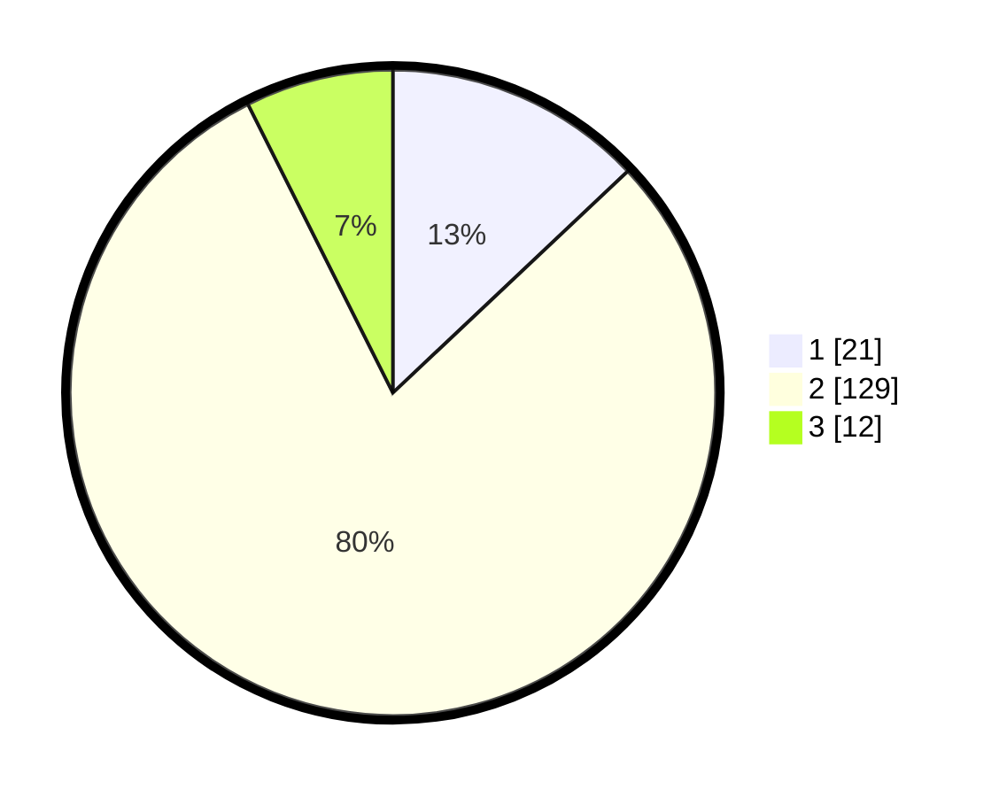

# Hasil

## Grafik

## Tabel

| No. | Nama Paslon    | Suara | Suara (raw) | Persentase |
|:--- |:-------------- | -----:| -----------:| ----------:|
| 1   | ANIES MUHAIMIN | 21    | [21][p-1]   | 12,96      |
| 2   | PRABOWO GIBRAN | 129   | [129][p-2]  | 79,63      |
| 3   | GANJAR MAHFUD  | 12    | [12][p-3]   | 7,41       |

[p-1]: https://github.com/gigit-pemilu/pemilu-2024-35-jawa-timur/blob/main/pilpres/hitung-suara/sub/35-jawa-timur/sub/09-jember/sub/09-bangsalsari/sub/2002-gambirono/sub/025-tps/sub/paslon-1.txt
[p-2]: https://github.com/gigit-pemilu/pemilu-2024-35-jawa-timur/blob/main/pilpres/hitung-suara/sub/35-jawa-timur/sub/09-jember/sub/09-bangsalsari/sub/2002-gambirono/sub/025-tps/sub/paslon-2.txt
[p-3]: https://github.com/gigit-pemilu/pemilu-2024-35-jawa-timur/blob/main/pilpres/hitung-suara/sub/35-jawa-timur/sub/09-jember/sub/09-bangsalsari/sub/2002-gambirono/sub/025-tps/sub/paslon-3.txt

## Foto C Plano

https://sirekap-obj-formc.kpu.go.id/af5b/pemilu/ppwp/35/09/09/20/02/3509092002025-20240214-220956--8b35d8f9-03e7-427b-b001-6d5ad5b0ce7a.jpg

https://sirekap-obj-formc.kpu.go.id/af5b/pemilu/ppwp/35/09/09/20/02/3509092002025-20240214-221203--7c7aef78-5839-4680-977d-3627189c4012.jpg

https://sirekap-obj-formc.kpu.go.id/af5b/pemilu/ppwp/35/09/09/20/02/3509092002025-20240214-221313--8a1bd9ed-0894-4fe1-ae17-3c9403699823.jpg

## Metadata

| Key        | Value               |
| ---------- | ------------------- |
| Time Stamp | 2024-02-15 23:29:50 |

