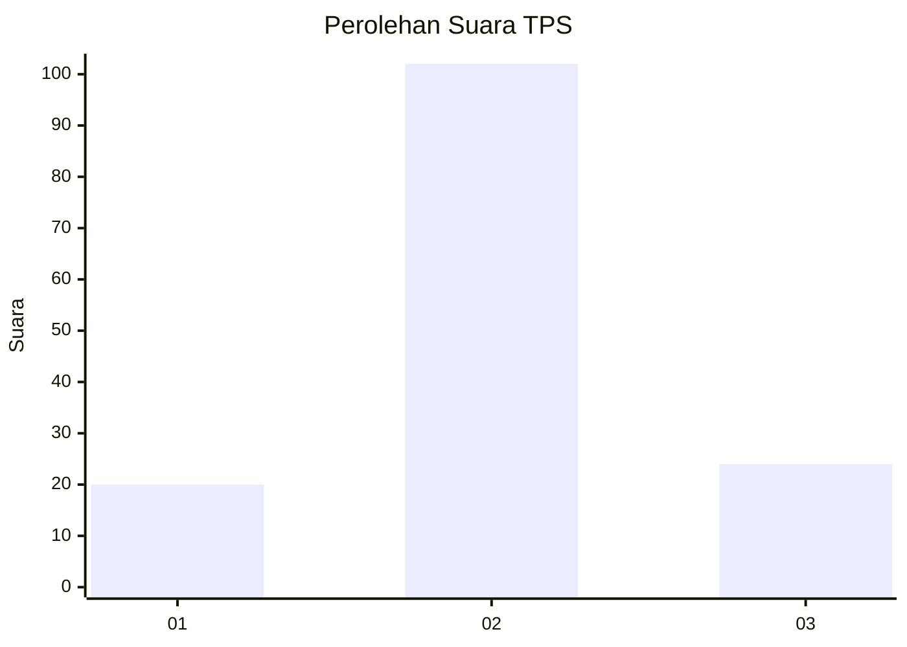
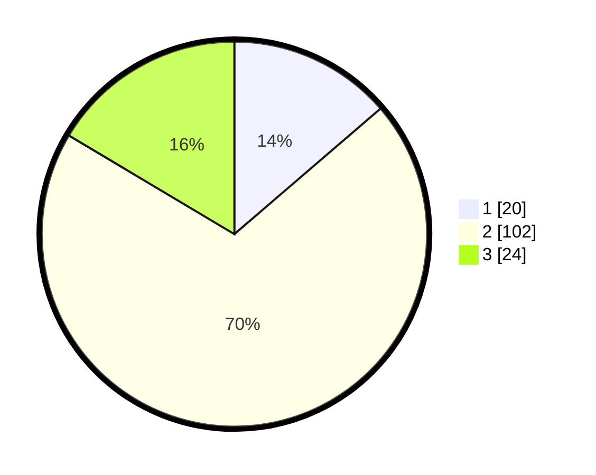

# Hasil

## Grafik

## Tabel

| No. | Nama Paslon    | Suara | Suara (raw) | Persentase |
|:--- |:-------------- | -----:| -----------:| ----------:|
| 1   | ANIES MUHAIMIN | 20    | [20][p-1]   | 13,70      |
| 2   | PRABOWO GIBRAN | 102   | [102][p-2]  | 69,86      |
| 3   | GANJAR MAHFUD  | 24    | [24][p-3]   | 16,44      |

[p-1]: https://github.com/gigit-pemilu/pemilu-2024/blob/main/pilpres/hitung-suara/sub/35-jawa-timur/sub/09-jember/sub/09-bangsalsari/sub/2002-gambirono/sub/027-tps/sub/paslon-1.txt
[p-2]: https://github.com/gigit-pemilu/pemilu-2024/blob/main/pilpres/hitung-suara/sub/35-jawa-timur/sub/09-jember/sub/09-bangsalsari/sub/2002-gambirono/sub/027-tps/sub/paslon-2.txt
[p-3]: https://github.com/gigit-pemilu/pemilu-2024/blob/main/pilpres/hitung-suara/sub/35-jawa-timur/sub/09-jember/sub/09-bangsalsari/sub/2002-gambirono/sub/027-tps/sub/paslon-3.txt

## Foto C Plano

https://sirekap-obj-formc.kpu.go.id/8d75/pemilu/ppwp/35/09/09/20/02/3509092002027-20240214-203757--e8b98d38-0dbc-48d2-8bde-bfa2103cc8b3.jpg

https://sirekap-obj-formc.kpu.go.id/8d75/pemilu/ppwp/35/09/09/20/02/3509092002027-20240215-000810--217bc840-32bb-4462-8d8f-d7755464ae62.jpg

https://sirekap-obj-formc.kpu.go.id/8d75/pemilu/ppwp/35/09/09/20/02/3509092002027-20240214-204436--047cf22b-f925-4096-8cdd-6eeaad10bcdd.jpg

## Metadata

| Key        | Value               |
| ---------- | ------------------- |
| Time Stamp | 2024-02-16 23:30:00 |

